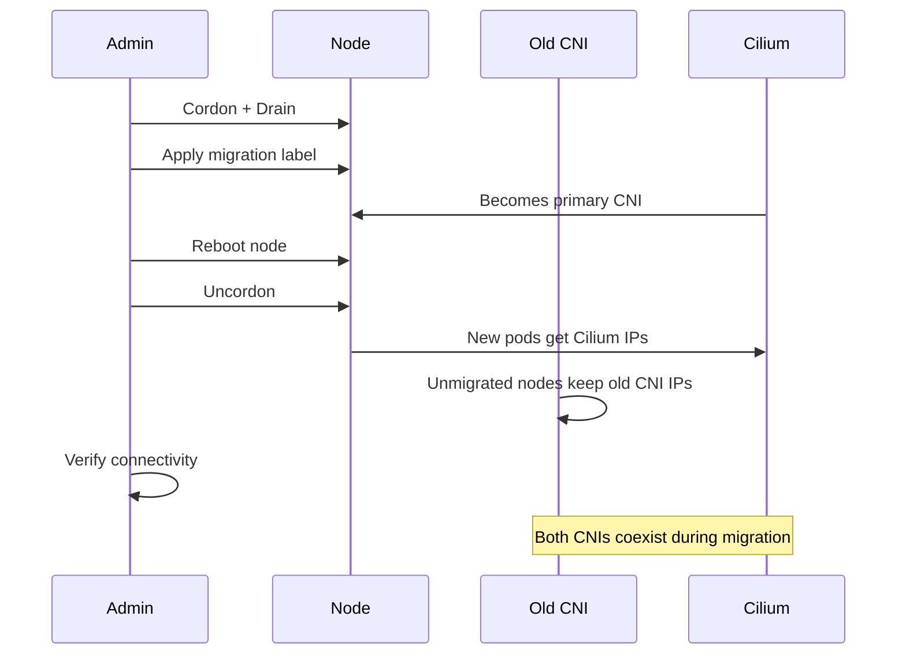

# Cilium CNI Migration Procedure: Configure, Troubleshoot, Validate, and Monitor

Author: [nawazdhandala](https://github.com/nawazdhandala)

Tags: Cilium, Kubernetes, Networking, CNI, Migration

Description: Step-by-step procedure for migrating a live Kubernetes cluster from an existing CNI plugin to Cilium with minimal disruption to running workloads.

---

## Introduction

Migrating a production Kubernetes cluster's CNI plugin to Cilium requires a well-defined procedure that minimizes downtime and preserves workload connectivity. Unlike initial cluster installations, in-place migrations must handle running pods with IPs assigned by the old CNI, services with established endpoints, and potentially active user traffic. Cilium's migration support accommodates these constraints through a phased approach.

The recommended migration approach uses Cilium's secondary mode with per-node configuration to deploy Cilium alongside the existing CNI during the transition. This allows nodes to be migrated one at a time while the rest of the cluster continues operating normally under the old CNI.

This guide covers the complete migration procedure from deploying Cilium in migration mode through final cutover and cleanup.

## Prerequisites

- All pre-migration prerequisites satisfied (see Cilium Pre-Requisites for Migration)
- Maintenance window scheduled for node-by-node migration
- Current CNI plugin backup and rollback plan prepared
- `cilium` CLI and `helm` 3.x available
- kubectl cluster admin access

## Configure Migration Mode

Install Cilium in per-node migration mode. Choose a Cilium pod CIDR and encapsulation port that are distinct from the existing CNI:

```bash
# Install Cilium in secondary mode alongside existing CNI

helm install cilium cilium/cilium \
  --namespace kube-system \
  --set routingMode=tunnel \
  --set tunnelProtocol=vxlan \
  --set tunnelPort=8473 \
  --set ipam.mode=cluster-pool \
  --set ipam.operator.clusterPoolIPv4PodCIDRList="{10.245.0.0/16}" \
  --set ipam.operator.clusterPoolIPv4MaskSize=24 \
  --set cni.customConf=true \
  --set cni.uninstall=false \
  --set operator.unmanagedPodWatcher.restart=false \
  --set bpf.hostLegacyRouting=true \
  --set policyEnforcementMode=never

# Verify Cilium pods are running but not yet managing pods
kubectl -n kube-system get pods -l k8s-app=cilium
cilium status --wait
```

Create the per-node configuration that makes Cilium the primary CNI only on labeled nodes:

```bash
cat <<EOF | kubectl apply --server-side -f -
apiVersion: cilium.io/v2
kind: CiliumNodeConfig
metadata:
  namespace: kube-system
  name: cilium-default
spec:
  nodeSelector:
    matchLabels:
      io.cilium.migration/cilium-default: "true"
  defaults:
    write-cni-conf-when-ready: /host/etc/cni/net.d/05-cilium.conflist
    custom-cni-conf: "false"
    cni-chaining-mode: "none"
    cni-exclusive: "true"
EOF
```

Migrate nodes one at a time:

```bash
NODE="<node-name>"

# Cordon and drain a node
kubectl cordon "$NODE"
kubectl drain "$NODE" --ignore-daemonsets --delete-emptydir-data

# Label the node so the CiliumNodeConfig applies to it
kubectl label node "$NODE" --overwrite "io.cilium.migration/cilium-default=true"

# Restart Cilium on this node so it writes the CNI configuration
kubectl -n kube-system delete pod --field-selector spec.nodeName="$NODE" -l k8s-app=cilium
kubectl -n kube-system rollout status ds/cilium -w

# Reboot the node or restart the VM/instance through your infrastructure provider

# Uncordon to allow pods to be scheduled with Cilium networking
kubectl uncordon "$NODE"
```

## Troubleshoot Migration Issues

Diagnose issues during migration:

```bash
# Check Cilium agent status on a specific node
kubectl -n kube-system exec -it <cilium-pod-on-node> -- cilium-dbg status

# View migration-related errors
kubectl -n kube-system logs <cilium-pod-on-node> --tail=200 | grep -i "error\|failed\|migration"

# Check if old CNI pods are still running on migrated nodes
kubectl -n kube-system get pods -o wide | grep <old-cni-name>

# Diagnose connectivity between old-CNI and Cilium pods
kubectl exec -it <old-cni-pod> -- ping <cilium-pod-ip>
```

Handle common migration errors:

```bash
# Issue: Pods on migrated nodes can't reach pods on unmigrated nodes
# Check tunnel/overlay configuration matches
kubectl -n kube-system exec ds/cilium -- cilium-dbg config --all | grep -E "tunnel|host-legacy-routing"

# Issue: IP address conflicts during migration
kubectl get cep -A -o wide
kubectl get pods -A -o wide | awk 'NR>1 {print $7}' | sort | uniq -d

# Issue: DNS broken after node migration
kubectl -n kube-system exec ds/cilium -- cilium-dbg endpoint list | grep kube-dns
# Ensure CoreDNS pods are rescheduled after drain
kubectl -n kube-system get pods -l k8s-app=kube-dns -o wide
```

## Validate Migration Progress

Verify each node migrates successfully:

```bash
# Confirm the node is selected for Cilium CNI takeover
kubectl get node <node-name> -o jsonpath='{.metadata.labels.io\.cilium\.migration/cilium-default}'

# Check Cilium endpoint registration during migration
NODE="<node-name>"
POD_COUNT=$(kubectl get pods -A --field-selector spec.nodeName=$NODE --no-headers | wc -l)
CEP_COUNT=$(kubectl get cep -A --no-headers | wc -l)
echo "Pods: $POD_COUNT, Cilium Endpoints: $CEP_COUNT"

# Run a one-off pod on the migrated node and confirm it gets a Cilium CIDR IP
kubectl -n kube-system run --attach --rm --restart=Never verify-network \
  --overrides='{"spec":{"nodeName":"'"$NODE"'","tolerations":[{"operator":"Exists"}]}}' \
  --image ghcr.io/nicolaka/netshoot:v0.8 -- \
  /bin/bash -c 'ip -br addr && curl -s -k https://$KUBERNETES_SERVICE_HOST/healthz && echo'

# Verify cross-node communication
kubectl exec -it <pod-on-cilium-node> -- ping <pod-ip-on-old-cni-node>
```

Complete migration validation:

```bash
# After all nodes migrated: remove old CNI
helm uninstall <old-cni-release> -n kube-system

# Enable Cilium network policy enforcement
helm upgrade cilium cilium/cilium \
  --namespace kube-system \
  --reuse-values \
  --set cni.customConf=false \
  --set operator.unmanagedPodWatcher.restart=true \
  --set bpf.hostLegacyRouting=false \
  --set policyEnforcementMode=default \
  --set cni.exclusive=true

kubectl -n kube-system rollout restart daemonset cilium
kubectl delete -n kube-system ciliumnodeconfig cilium-default

# Final connectivity test
cilium connectivity test
```

## Monitor Migration


```mermaid
sequenceDiagram
    participant A as Admin
    participant N as Node
    participant OC as Old CNI
    participant CC as Cilium
    A->>N: Cordon + Drain
    A->>N: Apply migration label
    CC->>N: Becomes primary CNI
    A->>N: Reboot node
    A->>N: Uncordon
    N->>CC: New pods get Cilium IPs
    OC->>OC: Unmigrated nodes keep old CNI IPs
    A->>A: Verify connectivity
    Note over OC,CC: Both CNIs coexist during migration
```

Monitor migration progress:

```bash
# Track how many nodes have migrated
TOTAL=$(kubectl get nodes --no-headers | wc -l)
CILIUM=$(kubectl -n kube-system get pods -l k8s-app=cilium -o wide | grep Running | wc -l)
echo "Migration progress: $CILIUM/$TOTAL nodes"

# Monitor endpoint registration rate
watch -n5 "kubectl get cep -A --no-headers | wc -l"

# Watch for error events during migration
kubectl get events -A --watch | grep -i "cilium\|cni\|network"

# Monitor node connectivity
watch -n10 "cilium status"
```

## Conclusion

A phased Cilium migration using secondary mode and per-node configuration allows you to migrate production clusters with minimal risk. By migrating one node at a time, testing connectivity at each step, and deferring policy enforcement until migration completes, you maintain cluster stability throughout the transition. Always validate connectivity between pods on migrated and unmigrated nodes before proceeding to the next node, and run the full Cilium connectivity test suite after migration completes.
