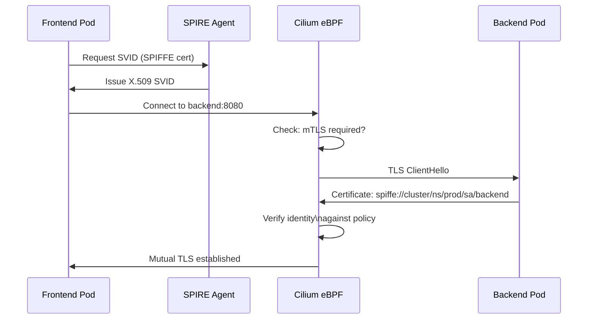

# Mutual TLS with Cilium

Author: [nawazdhandala](https://github.com/nawazdhandala)

Tags: Cilium, Kubernetes, MTLS, Security, Service Mesh

Description: Configure mutual TLS in Cilium Service Mesh to encrypt and authenticate service-to-service communication without modifying application code or managing certificates manually.

---

## Introduction

Mutual TLS (mTLS) is the gold standard for service-to-service authentication in microservices architectures. It ensures that both the client and server verify each other's identity using X.509 certificates, preventing man-in-the-middle attacks and unauthorized service calls even within the cluster. Traditional mTLS with Istio requires sidecar injection and complex certificate management through Citadel or an external PKI.

Cilium Service Mesh implements mTLS transparently using SPIFFE (Secure Production Identity Framework for Everyone) and its own certificate authority. SPIFFE identities are derived from Kubernetes service accounts, meaning every pod gets a unique workload identity that is cryptographically verifiable without any application changes. Cilium handles certificate issuance, rotation, and session establishment automatically.

This guide covers enabling mTLS in Cilium, configuring mutual authentication policies, and verifying that service-to-service traffic is encrypted and authenticated.

## Prerequisites

- Cilium v1.14+ with mTLS support
- Helm v3+
- `kubectl` installed
- `cilium` CLI installed
- Certificate management infrastructure (or use Cilium's built-in CA)

## Step 1: Enable mTLS in Cilium

```bash
helm upgrade cilium cilium/cilium \
  --namespace kube-system \
  --reuse-values \
  --set authentication.mutual.spire.enabled=true \
  --set authentication.mutual.spire.install.enabled=true
```

Verify SPIRE is running:

```bash
kubectl get pods -n cilium-spire
kubectl get daemonset -n cilium-spire spire-agent
```

## Step 2: Verify SPIFFE Identity Assignment

```bash
# Check SPIFFE identities assigned to pods
kubectl exec -n cilium-spire spire-server-0 -- \
  spire-server entry show

# Verify Cilium agent has a SPIFFE identity
kubectl exec -n kube-system cilium-xxxxx -- \
  cilium debuginfo | grep -i spiffe
```

## Step 3: Configure mTLS Authentication Policy

Require mutual authentication between services:

```yaml
apiVersion: cilium.io/v2
kind: CiliumNetworkPolicy
metadata:
  name: require-mtls-backend
  namespace: production
spec:
  endpointSelector:
    matchLabels:
      app: backend
  ingress:
    - fromEndpoints:
        - matchLabels:
            app: frontend
      authentication:
        mode: "required"
      toPorts:
        - ports:
            - port: "8080"
              protocol: TCP
```

## Step 4: Verify mTLS is Active

```bash
# Check authentication state for an endpoint
cilium endpoint list | grep -E "ID|AUTH"

# Get detailed authentication state
cilium endpoint get <id> | grep -i auth

# Use Hubble to observe mTLS flows
hubble observe --namespace production \
  --type l4 \
  --follow | grep -i auth
```

## Step 5: Monitor Certificate Rotation

```bash
# Check SPIRE agent certificate status
kubectl exec -n cilium-spire spire-agent-xxxxx -- \
  spire-agent api fetch x509

# Monitor for certificate renewal events
kubectl logs -n cilium-spire spire-agent-xxxxx | grep -i "renew\|rotate\|cert"

# Check Cilium agent authentication metrics
kubectl port-forward -n kube-system svc/cilium-agent 9962:9962
curl -s http://localhost:9962/metrics | grep authentication
```

## mTLS Authentication Flow



## Conclusion

Cilium's mTLS implementation using SPIFFE/SPIRE brings cryptographic service identity to Kubernetes without application changes, sidecar injection per pod, or manual certificate management. The `authentication: required` field in `CiliumNetworkPolicy` is the only configuration needed to enforce mutual authentication between services. Combined with Cilium's L7 policies, you get both encrypted transport and application-layer access control in a unified policy model - the foundation of a zero-trust service mesh.
