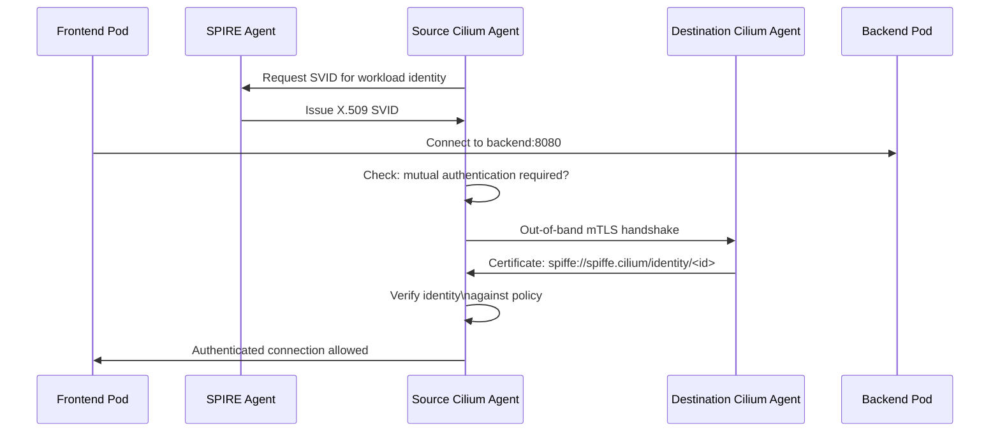

# Mutual TLS with Cilium

Author: [nawazdhandala](https://github.com/nawazdhandala)

Tags: Cilium, Kubernetes, mTLS, Security, Service Mesh

Description: Configure mutual TLS in Cilium Service Mesh to encrypt and authenticate service-to-service communication without modifying application code or managing certificates manually.

---

## Introduction

Mutual TLS (mTLS) is the gold standard for service-to-service authentication in microservices architectures. It ensures that both the client and server verify each other's identity using X.509 certificates, preventing unauthorized service calls even within the cluster. Traditional mTLS with Istio requires sidecar injection and certificate management through Istio's certificate authority or an external PKI.

Cilium Service Mesh implements mutual authentication using an out-of-band mTLS handshake between Cilium agents. It uses SPIFFE (Secure Production Identity Framework for Everyone) APIs and SPIRE for certificate-backed identity management. Workload SPIFFE identities are based on Cilium security identities, and Cilium registers those identities with SPIRE without application changes. For encrypted pod data traffic, enable Cilium transparent encryption with WireGuard or IPsec in addition to mutual authentication.

This guide covers enabling mutual authentication in Cilium, configuring mutual authentication policies, and verifying that service-to-service traffic is authenticated.

## Prerequisites

- Cilium with mutual authentication support
- Helm v3+
- `kubectl` installed
- `cilium` CLI installed
- SPIRE for SPIFFE certificate management, either installed by the Cilium Helm chart or deployed separately

## Step 1: Enable mTLS in Cilium

```bash
helm upgrade cilium cilium/cilium \
  --namespace kube-system \
  --reuse-values \
  --set authentication.enabled=true \
  --set authentication.mutual.spire.enabled=true \
  --set authentication.mutual.spire.install.enabled=true

kubectl -n kube-system rollout restart deployment/cilium-operator
kubectl -n kube-system rollout restart ds/cilium
```

Verify SPIRE is running:

```bash
kubectl get all -n cilium-spire
kubectl exec -n cilium-spire spire-server-0 -c spire-server -- \
  /opt/spire/bin/spire-server healthcheck
kubectl exec -n cilium-spire spire-server-0 -c spire-server -- \
  /opt/spire/bin/spire-server agent list
```

## Step 2: Verify SPIFFE Identity Assignment

```bash
# Verify Cilium agent and operator delegate identities

kubectl exec -n cilium-spire spire-server-0 -c spire-server -- \
  /opt/spire/bin/spire-server entry show \
  -parentID spiffe://spiffe.cilium/ns/cilium-spire/sa/spire-agent

# Verify a workload identity registered by Cilium
IDENTITY_ID=$(kubectl get cep -n production -l app=backend \
  -o=jsonpath='{.items[0].status.identity.id}')
kubectl exec -n cilium-spire spire-server-0 -c spire-server -- \
  /opt/spire/bin/spire-server entry show \
  -spiffeID spiffe://spiffe.cilium/identity/$IDENTITY_ID
```

## Step 3: Configure mTLS Authentication Policy

Require mutual authentication between services:

```yaml
apiVersion: cilium.io/v2
kind: CiliumNetworkPolicy
metadata:
  name: require-mtls-backend
  namespace: production
spec:
  endpointSelector:
    matchLabels:
      app: backend
  ingress:
    - fromEndpoints:
        - matchLabels:
            app: frontend
      authentication:
        mode: "required"
      toPorts:
        - ports:
            - port: "8080"
              protocol: TCP
```

## Step 4: Verify mTLS is Active

```bash
# Enable debug logs while testing mutual authentication
cilium config set debug true

# Exercise traffic from frontend to backend, then check Cilium agent logs
kubectl -n kube-system -c cilium-agent logs -l k8s-app=cilium \
  --timestamps=true | \
  grep "Policy is requiring authentication\|Validating Server SNI\|Validated certificate\|Successfully authenticated"

# Inspect endpoint state if needed
kubectl -n kube-system exec ds/cilium -c cilium-agent -- \
  cilium-dbg endpoint list
kubectl -n kube-system exec ds/cilium -c cilium-agent -- \
  cilium-dbg endpoint get <id>
```

## Step 5: Monitor Certificate Rotation

```bash
# Check SPIRE agent certificate status
kubectl exec -n cilium-spire ds/spire-agent -c spire-agent -- \
  /opt/spire/bin/spire-agent api fetch x509 \
  -socketPath /run/spire/sockets/agent/agent.sock

# Monitor for certificate renewal events
kubectl logs -n cilium-spire ds/spire-agent -c spire-agent | grep -i "renew\|rotate\|cert"

# Check Cilium agent feature metrics if Prometheus metrics are enabled
kubectl port-forward -n kube-system svc/cilium-agent 9962:9962
curl -s http://localhost:9962/metrics | grep cilium_feature.*mutual_auth
```

## mTLS Authentication Flow


```mermaid
sequenceDiagram
    participant F as Frontend Pod
    participant CA as SPIRE Agent
    participant SCA as Source Cilium Agent
    participant DCA as Destination Cilium Agent
    participant B as Backend Pod

    SCA->>CA: Request SVID for workload identity
    CA->>SCA: Issue X.509 SVID
    F->>B: Connect to backend:8080
    SCA->>SCA: Check: mutual authentication required?
    SCA->>DCA: Out-of-band mTLS handshake
    DCA->>SCA: Certificate: spiffe://spiffe.cilium/identity/<id>
    SCA->>SCA: Verify identity\nagainst policy
    SCA->>F: Authenticated connection allowed
```

## Conclusion

Cilium's mutual authentication implementation using SPIFFE/SPIRE brings cryptographic service identity to Kubernetes without application changes, sidecar injection per pod, or manual certificate management. The `authentication.mode: "required"` field in `CiliumNetworkPolicy` is the policy configuration needed to enforce mutual authentication between services. Combined with Cilium's L7 policies and transparent encryption, you get authenticated transport, optional encrypted pod traffic, and application-layer access control in a unified policy model - the foundation of a zero-trust service mesh.
