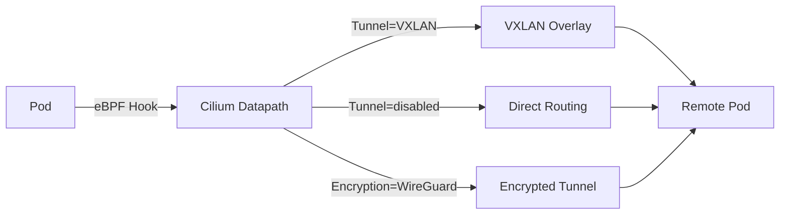

# Cilium Networking Configuration Options: Configure, Troubleshoot, Validate, and Monitor

Author: [nawazdhandala](https://github.com/nawazdhandala)

Tags: Cilium, Kubernetes, Networking, eBPF, Configuration

Description: Explore the full range of Cilium networking configuration options including tunnel modes, direct routing, encryption, and datapath settings with practical examples.

---

## Introduction

Cilium offers a rich set of networking configuration options that control how packets flow between pods, how the datapath is implemented, and how the cluster integrates with the underlying infrastructure. These options span tunnel encapsulation modes, native routing, load balancing algorithms, encryption methods, and eBPF program behaviors. Choosing the right configuration for your environment significantly impacts performance, compatibility, and operational complexity.

Unlike traditional CNI plugins that rely on iptables, Cilium's eBPF-based datapath allows configuration options that were previously impossible: per-flow load balancing, XDP-accelerated kube-proxy replacement, transparent encryption at the kernel level, and L7-aware network policies. Understanding these options helps you unlock Cilium's full potential for your specific use case.

This guide covers the core networking configuration categories, how to apply them, diagnose misconfigurations, validate behavior, and monitor their effectiveness.

## Prerequisites

- Cilium installed in your Kubernetes cluster
- `helm` 3.x with `cilium/cilium` repository added
- `kubectl` with cluster admin access
- Cilium CLI for status checks

## Configure Cilium Networking Options

Core networking mode configuration:

```bash
# Option 1: VXLAN tunnel mode (default, most compatible)
helm upgrade cilium cilium/cilium \
  --namespace kube-system \
  --reuse-values \
  --set tunnel=vxlan

# Option 2: Geneve tunnel mode
helm upgrade cilium cilium/cilium \
  --namespace kube-system \
  --reuse-values \
  --set tunnel=geneve

# Option 3: Direct routing (native routing, best performance)
helm upgrade cilium cilium/cilium \
  --namespace kube-system \
  --reuse-values \
  --set tunnel=disabled \
  --set autoDirectNodeRoutes=true \
  --set ipv4NativeRoutingCIDR=10.244.0.0/16

# Option 4: kube-proxy replacement with eBPF
helm upgrade cilium cilium/cilium \
  --namespace kube-system \
  --reuse-values \
  --set kubeProxyReplacement=true \
  --set k8sServiceHost=<api-server-ip> \
  --set k8sServicePort=6443
```

Load balancing and service configuration:

```bash
# Configure DSR (Direct Server Return) for better performance
helm upgrade cilium cilium/cilium \
  --namespace kube-system \
  --reuse-values \
  --set loadBalancer.mode=dsr

# Enable Maglev consistent hashing for session affinity
helm upgrade cilium cilium/cilium \
  --namespace kube-system \
  --reuse-values \
  --set loadBalancer.algorithm=maglev

# Configure XDP acceleration for NodePort
helm upgrade cilium cilium/cilium \
  --namespace kube-system \
  --reuse-values \
  --set loadBalancer.acceleration=native
```

Encryption options:

```bash
# Enable WireGuard transparent encryption
helm upgrade cilium cilium/cilium \
  --namespace kube-system \
  --reuse-values \
  --set encryption.enabled=true \
  --set encryption.type=wireguard

# Enable IPsec encryption
helm upgrade cilium cilium/cilium \
  --namespace kube-system \
  --reuse-values \
  --set encryption.enabled=true \
  --set encryption.type=ipsec
```

## Troubleshoot Configuration Issues

Diagnose networking configuration problems:

```bash
# View active configuration
kubectl -n kube-system exec ds/cilium -- cilium config view

# Check tunnel mode is correctly set
kubectl -n kube-system exec ds/cilium -- cilium config view | grep -E "tunnel|routing"

# Verify kube-proxy replacement status
kubectl -n kube-system exec ds/cilium -- cilium status | grep -i "kube-proxy"

# Check for eBPF map errors
kubectl -n kube-system exec ds/cilium -- cilium bpf lb list
kubectl -n kube-system exec ds/cilium -- cilium bpf ct list global

# Diagnose load balancing issues
kubectl -n kube-system exec ds/cilium -- cilium service list
kubectl -n kube-system exec ds/cilium -- cilium bpf lb list | grep <service-ip>
```

Fix common configuration errors:

```bash
# Issue: Pods can't communicate after switching tunnel modes
# Must restart all Cilium agents after tunnel mode change
kubectl -n kube-system rollout restart ds/cilium

# Issue: DSR not working with cloud load balancers
# DSR requires L2 adjacency - not compatible with all environments
kubectl -n kube-system exec ds/cilium -- cilium config view | grep loadBalancer

# Issue: WireGuard keys not rotating
kubectl -n kube-system exec ds/cilium -- cilium encrypt status
```

## Validate Configuration

Verify networking configuration is applied correctly:

```bash
# Confirm tunnel mode
kubectl -n kube-system exec ds/cilium -- cilium status --verbose | grep -A 3 "Tunnel"

# Test connectivity with current config
cilium connectivity test

# Verify service load balancing
for i in $(seq 1 10); do
  kubectl run test-$i --image=curlimages/curl --restart=Never -- \
    curl -s http://my-service.default.svc.cluster.local
done

# Check eBPF programs are loaded
kubectl -n kube-system exec ds/cilium -- cilium bpf perf list
```

## Monitor Configuration Effectiveness



Monitor performance impact of configuration choices:

```bash
# Measure bandwidth with current config
kubectl run iperf-server --image=networkstatic/iperf3 -- iperf3 -s
kubectl run iperf-client --image=networkstatic/iperf3 -it --rm -- \
  iperf3 -c iperf-server.default.svc.cluster.local -t 30

# Monitor eBPF program drop reasons
kubectl -n kube-system exec ds/cilium -- cilium monitor --type drop

# Check Hubble for forwarding statistics
cilium hubble port-forward &
hubble observe --verdict FORWARDED | head -50

# Monitor Cilium metrics
kubectl -n kube-system port-forward svc/cilium-operator 9963:9963 &
curl -s http://localhost:9963/metrics | grep cilium_forward
```

## Conclusion

Cilium's networking configuration options provide fine-grained control over datapath behavior, encapsulation modes, and performance characteristics. Start with VXLAN tunnel mode for maximum compatibility and consider switching to direct routing or enabling kube-proxy replacement once your environment is validated. Encrypt traffic with WireGuard for a low-overhead encryption option, or use IPsec for compliance requirements. Always test configuration changes in a non-production environment and run the connectivity test suite after any change.
