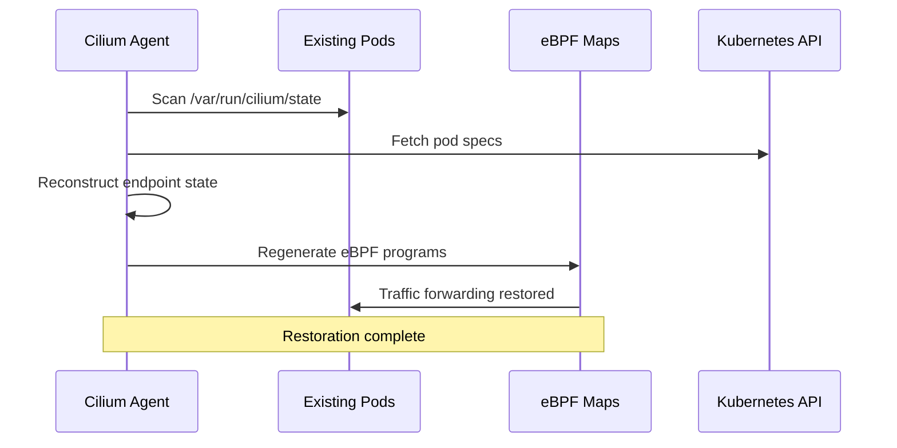

# Networking For Existing Pods with Cilium

Author: [nawazdhandala](https://github.com/nawazdhandala)

Tags: Cilium, Kubernetes, Networking, eBPF, IPAM

Description: Learn how Cilium manages networking for existing pods after installation or upgrade, handling endpoint regeneration, policy application, and connectivity restoration for already-running workloads.

---

## Introduction

When Cilium is installed on a cluster that already has running pods, or when the Cilium agent is restarted, it must reconcile its state with the existing workloads. This process - endpoint restoration - involves re-establishing eBPF maps for each running pod without disrupting their network connectivity. Understanding how Cilium handles existing pods is critical when planning maintenance windows, agent upgrades, and troubleshooting post-installation issues.

During endpoint restoration, the Cilium agent reads the existing pod network namespaces from the node, recreates Cilium Endpoint objects, re-applies network policies, and regenerates eBPF programs. This process is designed to be transparent to workloads, but it can take significant time on busy nodes with many pods. During restoration, traffic may temporarily use fallback paths or experience brief policy enforcement gaps.

This guide explains how to configure Cilium's endpoint restoration behavior, troubleshoot restoration failures, validate that existing pods are correctly managed post-installation, and monitor restoration progress.

## Prerequisites

- Cilium installed (or being installed) on a cluster with existing workloads
- `kubectl` with cluster admin access
- Cilium CLI installed
- Understanding of Cilium endpoints and the IPAM model

## Configure Endpoint Restoration for Existing Pods

Configure how Cilium handles existing pods at startup:

```bash
# Configure endpoint restoration timeout
helm upgrade cilium cilium/cilium \
  --namespace kube-system \
  --reuse-values \
  --set endpointRestoreTime=2m

# Configure maximum endpoint regeneration parallelism
# (Higher values speed up restoration but increase CPU load)
helm upgrade cilium cilium/cilium \
  --namespace kube-system \
  --reuse-values \
  --set maxConnectedClusters=255

# Check current restoration configuration
kubectl -n kube-system get configmap cilium-config -o yaml | grep -E "restore|endpoint"
```

Manually trigger endpoint restoration after agent restart:

```bash
# Restart Cilium agent on a specific node (triggers endpoint restoration)
NODE="worker-1"
CILIUM_POD=$(kubectl -n kube-system get pods -l k8s-app=cilium \
  --field-selector spec.nodeName=$NODE -o jsonpath='{.items[0].metadata.name}')
kubectl -n kube-system delete pod $CILIUM_POD

# Monitor restoration progress
kubectl -n kube-system logs -f $CILIUM_POD | grep -i "restore\|endpoint\|regenerat"

# Check endpoints transitioning from restoring to ready
kubectl -n kube-system exec ds/cilium -- \
  watch -n2 "cilium endpoint list | grep -E 'restoring|regenerating|ready'"
```

## Troubleshoot Existing Pod Networking Issues

Diagnose issues with existing pods after Cilium installation:

```bash
# Check if existing pods have Cilium endpoints
kubectl get pods -n default -o wide
kubectl -n kube-system exec ds/cilium -- cilium endpoint list | grep <pod-ip>

# If a pod IP is missing from endpoint list
kubectl describe pod <pod-name> -n <namespace>
# Check if pod is using host networking (hostNetwork: true)
# Host network pods don't get Cilium endpoints

# Check for endpoints stuck in restoring state
kubectl -n kube-system exec ds/cilium -- cilium endpoint list | grep -v ready

# Investigate a specific stuck endpoint
kubectl -n kube-system exec ds/cilium -- \
  cilium endpoint get <endpoint-id> | jq '.status.log[-5:]'
```

Force endpoint regeneration for stuck pods:

```bash
# Regenerate a specific endpoint
kubectl -n kube-system exec ds/cilium -- \
  cilium endpoint regenerate <endpoint-id>

# Regenerate all endpoints on a node
kubectl -n kube-system exec ds/cilium -- \
  cilium endpoint list --no-headers | awk '{print $1}' | \
  xargs -I{} kubectl -n kube-system exec ds/cilium -- cilium endpoint regenerate {}

# Last resort: delete and re-create the pod
kubectl delete pod <stuck-pod> -n <namespace>
# Kubernetes will reschedule it and Cilium will create a fresh endpoint
```

## Validate Existing Pod Connectivity

Confirm all existing pods have correct Cilium endpoint state:

```bash
# Compare running pods to Cilium endpoints on each node
NODE="worker-1"
PODS=$(kubectl get pods -A --field-selector spec.nodeName=$NODE \
  --no-headers | wc -l)
ENDPOINTS=$(kubectl -n kube-system exec <cilium-pod-on-node> -- \
  cilium endpoint list --no-headers | grep -v "host" | wc -l)
echo "Pods on $NODE: $PODS, Cilium Endpoints: $ENDPOINTS"

# Check all endpoints are in ready state
kubectl -n kube-system exec ds/cilium -- \
  cilium endpoint list | awk '$8 != "ready" {print $0}'
# Should return only the header line

# Validate policy is applied to existing pods
kubectl -n kube-system exec ds/cilium -- \
  cilium endpoint list | grep -E "Ingress|Egress"

# Test connectivity for a pre-existing pod
kubectl exec -it <existing-pod> -- curl http://my-service.default.svc.cluster.local
```

## Monitor Existing Pod Endpoint State



Monitor endpoint restoration metrics:

```bash
# Watch endpoint state distribution
watch -n5 "kubectl -n kube-system exec ds/cilium -- \
  cilium endpoint list | awk '{print \$8}' | sort | uniq -c"

# Monitor restoration time via Prometheus
# cilium_endpoint_regeneration_total
# cilium_endpoint_regeneration_time_stats_seconds

kubectl -n kube-system port-forward ds/cilium 9962:9962 &
curl -s http://localhost:9962/metrics | grep endpoint_regenerat

# Alert on slow restoration
# If restoration takes more than 5 minutes, investigate node health
kubectl -n kube-system logs ds/cilium --since=10m | grep -i "slow\|timeout\|error"
```

## Conclusion

Cilium's endpoint restoration mechanism ensures that existing pods maintain connectivity when the Cilium agent is restarted or upgraded. The restoration process is automatic but benefits from monitoring to ensure it completes in a timely manner. On busy nodes, restoration can take several minutes and endpoint regeneration parallelism may need tuning. Always validate that all endpoints reach "ready" state after Cilium installation or agent restarts, and investigate any pods with missing endpoints that could indicate incomplete CNI plugin configuration.
