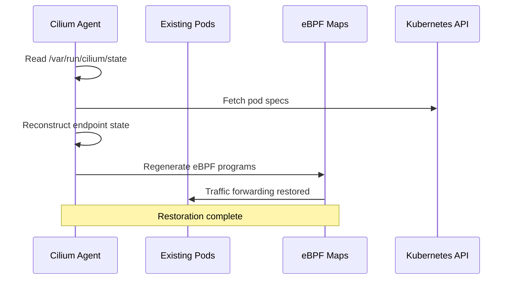

# Networking For Existing Pods with Cilium

Author: [nawazdhandala](https://github.com/nawazdhandala)

Tags: Cilium, Kubernetes, Networking, eBPF, IPAM

Description: Learn how Cilium manages networking for existing pods after installation or upgrade, handling endpoint regeneration, policy application, and connectivity restoration for already-running workloads.

---

## Introduction

When the Cilium agent is restarted or upgraded on a node that already has Cilium-managed pods, it must reconcile its state with the existing workloads. This process - endpoint restoration - involves re-establishing endpoint networking state and eBPF programs for those pods without disrupting their network connectivity. Understanding how Cilium handles existing pods is critical when planning maintenance windows, agent upgrades, and troubleshooting post-installation issues.

During endpoint restoration, the Cilium agent restores endpoint state from its local state directory, refreshes Kubernetes metadata, restores policy state, and regenerates eBPF programs. This process is designed to be transparent to workloads, but it can take significant time on busy nodes with many pods. If pods were started before Cilium became the active CNI on a node, they may be unmanaged instead of restored; those pods usually need to be restarted after Cilium is ready.

This guide explains how to configure Cilium's endpoint restoration behavior, troubleshoot restoration failures, validate that existing pods are correctly managed after agent restarts or upgrades, and monitor restoration progress.

## Prerequisites

- Cilium already installed on a cluster with existing Cilium-managed workloads
- `kubectl` with cluster admin access
- Access to `cilium-dbg` inside Cilium agent pods
- Understanding of Cilium endpoints and the IPAM model

## Configure Endpoint Restoration for Existing Pods

Configure how Cilium handles restored endpoint policy at startup:

```bash
# Configure the Envoy endpoint policy restore timeout
helm upgrade cilium cilium/cilium \
  --namespace kube-system \
  --reuse-values \
  --set envoy.policyRestoreTimeoutDuration=2m

# Check current restoration-related configuration
kubectl -n kube-system exec ds/cilium -- \
  cilium-dbg config get envoy-policy-restore-timeout
```

Manually trigger endpoint restoration after agent restart:

```bash
# Restart Cilium agent on a specific node (triggers endpoint restoration)
NODE="worker-1"
CILIUM_POD=$(kubectl -n kube-system get pods -l k8s-app=cilium \
  --field-selector spec.nodeName=$NODE -o jsonpath='{.items[0].metadata.name}')
kubectl -n kube-system delete pod $CILIUM_POD
kubectl -n kube-system wait --for=condition=Ready pod \
  -l k8s-app=cilium --field-selector spec.nodeName=$NODE --timeout=5m
CILIUM_POD=$(kubectl -n kube-system get pods -l k8s-app=cilium \
  --field-selector spec.nodeName=$NODE -o jsonpath='{.items[0].metadata.name}')

# Monitor restoration progress
kubectl -n kube-system logs -f $CILIUM_POD | grep -i "restore\|endpoint\|regenerat"

# Check endpoints transitioning from restoring to ready
watch -n2 "kubectl -n kube-system exec $CILIUM_POD -- \
  cilium-dbg endpoint list | grep -E 'restoring|regenerating|ready'"
```

## Troubleshoot Existing Pod Networking Issues

Diagnose issues with existing pods after a Cilium agent restart, upgrade, or migration:

```bash
# Check if existing pods have Cilium endpoints
kubectl get pods -n default -o wide
kubectl -n kube-system exec <cilium-pod-on-node> -- \
  cilium-dbg endpoint list | grep <pod-ip>

# If a pod IP is missing from endpoint list
kubectl describe pod <pod-name> -n <namespace>
# Check if pod is using host networking (hostNetwork: true)
# Host network pods don't get Cilium endpoints
# Pods that started before Cilium was ready on the node may be unmanaged

# Check for endpoints stuck in restoring state
kubectl -n kube-system exec <cilium-pod-on-node> -- \
  cilium-dbg endpoint list | grep -E 'restoring|waiting-to-regenerate|regenerating'

# Investigate a specific stuck endpoint
kubectl -n kube-system exec <cilium-pod-on-node> -- \
  cilium-dbg endpoint log <endpoint-id>
```

Recover stuck or unmanaged pods:

```bash
# Confirm the endpoint state and policy details
kubectl -n kube-system exec <cilium-pod-on-node> -- \
  cilium-dbg endpoint get <endpoint-id>

# Re-create the pod if it is unmanaged or remains stuck
kubectl delete pod <stuck-pod> -n <namespace>
# Kubernetes will reschedule it and Cilium will create a fresh endpoint
```

## Validate Existing Pod Connectivity

Confirm all existing pods have correct Cilium endpoint state:

```bash
# Compare running pods to Cilium endpoints on each node
NODE="worker-1"
PODS=$(kubectl get pods -A --field-selector spec.nodeName=$NODE \
  --no-headers | wc -l)
ENDPOINTS=$(kubectl -n kube-system exec <cilium-pod-on-node> -- \
  cilium-dbg endpoint list --no-headers | grep -v "reserved:host" | wc -l)
echo "Pods on $NODE: $PODS, Cilium Endpoints: $ENDPOINTS"
# Host-network pods and unmanaged pods will not have matching Cilium endpoints

# Check all endpoints are in ready state
kubectl -n kube-system exec <cilium-pod-on-node> -- \
  cilium-dbg endpoint list | grep -E 'restoring|waiting-to-regenerate|regenerating|disconnecting'
# Should return no endpoint rows after restoration completes

# Validate policy is applied to existing pods
kubectl -n kube-system exec <cilium-pod-on-node> -- \
  cilium-dbg endpoint get <endpoint-id> | grep -i policy

# Test connectivity for a pre-existing pod
kubectl exec -it <existing-pod> -- curl http://my-service.default.svc.cluster.local
```

## Monitor Existing Pod Endpoint State


```mermaid
sequenceDiagram
    participant CA as Cilium Agent
    participant EP as Existing Pods
    participant BPF as eBPF Maps
    participant K8s as Kubernetes API
    CA->>CA: Read /var/run/cilium/state
    CA->>K8s: Fetch pod specs
    CA->>CA: Reconstruct endpoint state
    CA->>BPF: Regenerate eBPF programs
    BPF->>EP: Traffic forwarding restored
    Note over CA,BPF: Restoration complete
```

Monitor endpoint restoration metrics:

```bash
# Watch endpoint state distribution
watch -n5 "kubectl -n kube-system exec ds/cilium -- \
  cilium-dbg endpoint list | awk '{print \$8}' | sort | uniq -c"

# Monitor restoration time via Prometheus
# cilium_endpoint_restoration_endpoints
# cilium_endpoint_restoration_duration_seconds
# cilium_endpoint_regenerations_total
# cilium_endpoint_regeneration_time_stats_seconds

kubectl -n kube-system port-forward ds/cilium 9962:9962 &
curl -s http://localhost:9962/metrics | grep -E "endpoint_restoration|endpoint_regeneration"

# Alert on slow restoration
# If restoration takes more than 5 minutes, investigate node health
kubectl -n kube-system logs ds/cilium --since=10m | grep -i "slow\|timeout\|error"
```

## Conclusion

Cilium's endpoint restoration mechanism ensures that existing Cilium-managed pods maintain connectivity when the Cilium agent is restarted or upgraded. The restoration process is automatic but benefits from monitoring to ensure it completes in a timely manner. On busy nodes, restoration can take several minutes. Always validate that all endpoints reach "ready" state after Cilium agent restarts or upgrades, and investigate any pods with missing endpoints that could indicate unmanaged pods or incomplete CNI plugin configuration.
