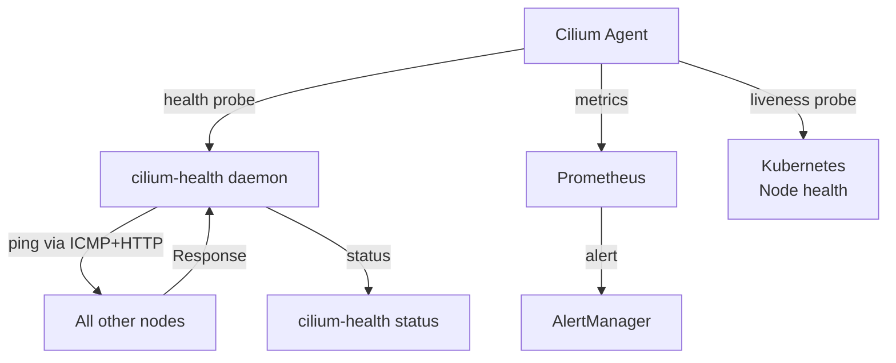

# Cilium Node Health

Author: [nawazdhandala](https://github.com/nawazdhandala)

Tags: Cilium, Kubernetes, Node Health, Observability, eBPF

Description: Monitor Cilium node health by inspecting the Cilium agent status, checking inter-node connectivity, and diagnosing issues with BPF program loading and kernel compatibility.

---

## Introduction

Cilium node health encompasses the health of the Cilium agent running on each node, the inter-node connectivity that enables pod-to-pod communication across nodes, and the kernel-level BPF program state that implements the data plane. A node where Cilium is unhealthy affects not just pods on that node but potentially all pods that need to communicate with them - broken inter-node tunnels cause cluster-wide connectivity issues for any communication involving pods on the unhealthy node.

Cilium provides health monitoring at multiple levels: the Cilium agent performs continuous health checks against all other nodes in the cluster through `cilium-health`, Kubernetes readiness and liveness probes monitor the agent process, and Prometheus metrics expose detailed health indicators for alerting. The `cilium status` command gives the most comprehensive single-command view of node health, while `cilium-health status` specifically checks the inter-node connectivity mesh.

This guide covers monitoring Cilium node health, diagnosing agent failures, checking inter-node connectivity, and recovering from node-level Cilium failures.

## Prerequisites

- Cilium installed with health checking enabled
- `kubectl` installed
- `cilium` CLI installed
- Prometheus (optional) for metric-based monitoring

## Step 1: Check Overall Node Health

```bash
# Comprehensive health status for the local node
cilium status --verbose

# Check all Cilium pods across the cluster
kubectl get pods -n kube-system -l k8s-app=cilium -o wide

# Look for pods not in Running state
kubectl get pods -n kube-system -l k8s-app=cilium | grep -v Running
```

## Step 2: Check Inter-Node Connectivity

```bash
# Check connectivity from this node to all other nodes
cilium-health status

# Expected output showing all nodes reachable:
# Probe Summary:
#   Total: 10
#   Up: 10
#   Down: 0

# Detailed per-node connectivity
cilium-health status --verbose

# Check specific node connectivity
cilium-health ping <node-name>
```

## Step 3: Verify BPF Program Loading

```bash
# Check if BPF programs are loaded correctly
kubectl exec -n kube-system cilium-xxxxx -- \
  cilium status | grep -i "BPF\|datapath"

# Verify TC BPF programs on interfaces
kubectl exec -n kube-system cilium-xxxxx -- \
  tc filter show dev eth0 ingress

# Check XDP programs (if enabled)
kubectl exec -n kube-system cilium-xxxxx -- \
  ip link show eth0 | grep xdp

# Verify kernel version compatibility
kubectl exec -n kube-system cilium-xxxxx -- \
  uname -r
```

## Step 4: Check Agent Logs for Errors

```bash
# Recent error logs
kubectl logs -n kube-system cilium-xxxxx --since=15m | grep -i error

# Check for specific failure patterns
kubectl logs -n kube-system cilium-xxxxx --since=15m | \
  grep -i "kvstore\|etcd\|unreachable\|timeout\|failed"

# Check for BPF loading failures
kubectl logs -n kube-system cilium-xxxxx --since=15m | \
  grep -i "bpf.*fail\|program.*load\|map.*fail"
```

## Step 5: Recover from Agent Crash

```bash
# Restart the Cilium pod on a specific node
NODE_IP="10.0.0.5"
POD=$(kubectl get pods -n kube-system -l k8s-app=cilium \
  --field-selector spec.nodeName=${NODE_IP} -o name)

kubectl delete ${POD} -n kube-system
# DaemonSet will automatically restart the pod

# Monitor recovery
kubectl get pods -n kube-system -l k8s-app=cilium -w
```

## Step 6: Monitor Node Health Metrics

```bash
# Key metrics for node health monitoring
kubectl port-forward -n kube-system ds/cilium 9962:9962

# Check agent up/down status
curl -s http://localhost:9962/metrics | grep "cilium_up"

# Check inter-node connectivity metric
curl -s http://localhost:9962/metrics | grep "cilium_node_connectivity"

# Endpoint regeneration failures
curl -s http://localhost:9962/metrics | grep "cilium_endpoint_regenerations_total.*failure"
```

## Node Health Alert Rule

```yaml
apiVersion: monitoring.coreos.com/v1
kind: PrometheusRule
metadata:
  name: cilium-node-health
  namespace: monitoring
spec:
  groups:
    - name: cilium-nodes
      rules:
        - alert: CiliumAgentDown
          expr: up{job="cilium-agent"} == 0
          for: 1m
          labels:
            severity: critical
          annotations:
            summary: "Cilium agent down on {{ $labels.node }}"
        - alert: CiliumInterNodeConnectivityDown
          expr: cilium_node_connectivity_status == 0
          for: 2m
          labels:
            severity: critical
```

## Node Health Architecture



## Conclusion

Cilium node health monitoring requires checking multiple layers: the Cilium agent process (via Kubernetes pod health), inter-node connectivity (via `cilium-health status`), BPF program loading (via `cilium status`), and agent logs for error patterns. Inter-node connectivity issues are particularly impactful because they affect all pods on the unhealthy node, not just local communication. Set up Prometheus alerts for `up{job="cilium-agent"} == 0` as a critical alert, and `cilium-health status` failures as a high-severity alert to catch node-level Cilium issues before they cause widespread service disruptions.
