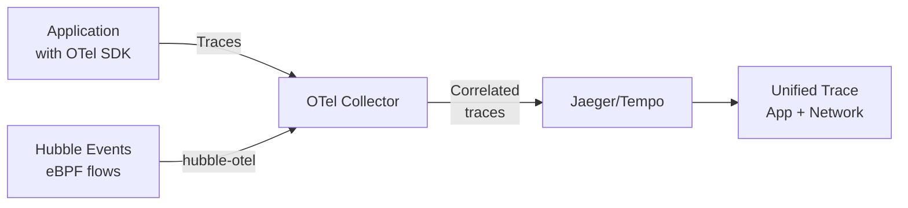

# Cilium Tracing with OpenTelemetry

Author: [nawazdhandala](https://github.com/nawazdhandala)

Tags: Cilium, Kubernetes, OpenTelemetry, Tracing, Observability

Description: Export Cilium Hubble flow data to OpenTelemetry collectors to correlate network-level events with distributed traces, enabling end-to-end visibility from eBPF to application spans.

---

## Introduction

OpenTelemetry has become the standard for distributed tracing in cloud-native environments, but traditional application tracing captures only the parts of a request that touch application code. Network delays, DNS resolution failures, and connection-level errors that happen outside application threads are invisible to application traces. Cilium's Hubble provides exactly the network-level telemetry that fills this gap.

Cilium can export Hubble flow data in OpenTelemetry format, allowing you to correlate network events with application traces in the same tracing backend (Jaeger, Tempo, Honeycomb). When a user reports slow API responses, you can look at both the application spans and the Cilium network flows in the same timeline to determine whether the latency is in the application code or the network path. This correlation is particularly powerful for debugging intermittent connectivity issues that are difficult to reproduce and investigate with traditional tools.

This guide covers configuring Cilium to export Hubble flows to an OpenTelemetry collector and correlating network events with application traces.

## Prerequisites

- Cilium with Hubble relay enabled
- OpenTelemetry Collector deployed in the cluster
- Tracing backend (Jaeger, Grafana Tempo, or similar)
- `kubectl` installed

## Step 1: Deploy OpenTelemetry Collector

```yaml
apiVersion: apps/v1
kind: Deployment
metadata:
  name: otel-collector
  namespace: monitoring
spec:
  replicas: 1
  selector:
    matchLabels:
      app: otel-collector
  template:
    metadata:
      labels:
        app: otel-collector
    spec:
      containers:
        - name: otel-collector
          image: otel/opentelemetry-collector-contrib:latest
          ports:
            - containerPort: 4317  # gRPC OTLP
            - containerPort: 4318  # HTTP OTLP
          volumeMounts:
            - name: config
              mountPath: /etc/otel
      volumes:
        - name: config
          configMap:
            name: otel-collector-config
```

## Step 2: Configure OTel Collector for Hubble Flows

```yaml
apiVersion: v1
kind: ConfigMap
metadata:
  name: otel-collector-config
  namespace: monitoring
data:
  config.yaml: |
    receivers:
      otlp:
        protocols:
          grpc:
            endpoint: 0.0.0.0:4317
          http:
            endpoint: 0.0.0.0:4318

    processors:
      batch:
        timeout: 10s

      attributes/cilium:
        actions:
          - key: service.name
            from_attribute: source.workload
            action: insert

    exporters:
      otlp/tempo:
        endpoint: http://tempo:4317
        tls:
          insecure: true

      logging:
        loglevel: debug

    service:
      pipelines:
        traces:
          receivers: [otlp]
          processors: [batch, attributes/cilium]
          exporters: [otlp/tempo, logging]
```

## Step 3: Configure Hubble to Export to OTel

```bash
helm upgrade cilium cilium/cilium \
  --namespace kube-system \
  --reuse-values \
  --set hubble.export.target.type=file \
  --set hubble.export.target.filePath=/var/run/cilium/hubble/events.log
```

Deploy Hubble OTel exporter (hubble-otel):

```yaml
apiVersion: apps/v1
kind: DaemonSet
metadata:
  name: hubble-otel-exporter
  namespace: kube-system
spec:
  selector:
    matchLabels:
      app: hubble-otel
  template:
    spec:
      containers:
        - name: hubble-otel
          image: ghcr.io/cilium/hubble-otel:latest
          args:
            - "--hubble-target=unix:///var/run/cilium/hubble.sock"
            - "--otel-target=otel-collector.monitoring:4317"
          volumeMounts:
            - name: cilium-run
              mountPath: /var/run/cilium
      volumes:
        - name: cilium-run
          hostPath:
            path: /var/run/cilium
```

## Step 4: Correlate Network and Application Traces

```bash
# In Jaeger/Tempo UI, search for traces that include Cilium spans
# Look for spans with service.name = "cilium" or "hubble"

# Check OTel collector is receiving Hubble events
kubectl logs -n monitoring deployment/otel-collector | grep -i "hubble\|cilium"
```

## Step 5: Validate OTel Export

```bash
# Port-forward to OTel collector debug endpoint
kubectl port-forward -n monitoring deployment/otel-collector 55679:55679
curl -s http://localhost:55679/debug/tracez | head -20
```

## Tracing Integration Architecture



## Conclusion

Exporting Hubble flows to OpenTelemetry enables the correlation of network-level events with application traces, filling the observability gap between what application code sees and what actually happens in the network. When debugging latency issues or connectivity problems, having network flows alongside application spans in the same trace timeline dramatically reduces the investigation time. The Hubble OTel exporter is the bridge component that translates Hubble's flow format into OTLP spans, and once configured it runs transparently without any application changes.
