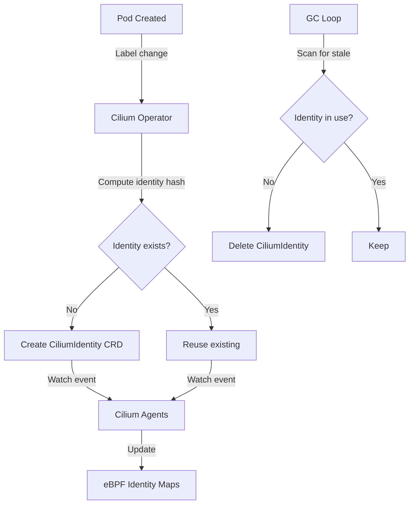

# Enable Identity Management by Cilium Operator (Beta)

Author: [nawazdhandala](https://github.com/nawazdhandala)

Tags: Cilium, Kubernetes, Networking, eBPF, IPAM

Description: Learn how to enable and configure the Cilium Operator's identity management mode (Beta), which centralizes identity allocation in the Operator to reduce API server load and improve scalability.

---

## Introduction

In standard Cilium deployments, each Cilium Agent participates in identity allocation - creating, updating, and garbage collecting CiliumIdentity resources. At large scale, this distributed allocation creates significant API server load as hundreds of agents simultaneously reconcile identity state. The Cilium Operator Identity Management feature (currently in Beta) addresses this by centralizing all identity lifecycle management in the Cilium Operator, reducing the number of API server writes and providing a single authoritative source for identity state.

When Operator Identity Management is enabled, Cilium Agents become consumers of identity information rather than producers. The Operator watches for pod label changes, computes new identities, creates CiliumIdentity CRDs, and garbage collects stale identities. Agents simply watch these CRDs and update their local eBPF maps accordingly. This separation of concerns improves scalability and makes identity state easier to reason about and debug.

This guide covers how to enable this Beta feature, configure it correctly, troubleshoot issues specific to the centralized model, validate identity management is working, and monitor the Operator's identity management workload.

## Prerequisites

- Cilium 1.14 or later (feature added in 1.13, stabilizing in 1.14+)
- Kubernetes cluster with Cilium Operator running
- `kubectl` with cluster admin access
- Helm 3.x for configuration management
- Review the current Beta limitations in Cilium release notes

## Configure Operator Identity Management

Enable the Operator Identity Management Beta feature:

```bash
# Check current Cilium version (requires 1.13+)
cilium version

# Enable Operator-managed identities via Helm
helm upgrade cilium cilium/cilium \
  --namespace kube-system \
  --reuse-values \
  --set identityAllocationMode=crd \
  --set operator.identityManagementEnabled=true

# Verify the feature is enabled
kubectl -n kube-system get configmap cilium-config -o yaml | grep identity-management
kubectl -n kube-system logs -l name=cilium-operator | grep -i "identity management\|operator identity"
```

Configure Operator identity management parameters:

```bash
# Configure identity GC settings
helm upgrade cilium cilium/cilium \
  --namespace kube-system \
  --reuse-values \
  --set operator.identityGCInterval=15m \
  --set operator.identityHeartbeatTimeout=30m \
  --set operator.identityGCRateInterval=1m \
  --set operator.identityGCRateLimit=2500

# Configure batch processing for large clusters
# (Process more identity allocations per reconciliation loop)
kubectl -n kube-system get configmap cilium-config -o yaml | \
  grep -E "identity|operator"
```

Monitor the transition when enabling on existing cluster:

```bash
# Before enabling: capture current identity count
kubectl get ciliumidentities --no-headers | wc -l

# Enable the feature
helm upgrade cilium cilium/cilium \
  --namespace kube-system \
  --reuse-values \
  --set operator.identityManagementEnabled=true

# Monitor Operator taking over identity management
kubectl -n kube-system logs -l name=cilium-operator -f | grep identity
```

## Troubleshoot Operator Identity Management

Diagnose issues specific to centralized identity management:

```bash
# Check if Operator is managing identities
kubectl -n kube-system logs -l name=cilium-operator | grep -i "identity" | tail -30

# Check for identity allocation errors
kubectl -n kube-system logs -l name=cilium-operator | \
  grep -i "error\|failed\|identity" | tail -50

# Verify Operator has correct RBAC for identity management
kubectl get clusterrole cilium-operator -o yaml | grep identity
kubectl get clusterrolebinding cilium-operator -o yaml

# Check if agents are correctly consuming Operator-managed identities
kubectl -n kube-system exec ds/cilium -- cilium identity list | head -20
kubectl get ciliumidentities | head -20
```

Fix common issues:

```bash
# Issue: Operator not creating identities for new pods
kubectl -n kube-system logs -l name=cilium-operator --since=5m | grep -i "pod\|identity\|watch"

# Check if Operator watch on pods is working
kubectl -n kube-system logs -l name=cilium-operator | grep -i "watch\|list\|pod" | head -20

# Issue: Identity GC removing active identities (too aggressive)
helm upgrade cilium cilium/cilium \
  --namespace kube-system \
  --reuse-values \
  --set operator.identityGCInterval=30m \
  --set operator.identityHeartbeatTimeout=2h

# Issue: Operator crash or OOM during identity management
kubectl -n kube-system top pods -l name=cilium-operator
# If memory high, check identity count
kubectl get ciliumidentities --no-headers | wc -l
```

## Validate Operator Identity Management

Verify the Operator is correctly managing identities:

```bash
# Deploy a test workload and verify identity creation
kubectl run id-test --image=nginx --labels="app=id-test,env=validation"

# Check that Operator created the identity (not the agent)
kubectl get ciliumidentities -o json | \
  jq '.items[] | select(.["security-labels"]["k8s:app"] == "id-test")'

# Verify the agent's identity came from Operator
kubectl -n kube-system exec ds/cilium -- \
  cilium endpoint list | grep id-test

# Check Operator identity GC is working
# Create and delete pods, verify identity is cleaned up after GC interval
kubectl delete pod id-test
kubectl get ciliumidentities | grep id-test  # Should eventually disappear

# Run connectivity test to ensure identities work correctly
cilium connectivity test
```

## Monitor Operator Identity Management



Monitor Operator identity management workload:

```bash
# Monitor identity creation/deletion rate
kubectl -n kube-system port-forward svc/cilium-operator 9963:9963 &
curl -s http://localhost:9963/metrics | grep -E "identity|cilium_operator"

# Key metrics
# cilium_operator_identity_gc_runs_total - GC run count
# cilium_operator_identity_gc_entries - entries processed per GC run
# cilium_identity_count - total active identities

# Watch for unexpected identity churn
watch -n30 "kubectl get ciliumidentities --no-headers | wc -l"

# Monitor Operator resource usage during identity management
kubectl -n kube-system top pods -l name=cilium-operator
```

## Conclusion

The Cilium Operator Identity Management Beta feature provides a more scalable approach to identity lifecycle management by centralizing it in a single Operator instance rather than distributing it across all agents. This reduces API server load significantly in large clusters and provides clearer operational semantics. While still in Beta, this feature is suitable for testing in staging environments and gradually rolling out to production. Monitor identity creation rates and Operator resource usage closely after enabling to catch any edge cases specific to your workload patterns.
