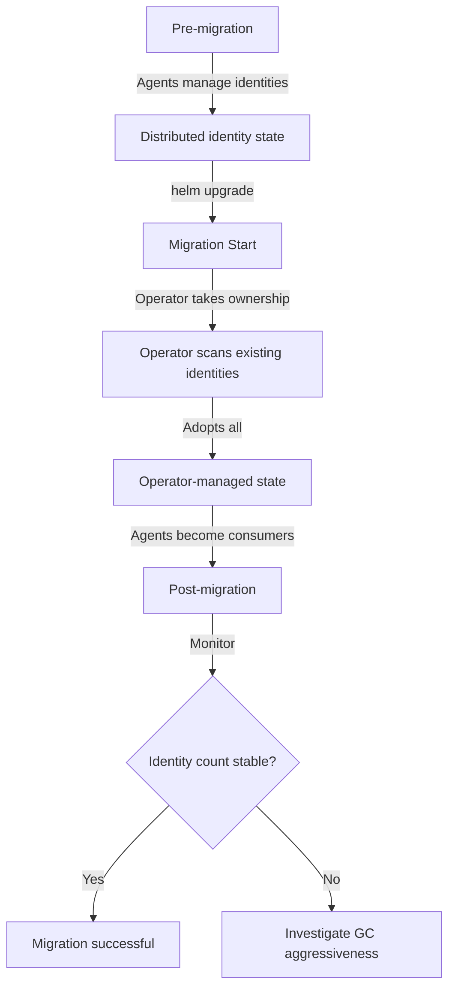

# Enable Operator Managing Identities Migration: Configure, Troubleshoot, Validate, and Monitor

Author: [nawazdhandala](https://github.com/nawazdhandala)

Tags: Cilium, Kubernetes, Identity Management, Migration, Cilium Operator

Description: A step-by-step guide to migrating an existing Cilium cluster from agent-distributed identity management to centralized Operator-managed identities with minimal disruption to running workloads.

---

## Introduction

Migrating an existing Cilium cluster to Operator-managed identities is more complex than enabling it on a new cluster because there is existing identity state that must be preserved and transitioned. All currently running pods have active identities, and network policies referencing those identities must continue to be enforced without interruption during the migration. The migration must be carefully sequenced to avoid a window where identities are neither agent-managed nor Operator-managed.

Cilium's migration approach is designed to be safe: the feature flag enables the Operator to take ownership of identity management while existing identities remain intact. The Operator performs a reconciliation pass that adopts all existing CiliumIdentity resources, then begins managing their lifecycle going forward. Agents transition from creating identities to consuming them without requiring pod restarts or network disruptions.

This guide provides a safe migration procedure, troubleshooting steps for migration-specific issues, validation to confirm the migration succeeded, and monitoring to catch post-migration regressions.

## Prerequisites

- Cilium 1.13 or later installed on an existing cluster
- All Cilium components healthy before starting migration
- Snapshot of current identity state for comparison
- Maintenance window scheduled (or willingness to accept brief elevated API server load)
- `kubectl` with cluster admin access and Helm 3.x

## Configure Identity Management Migration

Prepare and execute the migration:

```bash
# Step 1: Capture pre-migration state
echo "Pre-migration identity count:"
kubectl get ciliumidentities --no-headers | wc -l

echo "Saving identity list..."
kubectl get ciliumidentities -o json | \
  jq -r '.items[] | "\(.metadata.name): \(.["security-labels"])"' > /tmp/pre-migration-identities.txt

echo "Current Cilium health:"
cilium status

# Step 2: Verify Operator is healthy before migrating
kubectl -n kube-system get pods -l name=cilium-operator
kubectl -n kube-system logs -l name=cilium-operator --tail=20

# Step 3: Enable Operator identity management
helm upgrade cilium cilium/cilium \
  --namespace kube-system \
  --reuse-values \
  --set operator.identityManagementEnabled=true \
  --set operator.identityGCInterval=15m \
  --set operator.identityHeartbeatTimeout=30m

# Step 4: Monitor Operator taking ownership
kubectl -n kube-system logs -l name=cilium-operator -f | grep -i "identity"

# Step 5: Rollout updated Cilium agents
kubectl -n kube-system rollout restart ds/cilium
kubectl -n kube-system rollout status ds/cilium
```

Verify migration settings are applied:

```bash
# Confirm Operator identity management is enabled
kubectl -n kube-system get configmap cilium-config \
  -o jsonpath='{.data.identity-allocation-mode}'

# Confirm agents are in consumer mode
kubectl -n kube-system exec ds/cilium -- cilium config view | grep identity
```

## Troubleshoot Migration Issues

Diagnose problems during migration:

```bash
# Issue: Identity count drops unexpectedly after migration
PRE_COUNT=$(wc -l < /tmp/pre-migration-identities.txt)
POST_COUNT=$(kubectl get ciliumidentities --no-headers | wc -l)
echo "Pre: $PRE_COUNT, Post: $POST_COUNT"

# If count dropped, check if GC ran too aggressively
kubectl -n kube-system logs -l name=cilium-operator | grep "identity gc\|deleted identity"

# Issue: Network policies stopping enforcement during migration
cilium hubble port-forward &
hubble observe --verdict DROPPED --last 100 -f

# Check if policy enforcement dropped
kubectl -n kube-system exec ds/cilium -- cilium endpoint list | \
  grep -v "policy-enforcement=disabled"

# Issue: Operator not adopting existing identities
kubectl -n kube-system logs -l name=cilium-operator | grep -i "adopt\|existing\|identity"

# Issue: Agent still trying to create identities (dual-creation conflict)
kubectl -n kube-system logs ds/cilium | grep -i "identity created\|conflict"
```

Fix migration-specific problems:

```bash
# Fix: Re-enable agent identity creation temporarily if Operator is failing
helm upgrade cilium cilium/cilium \
  --namespace kube-system \
  --reuse-values \
  --set operator.identityManagementEnabled=false
# Stabilize, then retry migration

# Fix: Extend GC timeout to prevent premature identity cleanup during migration
helm upgrade cilium cilium/cilium \
  --namespace kube-system \
  --reuse-values \
  --set operator.identityGCInterval=2h \
  --set operator.identityHeartbeatTimeout=4h

# Fix: Manually recreate a lost identity
kubectl apply -f - <<EOF
apiVersion: cilium.io/v2
kind: CiliumIdentity
metadata:
  name: <identity-id>
security-labels:
  k8s:app: my-app
  io.kubernetes.pod.namespace: default
EOF
```

## Validate Migration Success

Confirm the migration completed successfully:

```bash
# Check identity count matches pre-migration
PRE_COUNT=$(wc -l < /tmp/pre-migration-identities.txt)
POST_COUNT=$(kubectl get ciliumidentities --no-headers | wc -l)
echo "Pre: $PRE_COUNT, Post: $POST_COUNT (should be similar)"

# Verify all running pods still have valid identities
kubectl get pods -A -o wide | while read ns pod rest; do
  IP=$(kubectl get pod $pod -n $ns -o jsonpath='{.status.podIP}' 2>/dev/null)
  if [ -n "$IP" ]; then
    ENDPOINT=$(kubectl -n kube-system exec ds/cilium -- \
      cilium endpoint list 2>/dev/null | grep $IP)
    if [ -z "$ENDPOINT" ]; then
      echo "WARNING: No endpoint for $ns/$pod ($IP)"
    fi
  fi
done

# Run full connectivity test to confirm no policy regressions
cilium connectivity test

# Verify Operator owns identity management
kubectl -n kube-system logs -l name=cilium-operator --since=30m | \
  grep -i "identity" | tail -20
```

## Monitor Post-Migration Identity Health



Post-migration monitoring:

```bash
# Monitor identity count stability for 24 hours after migration
watch -n300 "kubectl get ciliumidentities --no-headers | wc -l"

# Check Operator is reconciling identities correctly
kubectl -n kube-system port-forward svc/cilium-operator 9963:9963 &
watch -n60 "curl -s http://localhost:9963/metrics | grep identity"

# Compare identity ownership (should all be Operator-managed now)
kubectl get ciliumidentities -o json | \
  jq '[.items[] | .metadata.ownerReferences[0].kind] | group_by(.) | map({kind: .[0], count: length})'

# Alert on identity churn post-migration
kubectl apply -f - <<EOF
apiVersion: monitoring.coreos.com/v1
kind: PrometheusRule
metadata:
  name: cilium-post-migration
  namespace: kube-system
spec:
  groups:
  - name: post-migration
    rules:
    - alert: IdentityChurnHigh
      expr: rate(cilium_identity_count[5m]) > 10
      for: 5m
      labels:
        severity: warning
      annotations:
        summary: "High identity churn rate detected post-migration"
EOF
```

## Conclusion

Migrating to Operator-managed identities is a safe, low-risk operation when executed carefully. The key to success is capturing pre-migration state, ensuring the Operator is healthy before enabling the feature, and using an extended GC timeout to prevent premature identity cleanup during the transition. Post-migration validation through the connectivity test suite confirms no policy regressions. Once stable, Operator-managed identities provide a more scalable and operationally clear foundation for growing clusters, with all identity lifecycle events visible through the Operator's metrics and logs.
