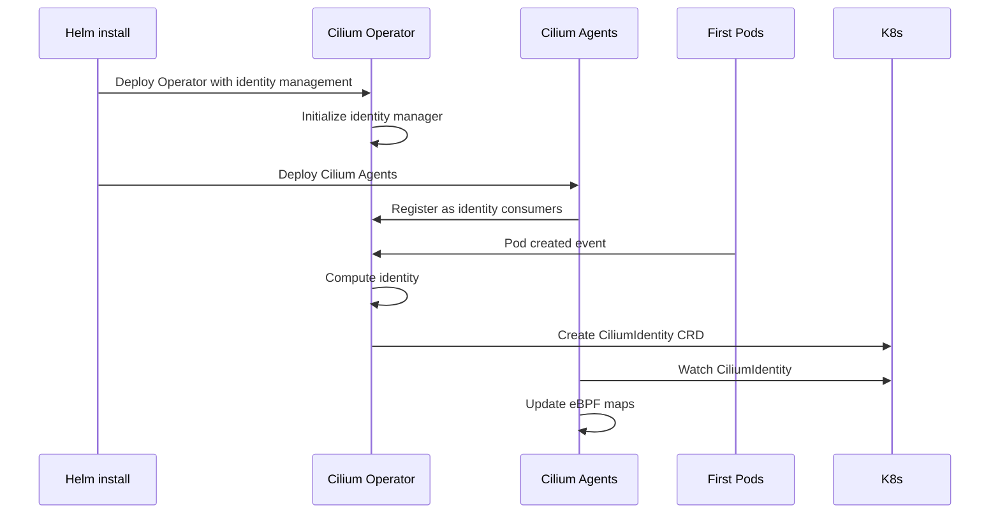

# Enable Operator Managing Identities on New Cluster

Author: [nawazdhandala](https://github.com/nawazdhandala)

Tags: Cilium, Kubernetes, Networking, eBPF, IPAM

Description: Step-by-step guide to deploying a new Cilium cluster with Operator-managed identity from the start, including optimal configuration, early validation, and monitoring setup.

---

## Introduction

When deploying a new Kubernetes cluster with Cilium, enabling Operator-managed identity from the very beginning is the cleanest approach - there is no existing identity state to migrate and no running workloads to disrupt. Starting with Operator-managed identities provides better scalability from day one and avoids the migration complexity required when enabling this feature on existing clusters.

Enabling this feature on a new cluster means configuring it in your initial Helm installation rather than as a post-deployment upgrade. The configuration is straightforward, but there are important considerations around Operator startup order, RBAC permissions, and ensuring the Operator is ready before the first workloads are scheduled. A properly configured new cluster with Operator-managed identities will require less operational attention as the cluster scales.

This guide provides the complete setup for Operator-managed identity on a fresh cluster installation, including configuration, early troubleshooting of installation issues, validation procedures, and initial monitoring setup.

## Prerequisites

- A new Kubernetes cluster (no Cilium installed yet)
- Helm 3.x with `cilium/cilium` repository added
- `kubectl` with cluster admin access
- Cilium CLI installed
- Understanding of Cilium identity concepts

## Configure Operator Identity on New Cluster

Install Cilium with Operator identity management enabled from the start:

```bash
# Add Cilium Helm repository
helm repo add cilium https://helm.cilium.io/
helm repo update

# Install Cilium with Operator identity management
helm install cilium cilium/cilium \
  --version 1.15.6 \
  --namespace kube-system \
  --create-namespace \
  --set identityAllocationMode=crd \
  --set operator.identityManagementEnabled=true \
  --set operator.identityGCInterval=15m \
  --set operator.identityHeartbeatTimeout=30m \
  --set ipam.mode=cluster-pool \
  --set ipam.operator.clusterPoolIPv4PodCIDRList="{10.244.0.0/16}" \
  --set ipam.operator.clusterPoolIPv4MaskSize=24 \
  --set prometheus.enabled=true \
  --set operator.prometheus.enabled=true

# Wait for Operator to be ready first (critical)
kubectl -n kube-system rollout status deploy/cilium-operator --timeout=5m

# Wait for all agents to be ready
kubectl -n kube-system rollout status ds/cilium --timeout=10m
```

Verify Operator is managing identities before scheduling workloads:

```bash
# Confirm Operator identity management is active
kubectl -n kube-system logs -l name=cilium-operator | grep "identity management"

# Check Operator RBAC is correct
kubectl get clusterrole cilium-operator -o yaml | grep ciliumidentities

# Initial state: should have no identities yet (empty cluster)
kubectl get ciliumidentities
# Expected: No resources found

# Verify configmap has correct settings
kubectl -n kube-system get configmap cilium-config \
  -o jsonpath='{.data.identity-allocation-mode}'
```

## Troubleshoot New Cluster Identity Setup

Diagnose issues during initial setup:

```bash
# Issue: Cilium agents starting before Operator is ready
# Symptom: No identities being created for initial workloads
kubectl -n kube-system get pods
kubectl -n kube-system logs ds/cilium | grep -i "waiting\|identity\|operator"

# Fix: Ensure Operator is deployed and ready before agents
kubectl -n kube-system rollout status deploy/cilium-operator

# Issue: RBAC insufficient for identity management
kubectl -n kube-system logs -l name=cilium-operator | grep "forbidden\|RBAC"
# Fix: Reinstall with correct RBAC
helm upgrade cilium cilium/cilium \
  --namespace kube-system \
  --reuse-values

# Issue: Operator crash loop during identity setup
kubectl -n kube-system describe pod -l name=cilium-operator
kubectl -n kube-system logs -l name=cilium-operator --previous

# Check resource constraints
kubectl -n kube-system top pods -l name=cilium-operator
```

## Validate Identity Management on New Cluster

Deploy test workloads and confirm identity lifecycle:

```bash
# Deploy initial workloads
kubectl apply -f - <<EOF
apiVersion: apps/v1
kind: Deployment
metadata:
  name: frontend
spec:
  replicas: 2
  selector:
    matchLabels:
      app: frontend
  template:
    metadata:
      labels:
        app: frontend
    spec:
      containers:
      - name: frontend
        image: nginx
---
apiVersion: apps/v1
kind: Deployment
metadata:
  name: backend
spec:
  replicas: 2
  selector:
    matchLabels:
      app: backend
  template:
    metadata:
      labels:
        app: backend
    spec:
      containers:
      - name: backend
        image: nginx
EOF

# Wait for pods
kubectl wait deployment frontend backend --for=condition=Available --timeout=60s

# Verify Operator created identities
kubectl get ciliumidentities
# Should show identities for frontend and backend labels

# Check identity labels match pod labels
kubectl get ciliumidentities -o json | \
  jq '.items[] | {id: .metadata.name, app: .["security-labels"]["k8s:app"]}'

# Verify all pods have endpoints with correct identities
kubectl -n kube-system exec ds/cilium -- cilium endpoint list

# Run connectivity test
cilium connectivity test
```

## Monitor Identity Management from Day One



Set up monitoring from day one:

```bash
# Establish baseline: identity count after initial workload deployment
kubectl get ciliumidentities --no-headers | wc -l

# Set up initial Prometheus queries
kubectl -n kube-system port-forward svc/cilium-operator 9963:9963 &

# Identity management health check
curl -s http://localhost:9963/metrics | grep -E "identity_gc|identity_count"

# Set up regular identity count tracking
cat > /tmp/identity-baseline.sh <<'EOF'
#!/bin/bash
echo "$(date): $(kubectl get ciliumidentities --no-headers | wc -l) identities"
kubectl get ciliumidentities --no-headers | awk '{print $1}' | sort > /tmp/identity-list-$(date +%Y%m%d).txt
EOF

# Create initial Prometheus alert for identity management
kubectl apply -f - <<EOF
apiVersion: monitoring.coreos.com/v1
kind: PrometheusRule
metadata:
  name: cilium-operator-identity
  namespace: kube-system
spec:
  groups:
  - name: cilium-operator-identity
    rules:
    - alert: CiliumOperatorIdentityManagementDown
      expr: absent(cilium_operator_identity_count)
      for: 5m
      labels:
        severity: critical
      annotations:
        summary: "Cilium Operator identity management metrics are missing"
EOF
```

## Conclusion

Starting a new cluster with Cilium Operator-managed identities sets you up for better scalability and operational simplicity as your cluster grows. The key difference from the migration path is that there is no existing identity state to reconcile - the Operator starts from a clean slate and manages all identities from the first pod. Ensure the Cilium Operator is deployed and healthy before your first workloads are scheduled to prevent race conditions during initial identity creation. The monitoring foundation established at cluster creation gives you early visibility into identity management health throughout the cluster's lifetime.
