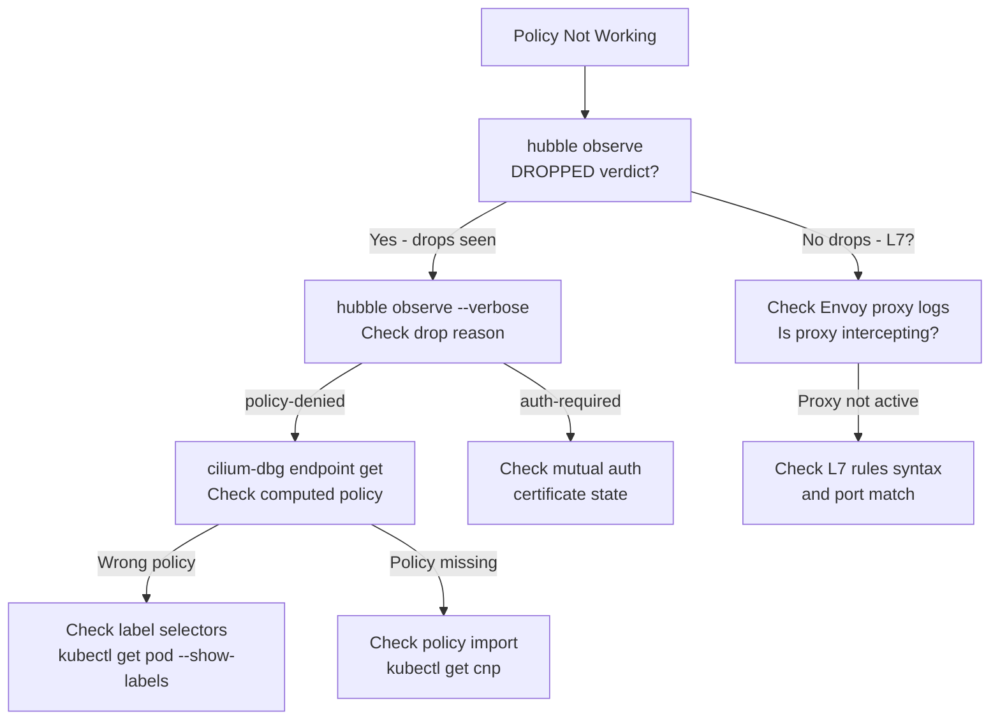

# Cilium Policy Troubleshooting

Author: [nawazdhandala](https://github.com/nawazdhandala)

Tags: Cilium, Kubernetes, Network Policy, Troubleshooting, eBPF

Description: Diagnose and resolve Cilium network policy issues including unexpected traffic drops, policy not applying to endpoints, and L7 policy enforcement failures.

---

## Introduction

Network policy troubleshooting in Cilium differs significantly from debugging iptables-based policies. You can't rely on `iptables -L` or parsing iptables rules - instead, Cilium policy is resolved by the agent and enforced with eBPF programs and policy maps keyed to endpoint identities. The good news is that Cilium provides much richer tooling for policy debugging: Hubble shows you policy verdicts for every flow, `cilium-dbg endpoint get` shows the computed policy for each pod, and `cilium-dbg monitor` captures detailed policy drop events with reason codes.

The most common policy troubleshooting scenarios are: pods that should be able to communicate but can't (missing allow rule), pods that can communicate when they shouldn't (overly broad allow rule), L7 rules that aren't applying (proxy not intercepting the traffic), and policy changes that aren't taking effect (stale endpoint state or policy revision mismatch). Each scenario requires a different diagnostic approach.

This guide provides a structured methodology for diagnosing each class of policy issue with specific commands and what to look for in the output.

## Prerequisites

- Cilium installed with Hubble enabled
- `kubectl` installed
- `hubble` CLI installed
- Policy YAML files for the policies being investigated

## Step 1: Identify if a Policy Drop is Occurring

```bash
# Watch for policy drops in real-time

hubble observe --verdict DROPPED --follow

# Look for drops between specific pods
hubble observe \
  --from-pod production/frontend \
  --to-pod production/backend \
  --verdict DROPPED \
  --follow

# Check drop reason in output
# "policy-denied" / "POLICY_DENIED" = no matching allow rule or a matching deny rule
# "auth-required" / "AUTH_REQUIRED" = Cilium mutual authentication is required
```

## Step 2: Check Endpoint Policy State

```bash
# Get the endpoint ID for the destination pod
kubectl exec -n kube-system cilium-xxxxx -- \
  cilium-dbg endpoint list | grep backend-pod-name

# Get the computed ingress policy for that endpoint
kubectl exec -n kube-system cilium-xxxxx -- \
  cilium-dbg endpoint get <id> --output json | \
  jq '.status.policy.realized.l4.ingress'
```

## Step 3: Verify Policy Import

```bash
# Check if policy was successfully imported
kubectl get ciliumnetworkpolicy -n production

# Check policy import errors
kubectl describe ciliumnetworkpolicy allow-frontend -n production

# Check Cilium agent logs for policy errors
kubectl logs -n kube-system cilium-xxxxx -c cilium-agent | grep -i "policy.*error\|import.*fail"

# Check the policy revision loaded by the local agent
kubectl exec -n kube-system cilium-xxxxx -- \
  cilium-dbg policy get | grep '^Revision:'
```

## Step 4: Check Label Selectors

```bash
# Verify source pod has the expected labels
kubectl get pod frontend-xxx -n production --show-labels

# Verify destination pod has the expected labels
kubectl get pod backend-xxx -n production --show-labels

# Simulate policy label matching
kubectl exec -n kube-system cilium-xxxxx -- \
  cilium-dbg endpoint list | grep -E "frontend|backend"

# Check Cilium endpoint identity labels
kubectl exec -n kube-system cilium-xxxxx -- \
  cilium-dbg identity get <identity-id>
```

## Step 5: Debug L7 Policy Issues

```bash
# Verify Envoy proxy support. By default, Envoy runs inside cilium-agent.
kubectl get pods -n kube-system -l k8s-app=cilium

# If standalone Envoy is enabled, verify the cilium-envoy DaemonSet pods
kubectl get pods -n kube-system -l app.kubernetes.io/name=cilium-envoy

# Check if Envoy has configured listeners for proxied traffic
kubectl exec -n kube-system cilium-xxxxx -- \
  cilium-dbg envoy admin listeners

# Check Cilium agent logs for L7/Envoy errors
kubectl logs -n kube-system cilium-xxxxx -c cilium-agent | grep -i "envoy\|proxy"

# If standalone Envoy is enabled, check Envoy proxy logs directly
kubectl logs -n kube-system cilium-envoy-xxxxx | tail -50

# For annotation-based L7 visibility, verify the proxy visibility annotation is set
kubectl get pod backend-xxx -n production -o yaml | grep -i proxy-visibility
```

## Step 6: Test Connectivity with curl/nc

```bash
# Test from the source pod directly
kubectl exec -n production frontend-xxx -- \
  curl -v http://backend:8080/api/health

# Test with nc for basic TCP connectivity
kubectl exec -n production frontend-xxx -- \
  nc -zv backend 8080

# Compare with what Hubble shows
hubble observe \
  --from-pod production/frontend-xxx \
  --to-pod production/backend-xxx \
  --last 10
```

## Policy Debug Flow


```mermaid
flowchart TD
    A[Policy Not Working] --> B[hubble observe\nDROPPED verdict?]
    B -->|Yes - drops seen| C[hubble observe --verbose\nCheck drop reason]
    B -->|No drops - L7?| D[Check Envoy proxy logs\nIs proxy intercepting?]
    C -->|policy-denied| E[cilium-dbg endpoint get\nCheck computed policy]
    C -->|auth-required| F[Check mutual auth\ncertificate state]
    E -->|Wrong policy| G[Check label selectors\nkubectl get pod --show-labels]
    E -->|Policy missing| H[Check policy import\nkubectl get cnp]
    D -->|Proxy not active| I[Check L7 rules syntax\nand port match]
```

## Conclusion

Cilium policy troubleshooting is most effective when approached in layers: first confirm whether traffic is dropping at all using Hubble's verdict filter, then inspect the computed policy on the destination endpoint, then trace back to the source of the policy mismatch - whether a label selector issue, a policy import failure, or a namespace scope problem. The `hubble observe --verdict DROPPED` command with `--from-pod` and `--to-pod` filters is the single most useful debugging command, as it shows you exactly what is being dropped and why.
