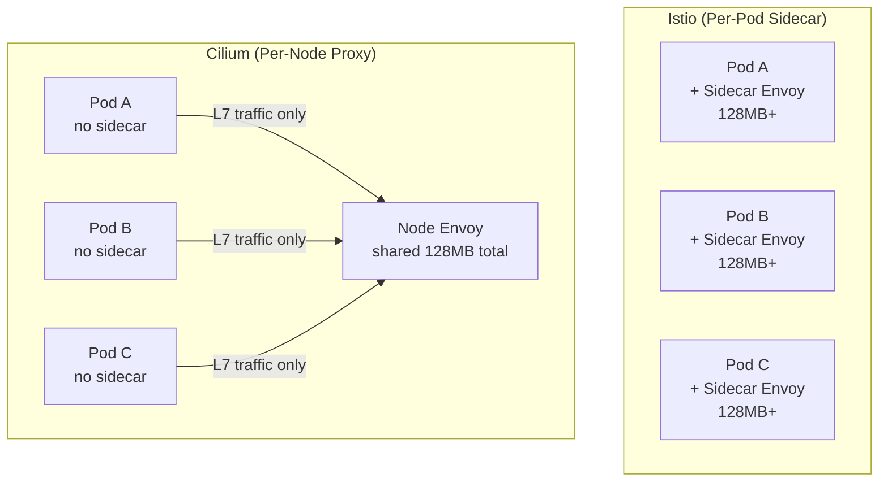

# Cilium Proxy Injection

Author: [nawazdhandala](https://github.com/nawazdhandala)

Tags: Cilium, Kubernetes, Service Mesh, Envoy, EBPF

Description: Understand how Cilium injects and manages a per-node Envoy proxy for L7 policy enforcement, contrasting with per-pod sidecar injection used by traditional service meshes.

---

## Introduction

When Cilium detects that an L7 policy (HTTP, gRPC, Kafka) applies to a pod, it needs a proxy to parse and enforce application-layer rules. Unlike Istio or Linkerd which inject a sidecar Envoy container into every pod that participates in the mesh, Cilium uses a single shared Envoy proxy per node. This shared proxy handles L7 traffic from all pods on that node, dramatically reducing resource consumption.

The proxy injection in Cilium is transparent and happens without adding any containers to your pod specifications. The Cilium DaemonSet manages the per-node Envoy instance, and eBPF programs in the kernel selectively redirect traffic to the proxy only when L7 policies exist for the connection. Pods without L7 policies bypass the proxy entirely, maintaining the performance characteristics of eBPF-only networking.

This guide explains the Cilium proxy injection model, how to configure it, how to verify proxy state, and how to troubleshoot proxy-related issues.

## Prerequisites

- Cilium v1.12+ with Envoy integration enabled
- `kubectl` installed
- `cilium` CLI installed
- At least one L7 CiliumNetworkPolicy applied

## Step 1: Enable Per-Node Envoy Proxy

```bash
helm upgrade cilium cilium/cilium \
  --namespace kube-system \
  --reuse-values \
  --set envoy.enabled=true \
  --set envoy.resources.requests.cpu=100m \
  --set envoy.resources.requests.memory=128Mi \
  --set envoy.resources.limits.cpu=500m \
  --set envoy.resources.limits.memory=512Mi
```

Verify the Envoy DaemonSet is running:

```bash
kubectl get daemonset -n kube-system cilium-envoy
kubectl get pods -n kube-system -l app.kubernetes.io/name=cilium-envoy
```

## Step 2: Verify Proxy is Active for L7 Policies

```bash
# Check if proxy visibility is configured for an endpoint
cilium endpoint list | grep -i proxy

# Get detailed proxy state for specific endpoint
cilium endpoint get <id> | grep -i proxy

# List active proxy redirects
cilium proxy list
```

## Step 3: Configure Visibility Annotations

Trigger L7 visibility for specific pods:

```bash
# Enable HTTP visibility for ingress on port 80
kubectl annotate pod my-pod \
  "policy.cilium.io/proxy-visibility"="+ingress:80/TCP/HTTP,+egress:80/TCP/HTTP"

# Enable for entire namespace
kubectl annotate namespace production \
  "policy.cilium.io/proxy-visibility"="+ingress:8080/TCP/HTTP"
```

## Step 4: Inspect Envoy Configuration

```bash
# Check Envoy admin interface on a node
kubectl port-forward -n kube-system cilium-envoy-xxxxx 9901:9901
curl -s http://localhost:9901/config_dump | jq '.configs[] | .["@type"]'

# Check Envoy listener configuration
curl -s http://localhost:9901/config_dump | jq '.configs[] | select(.["@type"] | contains("ListenersConfigDump"))'

# Check Envoy cluster (backend) configuration
curl -s http://localhost:9901/config_dump | jq '.configs[] | select(.["@type"] | contains("ClustersConfigDump"))'
```

## Step 5: Monitor Proxy Resource Usage

```bash
# Check Envoy resource consumption per node
kubectl top pod -n kube-system -l app.kubernetes.io/name=cilium-envoy

# View Envoy-specific metrics
kubectl port-forward -n kube-system cilium-envoy-xxxxx 9901:9901
curl -s http://localhost:9901/stats/prometheus | grep envoy_http
```

## Proxy Injection Model Comparison



## Conclusion

Cilium's per-node shared proxy model delivers L7 policy enforcement with significantly lower resource overhead than per-pod sidecar injection. A node with 20 pods needs one Envoy instance instead of 20, reducing memory consumption by roughly 20x for L7-capable deployments. eBPF selectively redirects only L7-policy-governed traffic to the proxy, leaving other traffic on the fast eBPF path. This architecture is particularly valuable in resource-constrained environments or at scale where sidecar overhead becomes a significant cluster cost.
