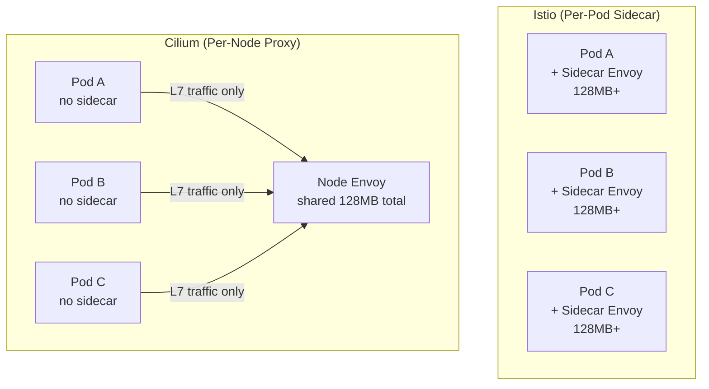

# Cilium Proxy Injection

Author: [nawazdhandala](https://github.com/nawazdhandala)

Tags: Cilium, Kubernetes, Service Mesh, Envoy, eBPF

Description: Understand how Cilium injects and manages a per-node Envoy proxy for L7 policy enforcement, contrasting with per-pod sidecar injection used by traditional service meshes.

---

## Introduction

When Cilium detects that an L7 policy (HTTP, DNS, Kafka) applies to a pod, it needs a proxy to parse and enforce application-layer rules. Unlike meshes which inject a sidecar proxy container into every pod that participates in the mesh, Cilium uses a node-local Envoy proxy. This shared proxy handles matching L7 traffic from pods on that node, dramatically reducing resource consumption.

The proxy injection in Cilium is transparent and happens without adding any containers to your pod specifications. Cilium can run Envoy as a process in the Cilium agent pod or as the dedicated `cilium-envoy` DaemonSet shown below, and eBPF programs in the kernel selectively redirect traffic to the proxy only when L7 policies exist for the connection. Pods without L7 policies bypass the proxy entirely, maintaining the performance characteristics of eBPF-only networking.

This guide explains the Cilium proxy injection model, how to configure it, how to verify proxy state, and how to troubleshoot proxy-related issues.

## Prerequisites

- Cilium with L7 proxy support enabled
- `kubectl` installed
- Access to the `cilium-dbg` CLI inside Cilium agent pods
- At least one L7 CiliumNetworkPolicy applied

## Step 1: Enable Per-Node Envoy Proxy

```bash
helm upgrade cilium cilium/cilium \
  --namespace kube-system \
  --reuse-values \
  --set envoy.enabled=true \
  --set envoy.resources.requests.cpu=100m \
  --set envoy.resources.requests.memory=128Mi \
  --set envoy.resources.limits.cpu=500m \
  --set envoy.resources.limits.memory=512Mi
```

Verify the Envoy DaemonSet is running:

```bash
kubectl get daemonset -n kube-system cilium-envoy
kubectl get pods -n kube-system -l k8s-app=cilium-envoy
```

## Step 2: Verify Proxy is Active for L7 Policies

```bash
# Pick a Cilium agent pod on the node you want to inspect
CILIUM_POD=$(kubectl get pods -n kube-system -l k8s-app=cilium -o jsonpath='{.items[0].metadata.name}')

# List local endpoints managed by that agent
kubectl exec -n kube-system "$CILIUM_POD" -- cilium-dbg endpoint list

# Get detailed policy state for a specific local endpoint
kubectl exec -n kube-system "$CILIUM_POD" -- cilium-dbg endpoint get <id> \
  -o jsonpath='{.status.policy.realized.l4}'

# List configured Envoy listeners
kubectl exec -n kube-system "$CILIUM_POD" -- cilium-dbg envoy admin listeners
```

## Step 3: Configure L7 Visibility Policy

Trigger L7 visibility with a CiliumNetworkPolicy:

```bash
kubectl apply -f - <<'EOF'
apiVersion: "cilium.io/v2"
kind: CiliumNetworkPolicy
metadata:
  name: "http-l7-visibility"
  namespace: production
spec:
  endpointSelector: {}
  egress:
  - toEndpoints:
    - matchLabels:
        "k8s:io.kubernetes.pod.namespace": production
    toPorts:
    - ports:
      - port: "80"
        protocol: TCP
      rules:
        http: [{}]
EOF
```

## Step 4: Inspect Envoy Configuration

```bash
# Check Envoy configuration through the Cilium debug CLI
kubectl exec -n kube-system "$CILIUM_POD" -- cilium-dbg envoy admin config

# Check Envoy listener configuration
kubectl exec -n kube-system "$CILIUM_POD" -- cilium-dbg envoy admin config listeners

# Check Envoy cluster configuration
kubectl exec -n kube-system "$CILIUM_POD" -- cilium-dbg envoy admin config clusters
```

## Step 5: Monitor Proxy Resource Usage

```bash
# Check Envoy resource consumption per node
kubectl top pod -n kube-system -l k8s-app=cilium-envoy

# View Envoy-specific metrics
kubectl exec -n kube-system "$CILIUM_POD" -- cilium-dbg envoy admin metrics --filter envoy_http
```

## Proxy Injection Model Comparison


```mermaid
flowchart TD
    subgraph Istio["Istio (Per-Pod Sidecar)"]
        A1[Pod A\n+ Sidecar Envoy\n128MB+]
        B1[Pod B\n+ Sidecar Envoy\n128MB+]
        C1[Pod C\n+ Sidecar Envoy\n128MB+]
    end
    subgraph Cilium["Cilium (Per-Node Proxy)"]
        A2[Pod A\nno sidecar]
        B2[Pod B\nno sidecar]
        C2[Pod C\nno sidecar]
        ENV[Node Envoy\nshared 128MB total]
        A2 -->|L7 traffic only| ENV
        B2 -->|L7 traffic only| ENV
        C2 -->|L7 traffic only| ENV
    end
```

## Conclusion

Cilium's per-node shared proxy model delivers L7 policy enforcement with significantly lower resource overhead than per-pod sidecar injection. A node with 20 pods needs one Envoy instance instead of 20, reducing memory consumption by roughly 20x for L7-capable deployments. eBPF selectively redirects only L7-policy-governed traffic to the proxy, leaving other traffic on the fast eBPF path. This architecture is particularly valuable in resource-constrained environments or at scale where sidecar overhead becomes a significant cluster cost.
