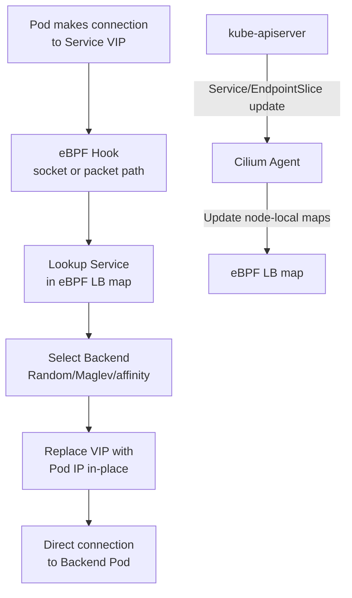

# Service Endpoints in Cilium

Author: [nawazdhandala](https://github.com/nawazdhandala)

Tags: Cilium, Kubernetes, Networking, eBPF, Service

Description: Understand how Cilium manages Kubernetes service endpoints using eBPF maps, replacing kube-proxy for load balancing and connection tracking at kernel speed.

---

## Introduction

Kubernetes services traditionally rely on kube-proxy to manage iptables rules that load balance traffic across pod endpoints. As clusters scale to thousands of services and tens of thousands of endpoints, kube-proxy's iptables approach can create performance bottlenecks: packet traversal depends on the programmed iptables chains, and large service or endpoint changes require kube-proxy to resync rules across nodes.

Cilium can replace kube-proxy using eBPF maps for service endpoint management. eBPF maps provide constant-time service lookups regardless of cluster size, while backend selection is handled by Cilium's load-balancing logic. When a pod is added or removed, Cilium updates the relevant eBPF map entries on each node, not an iptables rule set. This architecture also enables features such as per-service load balancing algorithms, topology-aware routing, and Kubernetes session affinity using Cilium's eBPF load-balancer state.

This guide explains how Cilium manages service endpoints, how to inspect the endpoint state, and how to troubleshoot endpoint-related connectivity issues.

## Prerequisites

- Cilium with kube-proxy replacement enabled
- `loadBalancer.serviceTopology=true` if you want Cilium to honor topology-aware routing hints
- `kubectl` installed
- Access to a Cilium agent pod with `cilium-dbg`

## Step 1: Check Service Endpoint State

```bash
# List all services Cilium is managing

kubectl exec -n kube-system ds/cilium -- cilium-dbg service list

# Filter the service list for a specific ClusterIP or service port
kubectl exec -n kube-system ds/cilium -- \
  cilium-dbg service list | grep "10.96.0.1"

# Show load balancing backends
kubectl exec -n kube-system ds/cilium -- cilium-dbg bpf lb list
```

## Step 2: Inspect eBPF Load Balancer Maps

```bash
# List all load balancer service entries
kubectl exec -n kube-system ds/cilium -- cilium-dbg bpf lb list --frontends

# List all backend endpoints
kubectl exec -n kube-system ds/cilium -- cilium-dbg bpf lb list --backends

# Inspect a specific service entry
kubectl exec -n kube-system ds/cilium -- \
  cilium-dbg bpf lb list | grep "10.96.0.1"
```

## Step 3: Verify Endpoint Health

```bash
# List all endpoints and their state
kubectl exec -n kube-system ds/cilium -- cilium-dbg endpoint list

# Get detailed endpoint information
kubectl exec -n kube-system ds/cilium -- cilium-dbg endpoint get <endpoint-id>

# View health for a specific endpoint
kubectl exec -n kube-system ds/cilium -- cilium-dbg endpoint health <endpoint-id>

# Check endpoint policy enforcement state
kubectl exec -n kube-system ds/cilium -- \
  cilium-dbg endpoint list | grep -E "ID|POLICY|STATE"
```

## Step 4: Service Topology Awareness

Configure topology-aware routing to prefer same-zone endpoints:

```yaml
apiVersion: v1
kind: Service
metadata:
  name: web-service
  annotations:
    service.kubernetes.io/topology-mode: auto
spec:
  selector:
    app: web
  ports:
    - port: 80
      targetPort: 8080
```

## Step 5: Session Affinity Configuration

```yaml
apiVersion: v1
kind: Service
metadata:
  name: stateful-service
spec:
  selector:
    app: stateful
  sessionAffinity: ClientIP
  sessionAffinityConfig:
    clientIP:
      timeoutSeconds: 3600
  ports:
    - port: 8080
```

Verify session affinity in Cilium:

```bash
# Check session affinity configuration
kubectl exec -n kube-system ds/cilium -- \
  cilium-dbg service list | grep "8080"

# Verify connections are going to same backend
for i in {1..5}; do
  kubectl exec test-pod -- curl -s http://stateful-service:8080/whoami
done
```

## Service Endpoint Architecture



## Conclusion

Cilium's eBPF-based service endpoint management provides constant-time service lookups, eliminates the kube-proxy iptables bottleneck, and enables advanced features like topology-aware routing and efficient session affinity. The `cilium-dbg service list` and `cilium-dbg bpf lb list` commands give you direct visibility into how Cilium is handling your service traffic, which is invaluable for debugging connectivity issues that standard Kubernetes tools cannot expose.
