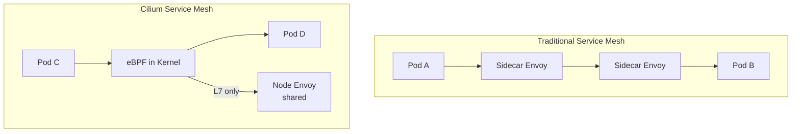

# Introduction to Cilium Service Mesh

Author: [nawazdhandala](https://github.com/nawazdhandala)

Tags: Cilium, Kubernetes, Service Mesh, EBPF, Networking

Description: Learn how Cilium Service Mesh replaces sidecar-based meshes with eBPF-powered L7 visibility, mTLS, and traffic management without injecting proxy containers into every pod.

---

## Introduction

Traditional service meshes like Istio and Linkerd operate by injecting a sidecar proxy (usually Envoy) into every pod. While effective, this approach adds per-pod resource overhead, increases latency due to the extra network hops through the sidecar, and complicates troubleshooting by introducing another process in the data path. Cilium Service Mesh takes a fundamentally different approach: eBPF programs running in the Linux kernel handle most traffic management tasks without any sidecar injection.

Cilium Service Mesh builds on the same eBPF foundation as Cilium's base networking. For L3/L4 policies and visibility, no proxy is needed at all - eBPF handles everything in the kernel. For L7 features like HTTP header manipulation, gRPC load balancing, and mTLS termination, Cilium injects a per-node Envoy proxy shared across all pods on the node, dramatically reducing the resource overhead compared to per-pod sidecars.

The result is a service mesh with the observability and security features of Istio at a fraction of the CPU and memory cost, with lower latency and simpler architecture. This guide introduces Cilium Service Mesh, its architecture, and how to enable its key features.

## Prerequisites

- Cilium v1.12+ installed in the cluster
- `cilium` CLI installed
- Helm v3+
- Basic understanding of Kubernetes Services

## Step 1: Enable Cilium Service Mesh Features

```bash
helm upgrade cilium cilium/cilium \
  --namespace kube-system \
  --reuse-values \
  --set envoy.enabled=true \
  --set envoyConfig.enabled=true \
  --set ingressController.enabled=true \
  --set ingressController.default=true
```

## Step 2: Verify Service Mesh Components

```bash
# Check Cilium Envoy DaemonSet
kubectl get daemonset -n kube-system cilium-envoy

# Verify Cilium agents report service mesh ready
cilium status | grep -i "service mesh\|envoy"

# Check CiliumEnvoyConfig CRD is available
kubectl get crd | grep envoy
```

## Step 3: Enable L7 Visibility for a Namespace

```bash
# Annotate namespace for L7 visibility
kubectl annotate namespace default \
  "policy.cilium.io/proxy-visibility"="+ingress:80/TCP/HTTP,+egress:80/TCP/HTTP"

# Verify Hubble sees L7 flows
cilium hubble enable
hubble observe --namespace default --type l7
```

## Step 4: Create a Basic CiliumNetworkPolicy with L7

```yaml
apiVersion: cilium.io/v2
kind: CiliumNetworkPolicy
metadata:
  name: allow-http-get-only
  namespace: default
spec:
  endpointSelector:
    matchLabels:
      app: backend
  ingress:
    - fromEndpoints:
        - matchLabels:
            app: frontend
      toPorts:
        - ports:
            - port: "80"
              protocol: TCP
          rules:
            http:
              - method: GET
                path: "/api/.*"
```

## Architecture Comparison



## Conclusion

Cilium Service Mesh delivers the core capabilities of a traditional service mesh - L7 traffic management, mutual TLS, and rich observability - using eBPF to avoid the overhead of per-pod sidecars. For most L3/L4 use cases, no proxy is involved at all. The per-node shared Envoy proxy handles L7 cases with far less resource overhead than per-pod injection. This architecture makes Cilium Service Mesh an excellent choice for performance-sensitive applications and resource-constrained clusters.
