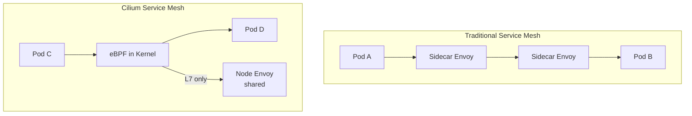

# Introduction to Cilium Service Mesh

Author: [nawazdhandala](https://github.com/nawazdhandala)

Tags: Cilium, Kubernetes, Service Mesh, eBPF, Networking

Description: Learn how Cilium Service Mesh replaces sidecar-based meshes with eBPF-powered L7 visibility, mTLS, and traffic management without injecting proxy containers into every pod.

---

## Introduction

Traditional service meshes like Istio sidecar mode and Linkerd operate by injecting a sidecar proxy into every pod. While effective, this approach adds per-pod resource overhead, increases latency due to the extra network hops through the sidecar, and complicates troubleshooting by introducing another process in the data path. Cilium Service Mesh takes a fundamentally different approach: eBPF programs running in the Linux kernel handle networking, policy, and visibility without any sidecar injection.

Cilium Service Mesh builds on the same eBPF foundation as Cilium's base networking. For L3/L4 policies and visibility, no proxy is needed at all - eBPF handles these functions in the kernel. For L7 features like HTTP header manipulation, gRPC-aware traffic management, and protocol visibility, Cilium uses Envoy as a per-node proxy shared across pods on the node, dramatically reducing the resource overhead compared to per-pod sidecars.

The result is a service mesh with rich observability and security features at lower proxy overhead, with lower latency and simpler architecture for many workloads. This guide introduces Cilium Service Mesh, its architecture, and how to enable its key features.

## Prerequisites

- A current Cilium release installed in the cluster
- `cilium` CLI installed
- Helm v3+
- Basic understanding of Kubernetes Services

## Step 1: Enable Cilium Service Mesh Features

```bash
helm upgrade cilium cilium/cilium \
  --namespace kube-system \
  --reuse-values \
  --set envoy.enabled=true \
  --set envoyConfig.enabled=true \
  --set ingressController.enabled=true \
  --set ingressController.default=true

kubectl -n kube-system rollout restart deployment/cilium-operator
kubectl -n kube-system rollout restart ds/cilium
```

## Step 2: Verify Service Mesh Components

```bash
# Check Cilium Envoy DaemonSet

kubectl get daemonset -n kube-system cilium-envoy

# Verify Cilium agents report service mesh ready
cilium status | grep -i "service mesh\|envoy"

# Check CiliumEnvoyConfig CRD is available
kubectl get crd | grep envoy
```

## Step 3: Enable L7 Visibility with a Policy

```yaml
apiVersion: cilium.io/v2
kind: CiliumNetworkPolicy
metadata:
  name: l7-visibility
  namespace: default
spec:
  endpointSelector:
    matchLabels:
      "k8s:io.kubernetes.pod.namespace": default
  egress:
    - toEndpoints:
        - matchLabels:
            "k8s:io.kubernetes.pod.namespace": default
      toPorts:
        - ports:
            - port: "80"
              protocol: TCP
          rules:
            http: [{}]
```

```bash
kubectl apply -f l7-visibility.yaml
hubble observe --namespace default -t l7
```

## Step 4: Create a Basic CiliumNetworkPolicy with L7

```yaml
apiVersion: cilium.io/v2
kind: CiliumNetworkPolicy
metadata:
  name: allow-http-get-only
  namespace: default
spec:
  endpointSelector:
    matchLabels:
      app: backend
  ingress:
    - fromEndpoints:
        - matchLabels:
            app: frontend
      toPorts:
        - ports:
            - port: "80"
              protocol: TCP
          rules:
            http:
              - method: GET
                path: "/api/.*"
```

## Architecture Comparison


```mermaid
flowchart TD
    subgraph Traditional["Traditional Service Mesh"]
        A[Pod A] --> SA[Sidecar Envoy]
        SA --> SB[Sidecar Envoy]
        SB --> B[Pod B]
    end
    subgraph Cilium["Cilium Service Mesh"]
        C[Pod C] --> E[eBPF in Kernel]
        E --> D[Pod D]
        E -->|L7 only| ENV[Node Envoy\nshared]
    end
```

## Conclusion

Cilium Service Mesh delivers the core capabilities of a traditional service mesh - L7 traffic management, mutual authentication, and rich observability - using eBPF to avoid the overhead of per-pod sidecars. For most L3/L4 use cases, no proxy is involved at all. The per-node shared Envoy proxy handles L7 cases with far less resource overhead than per-pod injection. This architecture makes Cilium Service Mesh an excellent choice for performance-sensitive applications and resource-constrained clusters.
