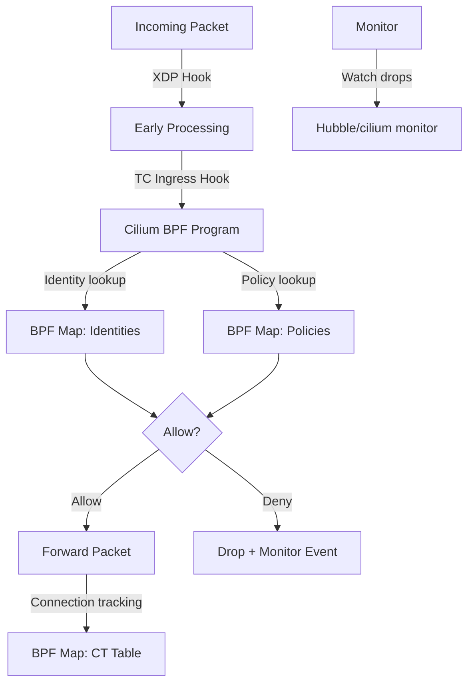

# Cilium Technical Deep Dive: Configure, Troubleshoot, Validate, and Monitor

Author: [nawazdhandala](https://github.com/nawazdhandala)

Tags: Cilium, Kubernetes, Networking, EBPF, IPAM

Description: A technical deep dive into Cilium's internals including the eBPF datapath architecture, identity-based security model, XDP acceleration, and kernel-level packet processing for advanced Kubernetes...

---

## Introduction

Cilium's technical architecture represents a fundamentally different approach to Kubernetes networking compared to traditional iptables-based CNI plugins. By compiling network policy logic directly into eBPF programs that run in the Linux kernel, Cilium achieves policy enforcement at line rate without traversing the full kernel networking stack. Understanding these internals helps operators make better architectural decisions, tune performance parameters, and diagnose complex networking issues that surface at the eBPF level.

At the core of Cilium's architecture are several key technical components: the per-endpoint eBPF programs attached to each virtual ethernet interface (veth pair), the shared eBPF maps that provide O(1) policy lookup, the XDP programs for early packet processing before kernel overhead, the BPF tail calls that implement policy chaining, and the Cilium monitor for per-packet eBPF event observation. Each of these components has specific performance characteristics and failure modes.

This guide explores the technical architecture through the lens of operational concerns: how to configure eBPF components, diagnose kernel-level issues, validate datapath behavior, and monitor eBPF program health.

## Prerequisites

- Cilium installed on Linux 5.10+ nodes
- `kubectl` with cluster admin access
- Familiarity with Linux networking fundamentals (veth, tc, XDP)
- Basic eBPF knowledge is helpful but not required

## Configure eBPF Datapath Components

Configure key eBPF components:

```bash
# Configure BPF map sizes (affects max connections/endpoints)
helm upgrade cilium cilium/cilium \
  --namespace kube-system \
  --reuse-values \
  --set bpf.mapDynamicSizeRatio=0.005 \
  --set bpf.preallocateMaps=true \
  --set bpf.ctTcpMax=524288 \
  --set bpf.ctAnyMax=262144

# Configure eBPF host routing (requires kernel 5.10+)
helm upgrade cilium cilium/cilium \
  --namespace kube-system \
  --reuse-values \
  --set bpf.hostLegacyRouting=false

# Enable XDP acceleration (requires compatible NIC driver)
helm upgrade cilium cilium/cilium \
  --namespace kube-system \
  --reuse-values \
  --set loadBalancer.acceleration=native

# Configure monitor aggregation to reduce overhead
helm upgrade cilium cilium/cilium \
  --namespace kube-system \
  --reuse-values \
  --set monitorAggregation=medium \
  --set monitorAggregationInterval=5s \
  --set monitorAggregationFlags=all
```

Inspect eBPF programs and maps:

```bash
# List eBPF programs loaded by Cilium
kubectl -n kube-system exec ds/cilium -- cilium bpf perf list

# View eBPF maps and their usage
kubectl -n kube-system exec ds/cilium -- cilium bpf ct list global | head -10
kubectl -n kube-system exec ds/cilium -- cilium bpf lb list
kubectl -n kube-system exec ds/cilium -- cilium bpf policy get --all

# Check BPF map utilization
kubectl -n kube-system exec ds/cilium -- cilium bpf map list
```

## Troubleshoot eBPF Datapath Issues

Diagnose kernel-level and eBPF problems:

```bash
# Check for eBPF program load failures
kubectl -n kube-system logs ds/cilium | grep -i "bpf\|ebpf\|prog\|load\|fail"

# Diagnose BPF map pressure
kubectl -n kube-system exec ds/cilium -- \
  cilium bpf ct list global 2>&1 | tail -5

# Check for eBPF tail call chain issues
kubectl -n kube-system exec ds/cilium -- \
  cilium monitor --type policy-verdict --hex 2>/dev/null | head -20

# Diagnose XDP issues
kubectl debug node/<node-name> -it --image=ubuntu -- \
  bpftool net show 2>/dev/null | grep xdp

# Check kernel support for Cilium features
kubectl -n kube-system exec ds/cilium -- \
  cilium status --verbose | grep -E "BPF|kube-proxy|XDP"

# Look for BPF verifier errors (indicates kernel/program incompatibility)
kubectl -n kube-system logs ds/cilium | grep -i "verif\|invalid prog\|permission denied"
```

Advanced eBPF debugging:

```bash
# Enable per-packet debugging (very verbose - use sparingly)
kubectl -n kube-system exec ds/cilium -- \
  cilium monitor --type debug

# Trace specific packet flow
kubectl -n kube-system exec ds/cilium -- \
  cilium monitor --type trace -f | grep <pod-ip>

# Check BPF CT table for connection state
kubectl -n kube-system exec ds/cilium -- \
  cilium bpf ct list global | grep <pod-ip>

# Check BPF policy verdict for specific endpoints
kubectl -n kube-system exec ds/cilium -- \
  cilium monitor --type policy-verdict | grep -i "allow\|deny"
```

## Validate eBPF Datapath

Confirm the eBPF datapath is correctly programmed:

```bash
# Verify eBPF programs are attached to all endpoints
kubectl -n kube-system exec ds/cilium -- \
  cilium endpoint list --no-headers | awk '{print $1}' | while read ep_id; do
    STATUS=$(kubectl -n kube-system exec ds/cilium -- \
      cilium endpoint get $ep_id | jq -r '.status.state')
    echo "Endpoint $ep_id: $STATUS"
  done

# Verify policy is compiled into eBPF (not just configured)
kubectl -n kube-system exec ds/cilium -- \
  cilium bpf policy get <endpoint-id>

# Test eBPF datapath with connectivity test
cilium connectivity test

# Verify XDP is active on appropriate interfaces
kubectl debug node/<node-name> -it --image=ubuntu -- \
  ip link show | grep "xdp"

# Check BPF tail call map is populated
kubectl -n kube-system exec ds/cilium -- \
  bpftool map list 2>/dev/null | grep cilium
```

## Monitor eBPF Datapath Health



Monitor eBPF program and map health:

```bash
# Monitor BPF map pressure
kubectl -n kube-system exec ds/cilium -- \
  cilium monitor --type trace 2>/dev/null | grep "MAX ENTRIES" | head -5

# Key eBPF performance metrics
kubectl -n kube-system port-forward ds/cilium 9962:9962 &
curl -s http://localhost:9962/metrics | grep -E "bpf_map|cilium_policy_verdict|cilium_drop"

# PromQL queries for eBPF health
# rate(cilium_drop_count_total[5m]) by (reason) - drop reasons
# cilium_endpoint_count - total eBPF-managed endpoints
# cilium_bpf_map_pressure - eBPF map utilization

# Watch for BPF OOM events (map too small)
kubectl -n kube-system logs ds/cilium --since=1h | \
  grep -i "map full\|ENOMEM\|too many entries"
```

## Conclusion

Cilium's eBPF-based datapath provides kernel-native packet processing that surpasses what's possible with iptables-based approaches. The direct compilation of network policies into eBPF programs eliminates the per-packet overhead of traversing iptables chains, while shared eBPF maps provide O(1) identity and policy lookups. Monitoring BPF map utilization, verifier errors, and XDP program attachment status gives visibility into the health of the kernel-level networking implementation. For most operational teams, the `cilium monitor` tool and Hubble provide sufficient eBPF visibility without needing to interact with raw bpftool commands.
