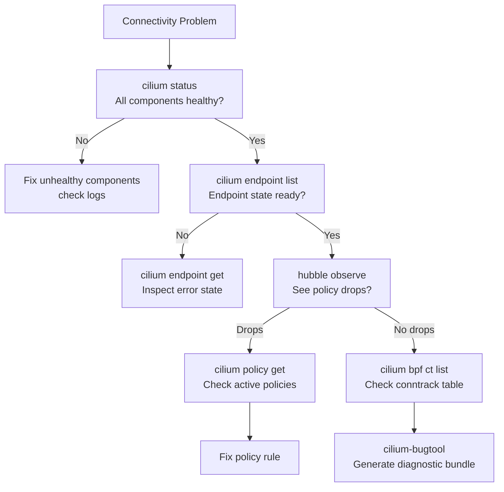

# Cilium Troubleshooting Tools

Author: [nawazdhandala](https://github.com/nawazdhandala)

Tags: Cilium, Kubernetes, Troubleshooting, eBPF, Networking

Description: Master Cilium's built-in troubleshooting toolkit including cilium-bugtool, connectivity tests, endpoint inspection commands, and BPF map inspection to diagnose networking issues.

---

## Introduction

Cilium provides a comprehensive set of built-in troubleshooting tools that leverage its eBPF data plane to expose information that is impossible to obtain with traditional networking tools. When a pod can't connect to a service, `traceroute` and `tcpdump` give you incomplete answers because they operate outside the kernel eBPF context where Cilium does its work. Cilium's own tools can tell you exactly which eBPF program is handling the packet, what policy decision was made, and which BPF map entry caused a drop.

The key troubleshooting commands are: `cilium status` for overall health, `cilium endpoint list` and `cilium endpoint get` for per-pod state, `cilium policy get` for verifying what policies are active, `cilium bpf` subcommands for inspecting the eBPF maps directly, and `cilium-bugtool` for generating a comprehensive diagnostic bundle to share with support. Together these tools give you visibility into every layer of the Cilium data plane.

This guide provides a systematic troubleshooting workflow using Cilium's native tools, covering connectivity issues, policy problems, and data plane anomalies.

## Prerequisites

- Cilium installed and running
- `cilium` CLI and `kubectl` installed
- `hubble` CLI for flow observation

## Step 1: Overall Health Check

```bash
# Comprehensive status including component health
cilium status --verbose

# Check all Cilium pods are healthy
kubectl get pods -n kube-system -l k8s-app=cilium

# Check for Cilium-level errors
kubectl logs -n kube-system -l k8s-app=cilium --since=10m | grep -i error
```

## Step 2: Endpoint Inspection

```bash
# List all endpoints with their state
cilium endpoint list

# Key states:
# ready      - endpoint fully configured
# waiting-for-identity - identity not yet assigned
# disconnecting - pod is terminating
# not-ready  - configuration error

# Get detailed info for a specific endpoint
cilium endpoint get <endpoint-id>

# Get endpoint info by pod name
kubectl exec -n kube-system cilium-xxxxx -- \
  cilium endpoint list | grep <pod-name>
```

## Step 3: Run Connectivity Tests

```bash
# Full connectivity test suite
cilium connectivity test

# Quick connectivity test
cilium connectivity test --test-namespace cilium-test --request-timeout 30s

# Test specific scenarios
cilium connectivity test \
  --include-conn-disrupt-test \
  --junit-file /tmp/cilium-test-results.xml
```

## Step 4: Policy Inspection

```bash
# List all active policies
kubectl exec -n kube-system cilium-xxxxx -- cilium policy get

# Get policy for a specific endpoint
kubectl exec -n kube-system cilium-xxxxx -- \
  cilium endpoint get <id> | grep -A 20 "policy"

# Check policy revision
kubectl exec -n kube-system cilium-xxxxx -- \
  cilium policy get --revision
```

## Step 5: BPF Map Inspection

```bash
# List all BPF maps
kubectl exec -n kube-system cilium-xxxxx -- cilium bpf list

# Check conntrack table
kubectl exec -n kube-system cilium-xxxxx -- cilium bpf ct list global

# Check NAT table
kubectl exec -n kube-system cilium-xxxxx -- cilium bpf nat list

# Check load balancer state
kubectl exec -n kube-system cilium-xxxxx -- cilium bpf lb list

# Check policy maps for an endpoint
kubectl exec -n kube-system cilium-xxxxx -- \
  cilium bpf policy get <endpoint-id>
```

## Step 6: Generate Bug Report

```bash
# Generate comprehensive diagnostic bundle
kubectl exec -n kube-system cilium-xxxxx -- cilium-bugtool

# Copy the bundle from the pod
POD=$(kubectl get pods -n kube-system -l k8s-app=cilium -o name | head -1)
kubectl cp kube-system/${POD##*/}:/tmp/cilium-bugtool-*.tar.gz ./cilium-bugtool.tar.gz

# Inspect the bundle
tar xzvf cilium-bugtool.tar.gz
ls cilium-bugtool-*/
```

## Troubleshooting Decision Tree



## Conclusion

Cilium's troubleshooting tools provide a complete diagnostic suite that exposes the eBPF data plane state that traditional networking tools cannot see. Start every investigation with `cilium status` and `cilium endpoint list` to establish baseline health, then use `hubble observe` to see real-time flow events before diving into BPF map inspection with `cilium bpf` commands. For difficult-to-reproduce issues, `cilium-bugtool` generates a comprehensive diagnostic bundle containing all state needed for root cause analysis without requiring live access to the cluster.
