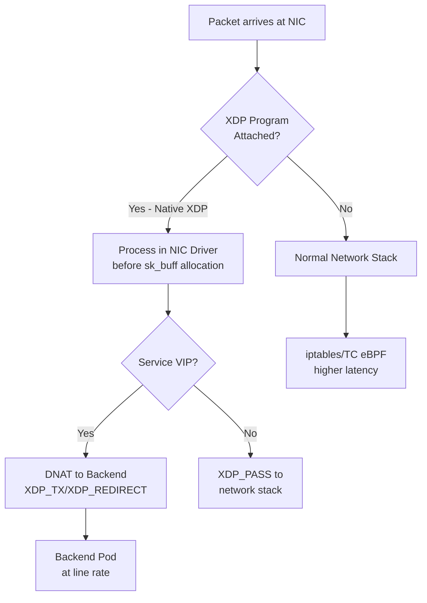

# Cilium XDP Acceleration

Author: [nawazdhandala](https://github.com/nawazdhandala)

Tags: Cilium, Kubernetes, XDP, eBPF, Networking

Description: Enable Cilium XDP acceleration to process network packets at the driver level before they enter the Linux network stack, achieving maximum throughput for Kubernetes service load balancing.

---

## Introduction

XDP (eXpress Data Path) is the fastest eBPF attachment point available in Linux — programs run directly in the NIC driver context, processing packets before they are allocated as kernel `sk_buff` structures and before they enter the network stack. This dramatically reduces per-packet CPU overhead and enables line-rate packet processing even on standard server hardware.

Cilium leverages XDP for its service load balancing implementation. When XDP acceleration is enabled, NodePort and LoadBalancer traffic is processed at the driver level by an eBPF program that performs the service VIP-to-backend IP translation and packet forwarding without any conventional network stack involvement. For traffic-intensive services like API gateways, proxies, or streaming endpoints, XDP can double or triple the achievable throughput compared to TC eBPF alone.

This guide covers enabling Cilium XDP acceleration, verifying it is active on the right network interfaces, and benchmarking the performance improvement.

## Prerequisites

- Cilium v1.10+ with kube-proxy replacement enabled
- Linux kernel 5.4+ (5.10+ recommended for native XDP)
- NIC with XDP driver support (Intel, Mellanox, Broadcom mainstream cards)
- `kubectl` and `cilium` CLI installed

## Step 1: Check NIC XDP Support

```bash
# Check if NIC supports native XDP
kubectl debug node/worker-0 -it --image=nicolaka/netshoot

# Inside node debug pod:
ethtool -i eth0 | grep driver
# Intel: i40e, ixgbe support native XDP
# Mellanox: mlx5_core supports native XDP

# Check kernel XDP support
uname -r  # 5.4+ required
```

## Step 2: Enable XDP Acceleration in Cilium

```bash
helm upgrade cilium cilium/cilium \
  --namespace kube-system \
  --reuse-values \
  --set loadBalancer.acceleration=native \
  --set loadBalancer.mode=dsr \
  --set kubeProxyReplacement=true
```

For NICs without native XDP support, use generic mode:

```bash
helm upgrade cilium cilium/cilium \
  --namespace kube-system \
  --reuse-values \
  --set loadBalancer.acceleration=generic
```

## Step 3: Verify XDP Program Attachment

```bash
# Check XDP program is attached to the NIC
kubectl exec -n kube-system cilium-xxxxx -- ip link show eth0 | grep xdp

# Verify Cilium reports XDP acceleration active
cilium status | grep -i "xdp\|acceleration"

# Check XDP statistics
kubectl exec -n kube-system cilium-xxxxx -- \
  cilium bpf lb list | grep -i xdp
```

## Step 4: Check XDP Program Statistics

```bash
# View XDP program statistics per interface
kubectl exec -n kube-system cilium-xxxxx -- \
  cilium bpf lb stats

# Check kernel XDP statistics
kubectl debug node/worker-0 -it --image=nicolaka/netshoot -- \
  xdp_rxq_info --dev eth0 --action XDP_PASS
```

## Step 5: Benchmark XDP vs TC Performance

```bash
# Install iperf3 in test pods
kubectl run server --image=nicolaka/netshoot -- iperf3 -s
kubectl run client --image=nicolaka/netshoot

# Benchmark without XDP (disable temporarily)
kubectl exec client -- iperf3 -c server-ip -t 30

# Enable XDP and re-benchmark
# helm upgrade... --set loadBalancer.acceleration=native
kubectl exec client -- iperf3 -c server-ip -t 30

# Compare results - expect 20-50% improvement in throughput
```

## XDP Processing Pipeline



## Conclusion

XDP acceleration transforms Cilium's service load balancing into a near-line-rate data plane by processing NodePort and LoadBalancer traffic before it enters the Linux network stack. The performance gains are most significant for high-throughput services with many small packets (API gateways, proxy services) where per-packet CPU overhead dominates. Native XDP mode requires NIC driver support but delivers the maximum benefit; generic XDP mode works on all NICs at a smaller performance gain. Combine XDP acceleration with DSR (Direct Server Return) for maximum throughput by eliminating the return path through the load balancer node entirely.
