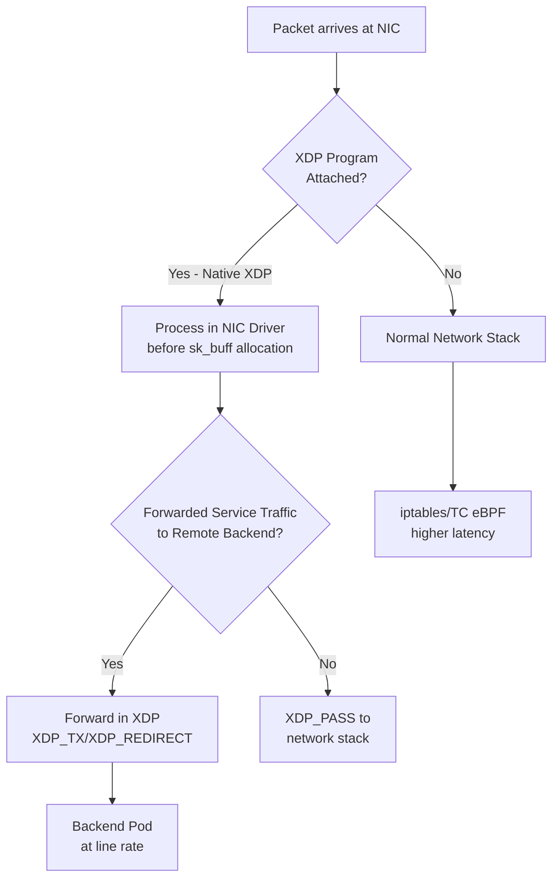

# Cilium XDP Acceleration

Author: [nawazdhandala](https://github.com/nawazdhandala)

Tags: Cilium, Kubernetes, XDP, eBPF, Networking

Description: Enable Cilium XDP acceleration to process network packets at the driver level before they enter the Linux network stack, achieving maximum throughput for Kubernetes service load balancing.

---

## Introduction

XDP (eXpress Data Path) is the fastest eBPF attachment point available in Linux - programs run directly in the NIC driver context, processing packets before they are allocated as kernel `sk_buff` structures and before they enter the network stack. This dramatically reduces per-packet CPU overhead and enables line-rate packet processing even on standard server hardware.

Cilium leverages XDP for its service load balancing implementation. When XDP acceleration is enabled, NodePort, LoadBalancer, and externalIP traffic that must be forwarded to a remote-node backend can be processed at the driver level by an eBPF program, avoiding the higher layers of the networking stack on that forwarding path. For traffic-intensive services like API gateways, proxies, or streaming endpoints, XDP can significantly increase forwarding capacity compared to TC eBPF alone.

This guide covers enabling Cilium XDP acceleration, verifying it is active on the right network interfaces, and benchmarking the performance improvement.

## Prerequisites

- Cilium v1.8+ with kube-proxy replacement enabled
- Linux kernel with Cilium's XDP acceleration requirements (5.x or 6.x recommended)
- NIC with native XDP driver support for `native` acceleration
- `kubectl` and Helm installed

## Step 1: Check NIC XDP Support

```bash
# Check if NIC supports native XDP

kubectl debug node/worker-0 -it --image=nicolaka/netshoot

# Inside node debug pod:
ethtool -i eth0 | grep driver
# Intel: i40e, ixgbe support native XDP
# Mellanox: mlx5_core supports native XDP

# Check kernel XDP support
uname -r  # Recent 5.x or 6.x kernels are recommended
```

## Step 2: Enable XDP Acceleration in Cilium

```bash
helm upgrade cilium cilium/cilium \
  --namespace kube-system \
  --reuse-values \
  --set routingMode=native \
  --set loadBalancer.acceleration=native \
  --set loadBalancer.mode=dsr \
  --set loadBalancer.dsrDispatch=opt \
  --set kubeProxyReplacement=true
```

For mixed environments where some Cilium-managed devices support native XDP and others do not, use best-effort mode:

```bash
helm upgrade cilium cilium/cilium \
  --namespace kube-system \
  --reuse-values \
  --set loadBalancer.acceleration=best-effort
```

Devices without native XDP support will continue without XDP acceleration.

## Step 3: Verify XDP Program Attachment

```bash
# Check XDP program is attached to the NIC
kubectl exec -n kube-system ds/cilium -- ip -details link show dev eth0 | grep xdp

# Verify Cilium reports XDP acceleration active
kubectl exec -n kube-system ds/cilium -- \
  cilium-dbg status --verbose | grep XDP

# Check the Cilium service load-balancing BPF map
kubectl exec -n kube-system ds/cilium -- \
  cilium-dbg bpf lb list
```

## Step 4: Check XDP Program Statistics

```bash
# View XDP program statistics per interface
kubectl exec -n kube-system ds/cilium -- \
  cilium-dbg bpf metrics list

# Check kernel XDP attachment from the Cilium pod
kubectl exec -n kube-system ds/cilium -- \
  bpftool net show dev eth0
```

## Step 5: Benchmark XDP vs TC Performance

```bash
# Install iperf3 in test pods
kubectl run server --image=nicolaka/netshoot --restart=Never -- iperf3 -s
kubectl run client --image=nicolaka/netshoot --restart=Never -- sleep infinity
SERVER_IP=$(kubectl get pod server -o jsonpath='{.status.podIP}')

# Benchmark without XDP (disable temporarily)
kubectl exec client -- iperf3 -c "$SERVER_IP" -t 30

# Enable XDP and re-benchmark
# helm upgrade... --set loadBalancer.acceleration=native
kubectl exec client -- iperf3 -c "$SERVER_IP" -t 30

# Compare results - improvement depends on hardware, packet size, and service topology
```

## XDP Processing Pipeline


```mermaid
flowchart TD
    A[Packet arrives at NIC] --> B{XDP Program\nAttached?}
    B -->|Yes - Native XDP| C[Process in NIC Driver\nbefore sk_buff allocation]
    B -->|No| D[Normal Network Stack]
    C --> E{Forwarded Service Traffic\nto Remote Backend?}
    E -->|Yes| F[Forward in XDP\nXDP_TX/XDP_REDIRECT]
    E -->|No| G[XDP_PASS to\nnetwork stack]
    F --> H[Backend Pod\nat line rate]
    D --> I[iptables/TC eBPF\nhigher latency]
```

## Conclusion

XDP acceleration transforms Cilium's service load balancing into a near-line-rate data plane by processing forwarded NodePort and LoadBalancer traffic before it enters the higher layers of the Linux network stack. The performance gains are most significant for high-throughput services with many small packets (API gateways, proxy services) where per-packet CPU overhead dominates. Native XDP mode requires NIC driver support; best-effort mode enables native XDP only on devices that support it. Combine XDP acceleration with DSR (Direct Server Return) for maximum throughput by eliminating the return path through the load balancer node entirely.
