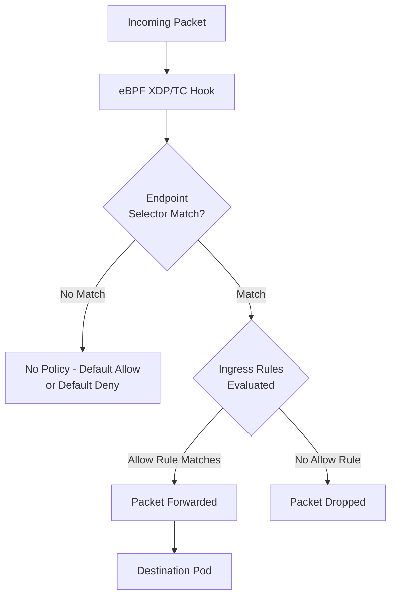

# CiliumNetworkPolicy for L3 and L4 Traffic Control

Author: [nawazdhandala](https://github.com/nawazdhandala)

Tags: Cilium, Kubernetes, Network Policy, eBPF, Security

Description: Master CiliumNetworkPolicy for L3 and L4 traffic control, using endpoint selectors, CIDR-based rules, namespace selectors, and port-level policies to secure Kubernetes workloads.

---

## Introduction

`CiliumNetworkPolicy` (CNP) is Cilium's enhanced version of the standard Kubernetes `NetworkPolicy`, extending it with richer selectors, CIDR-based ingress/egress rules, port ranges, and entity-based matching (e.g., allow traffic to/from `kube-apiserver` or `world`). While Kubernetes NetworkPolicy is limited to pod and namespace selectors with simple port specifications, CNP gives operators the expressiveness needed to model real-world security requirements.

At the L3/L4 level, CNP can match on endpoint labels, namespace labels, CIDR blocks, named entities, and protocol types including ICMP. Policies are evaluated by eBPF programs in the kernel, making enforcement extremely fast with no per-packet overhead at the user-space level. This is fundamentally different from iptables-based implementations where each rule adds latency through linear rule matching.

This guide covers the full range of L3/L4 CiliumNetworkPolicy features with practical examples covering common security patterns.

## Prerequisites

- Cilium v1.10+
- `kubectl` installed
- Workloads with appropriate labels in the cluster

## Step 1: Basic Endpoint Selector Policy

Allow traffic between frontend and backend pods:

```yaml
apiVersion: cilium.io/v2
kind: CiliumNetworkPolicy
metadata:
  name: frontend-to-backend
  namespace: production
spec:
  endpointSelector:
    matchLabels:
      app: backend
  ingress:
    - fromEndpoints:
        - matchLabels:
            app: frontend
      toPorts:
        - ports:
            - port: "8080"
              protocol: TCP
  egress:
    - toEndpoints:
        - matchLabels:
            app: database
      toPorts:
        - ports:
            - port: "5432"
              protocol: TCP
```

## Step 2: Namespace Selector Rules

Allow traffic from the `monitoring` namespace:

```yaml
spec:
  endpointSelector:
    matchLabels:
      app: api
  ingress:
    - fromEndpoints:
        - matchLabels:
            "k8s:io.kubernetes.pod.namespace": monitoring
      toPorts:
        - ports:
            - port: "9090"
              protocol: TCP
```

## Step 3: CIDR-Based Rules

Allow egress to an external service range:

```yaml
spec:
  endpointSelector:
    matchLabels:
      app: payment-service
  egress:
    - toCIDR:
        - "203.0.113.0/24"
      toPorts:
        - ports:
            - port: "443"
              protocol: TCP
    - toCIDRSet:
        - cidr: "10.0.0.0/8"
          except:
            - "10.100.0.0/16"
```

## Step 4: Entity-Based Rules

Use Cilium's built-in entity selectors for well-known targets:

```yaml
spec:
  endpointSelector:
    matchLabels:
      app: worker
  egress:
    - toEntities:
        - "kube-apiserver"   # Kubernetes API
    - toEntities:
        - "world"            # External internet
      toPorts:
        - ports:
            - port: "443"
              protocol: TCP
```

Available entities: `world`, `cluster`, `host`, `init`, `unmanaged`, `remote-node`, `kube-apiserver`, `ingress`

## Step 5: Port Range and Protocol Rules

```yaml
spec:
  endpointSelector:
    matchLabels:
      app: metrics-exporter
  ingress:
    - fromEndpoints:
        - matchLabels:
            role: prometheus
      toPorts:
        - ports:
            - port: "9000"
              endPort: 9100
              protocol: TCP
```

## L3/L4 Policy Evaluation



## Conclusion

`CiliumNetworkPolicy` extends standard Kubernetes NetworkPolicy with CIDR ranges, Cilium entities, port ranges, and richer label selectors — all enforced at line rate by eBPF. The entity selectors are particularly useful for allowing access to `kube-apiserver` or internet destinations without managing explicit CIDR lists. Start with endpoint-selector policies for pod-to-pod segmentation, then add CIDR and entity rules for external connectivity, building up your security posture incrementally.
