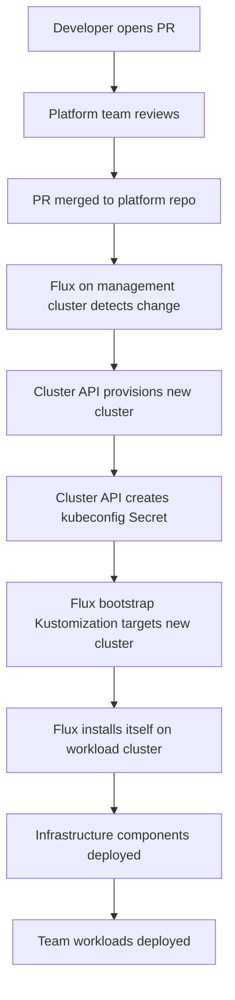

# How to Build a Cluster-as-a-Service Platform with Flux CD

Author: [nawazdhandala](https://github.com/nawazdhandala)

Tags: Flux CD, Kubernetes, GitOps, Platform Engineering, Cluster API, Multi-Cluster

Description: Use Flux CD to build a cluster-as-a-service platform that provisions and manages Kubernetes clusters for teams through GitOps workflows.

---

## Introduction

Cluster-as-a-Service (CaaS) takes platform engineering one step further than namespace isolation: instead of sharing a cluster, each team or product gets a dedicated Kubernetes cluster provisioned on demand. This model eliminates noisy neighbor problems, provides stronger security boundaries, and allows teams to customize their cluster configuration without impacting others.

Flux CD paired with Cluster API (CAPI) makes CaaS practical at scale. Cluster API manages the lifecycle of Kubernetes clusters declaratively, and Flux CD manages both the Cluster API objects that provision clusters and the workloads that run inside them. The result is a fully GitOps-driven platform where requesting a cluster is as simple as submitting a pull request.

In this guide you will build a management cluster that hosts Flux and Cluster API, define cluster templates for common use cases, and show how to bootstrap workload clusters with Flux automatically after provisioning.

## Prerequisites

- A management Kubernetes cluster with Flux CD v2 bootstrapped
- Cluster API installed with at least one infrastructure provider (e.g., CAPA for AWS or CAPV for vSphere)
- kubectl, clusterctl, and the Flux CLI installed
- Git repository for platform configuration

## Step 1: Install Cluster API via Flux

Manage the Cluster API installation itself through Flux to keep it version-controlled and auditable.

```yaml
# infrastructure/controllers/cluster-api/kustomization.yaml
apiVersion: kustomize.toolkit.fluxcd.io/v1
kind: Kustomization
metadata:
  name: cluster-api
  namespace: flux-system
spec:
  interval: 10m
  path: ./infrastructure/controllers/cluster-api
  prune: true
  sourceRef:
    kind: GitRepository
    name: flux-system
  healthChecks:
    - apiVersion: apps/v1
      kind: Deployment
      name: capi-controller-manager
      namespace: capi-system
```

```yaml
# infrastructure/controllers/cluster-api/helmrelease.yaml
apiVersion: helm.toolkit.fluxcd.io/v2
kind: HelmRelease
metadata:
  name: cluster-api
  namespace: capi-system
spec:
  interval: 10m
  chart:
    spec:
      chart: cluster-api
      version: "1.x"
      sourceRef:
        kind: HelmRepository
        name: cluster-api-helm
        namespace: flux-system
```

## Step 2: Define a Cluster Template

Create a reusable cluster template for a standard workload cluster.

```yaml
# clusters/templates/aws-standard/cluster.yaml
apiVersion: cluster.x-k8s.io/v1beta1
kind: Cluster
metadata:
  name: CLUSTER_NAME
  namespace: CLUSTER_NAMESPACE
  labels:
    platform.io/team: TEAM_NAME
    platform.io/environment: ENVIRONMENT
spec:
  clusterNetwork:
    pods:
      cidrBlocks: ["192.168.0.0/16"]
  infrastructureRef:
    apiVersion: infrastructure.cluster.x-k8s.io/v1beta2
    kind: AWSCluster
    name: CLUSTER_NAME
  controlPlaneRef:
    apiVersion: controlplane.cluster.x-k8s.io/v1beta2
    kind: KubeadmControlPlane
    name: CLUSTER_NAME-control-plane
```

```yaml
# clusters/templates/aws-standard/machinedeployment.yaml
apiVersion: cluster.x-k8s.io/v1beta1
kind: MachineDeployment
metadata:
  name: CLUSTER_NAME-workers
  namespace: CLUSTER_NAMESPACE
spec:
  clusterName: CLUSTER_NAME
  replicas: 3
  selector:
    matchLabels:
      cluster.x-k8s.io/cluster-name: CLUSTER_NAME
  template:
    spec:
      clusterName: CLUSTER_NAME
      bootstrap:
        configRef:
          apiVersion: bootstrap.cluster.x-k8s.io/v1beta1
          kind: KubeadmConfigTemplate
          name: CLUSTER_NAME-workers
      infrastructureRef:
        apiVersion: infrastructure.cluster.x-k8s.io/v1beta2
        kind: AWSMachineTemplate
        name: CLUSTER_NAME-workers
```

## Step 3: Create a Cluster Request

Teams request clusters by creating a directory in the platform repository.

```yaml
# clusters/requests/team-beta-prod/kustomization.yaml
apiVersion: kustomize.config.k8s.io/v1beta1
kind: Kustomization
resources:
  - ../../templates/aws-standard
patches:
  - patch: |-
      - op: replace
        path: /metadata/name
        value: team-beta-prod
      - op: replace
        path: /metadata/namespace
        value: team-beta
    target:
      kind: Cluster
  - patch: |-
      - op: replace
        path: /spec/replicas
        value: 5          # Team beta needs more workers
    target:
      kind: MachineDeployment
```

## Step 4: Bootstrap the Workload Cluster with Flux

Once Cluster API provisions the cluster, automatically bootstrap Flux into it using a GitOps-managed Secret and a Flux Kustomization on the management cluster.

```yaml
# clusters/requests/team-beta-prod/flux-bootstrap.yaml
apiVersion: kustomize.toolkit.fluxcd.io/v1
kind: Kustomization
metadata:
  name: team-beta-prod-bootstrap
  namespace: flux-system   # Running on the management cluster
spec:
  interval: 5m
  path: ./clusters/workloads/team-beta-prod
  prune: true
  sourceRef:
    kind: GitRepository
    name: flux-system
  # Use the kubeconfig from Cluster API for the target cluster
  kubeConfig:
    secretRef:
      name: team-beta-prod-kubeconfig   # Created by Cluster API automatically
```

## Step 5: Define Workload Cluster Configuration

The workload cluster bootstrap path installs the base platform components.

```yaml
# clusters/workloads/team-beta-prod/flux-system.yaml
apiVersion: kustomize.toolkit.fluxcd.io/v1
kind: Kustomization
metadata:
  name: flux-system
  namespace: flux-system
spec:
  interval: 10m
  path: ./clusters/base/flux-system
  prune: false
  sourceRef:
    kind: GitRepository
    name: platform-gitops
---
apiVersion: kustomize.toolkit.fluxcd.io/v1
kind: Kustomization
metadata:
  name: infrastructure
  namespace: flux-system
spec:
  interval: 10m
  path: ./infrastructure/overlays/standard
  prune: true
  dependsOn:
    - name: flux-system
  sourceRef:
    kind: GitRepository
    name: platform-gitops
```

## Step 6: Visualize the CaaS Flow



## Best Practices

- Use ClusterClass resources (CAPI v1beta1) to create reusable cluster topologies with sensible defaults
- Store cluster kubeconfig secrets in a secrets manager and sync them with External Secrets Operator
- Implement cluster lifecycle policies: automatically delete ephemeral dev clusters after 7 days
- Monitor cluster provisioning status with Flux health checks and alert on prolonged pending states
- Version cluster templates and require teams to opt in to major upgrades through PR reviews
- Use separate Git repositories for management cluster config and workload cluster config

## Conclusion

Building Cluster-as-a-Service with Flux CD and Cluster API gives platform teams a scalable, auditable way to provide dedicated Kubernetes clusters to product teams. Every cluster request, modification, and deletion is tracked in Git history, and Flux ensures the actual state of every cluster continuously matches the declared desired state. Teams get the isolation they need, and platform teams get the governance they require.
