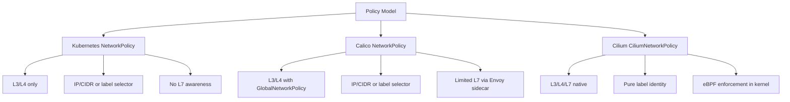

# Comparing the Cilium Star Wars Demo to Other CNI Policy Models

Author: [nawazdhandala](https://github.com/nawazdhandala)

Tags: Cilium, Kubernetes, eBPF, Networking, Network Policy, Calico, Comparison

Description: Compare how the Cilium Star Wars demo's identity-based policy model differs from traditional CNI policy approaches like Calico, Flannel, and standard Kubernetes NetworkPolicy.

---

## Introduction

The Cilium Star Wars demo illustrates a policy model that is qualitatively different from what most CNI plugins offer. To truly appreciate what makes it distinctive, it helps to compare Cilium's approach against the alternatives: standard Kubernetes `NetworkPolicy`, Calico's `GlobalNetworkPolicy`, and simpler overlays like Flannel that have no policy support at all.

The central comparison is between network-address-based policy (IP and CIDR-based) and workload-identity-based policy (label-based security identities). The Star Wars demo is compelling precisely because it makes the identity model tangible — the `tiefighter` and `xwing` are distinguished by who they are, not where they happen to be running.

This post is aimed at engineers evaluating CNI options or migrating from another CNI to Cilium. Understanding these differences will shape how you architect network policy across your organization.

## Prerequisites

- Familiarity with Kubernetes `NetworkPolicy` API
- Basic understanding of CNI concepts
- Optionally: experience with Calico or Flannel

## Comparison Matrix



## Standard Kubernetes NetworkPolicy

The baseline Kubernetes `NetworkPolicy` resource supports label selectors and port-based rules but is limited to L3/L4. Enforcement depends entirely on the CNI plugin — if the CNI does not support `NetworkPolicy`, policies are silently ignored.

```yaml
# Standard Kubernetes NetworkPolicy (no L7 support)
apiVersion: networking.k8s.io/v1
kind: NetworkPolicy
metadata:
  name: deathstar-policy
spec:
  podSelector:
    matchLabels:
      org: empire
      class: deathstar
  ingress:
  - from:
    - podSelector:
        matchLabels:
          org: empire
    ports:
    - port: 80
      protocol: TCP
```

This prevents the `xwing` from reaching the Death Star, but it cannot prevent the `tiefighter` from calling the `/v1/exhaust-port` endpoint. That distinction requires L7 policy.

## Calico GlobalNetworkPolicy

Calico supports similar label-based selectors and adds `GlobalNetworkPolicy` for cluster-wide rules. However, Calico's L7 policy relies on Envoy as a sidecar, adding latency and complexity.

```yaml
# Calico equivalent (iptables/eBPF dataplane)
apiVersion: projectcalico.org/v3
kind: NetworkPolicy
metadata:
  name: deathstar-calico
  namespace: default
spec:
  selector: org == 'empire' && class == 'deathstar'
  ingress:
  - action: Allow
    source:
      selector: org == 'empire'
    destination:
      ports: [80]
```

## Cilium CiliumNetworkPolicy with L7

```yaml
# Cilium: L7-aware policy with no sidecar needed
apiVersion: cilium.io/v2
kind: CiliumNetworkPolicy
metadata:
  name: deathstar-l7
spec:
  endpointSelector:
    matchLabels:
      org: empire
      class: deathstar
  ingress:
  - fromEndpoints:
    - matchLabels:
        org: empire
    toPorts:
    - ports:
      - port: "80"
        protocol: TCP
      rules:
        http:
        - method: POST
          path: "/v1/request-landing"
```

The key advantage: L7 enforcement happens in the eBPF program at the TC hook, not in a sidecar, resulting in much lower latency overhead.

## Performance Comparison

| CNI | Policy Enforcement | L7 Support | Latency Impact |
|-----|-------------------|------------|----------------|
| Flannel | None | No | Minimal |
| Calico (iptables) | iptables rules | Via Envoy sidecar | Medium |
| Calico (eBPF) | eBPF | Via Envoy sidecar | Low |
| Cilium (eBPF) | eBPF native | Native in-kernel | Lowest |

## Conclusion

The Cilium Star Wars demo does not just illustrate a cool concept — it demonstrates a genuinely superior policy model. By enforcing identity natively in the kernel using eBPF, Cilium eliminates the need for sidecars, survives pod restarts without rule updates, and extends seamlessly to L7 without architectural complexity. For teams considering a CNI choice, the Star Wars demo is a compelling argument for Cilium.
