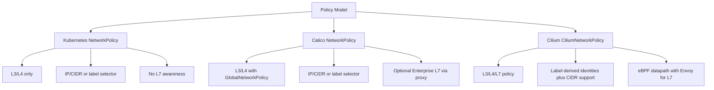

# Comparing the Cilium Star Wars Demo to Other CNI Policy Models

Author: [nawazdhandala](https://github.com/nawazdhandala)

Tags: Cilium, Kubernetes, eBPF, Network Policy, Star Wars Demo

Description: Compare how the Cilium Star Wars demo's identity-based policy model differs from traditional CNI policy approaches like Calico, Flannel, and standard Kubernetes NetworkPolicy.

---

## Introduction

The Cilium Star Wars demo illustrates a policy model that is qualitatively different from what most CNI plugins offer. To truly appreciate what makes it distinctive, it helps to compare Cilium's approach against the alternatives: standard Kubernetes `NetworkPolicy`, Calico's `GlobalNetworkPolicy`, and simpler overlays like Flannel that have no policy support at all.

The central comparison is between address-oriented policy rules (IP and CIDR-based) and workload-identity-oriented policy rules (label-derived security identities). The Star Wars demo is compelling precisely because it makes the identity model tangible - the `tiefighter` and `xwing` are distinguished by who they are, not where they happen to be running.

This post is aimed at engineers evaluating CNI options or migrating from another CNI to Cilium. Understanding these differences will shape how you architect network policy across your organization.

## Prerequisites

- Familiarity with Kubernetes `NetworkPolicy` API
- Basic understanding of CNI concepts
- Optionally: experience with Calico or Flannel

## Comparison Matrix


```mermaid
graph TD
    A[Policy Model] --> B[Kubernetes NetworkPolicy]
    A --> C[Calico NetworkPolicy]
    A --> D[Cilium CiliumNetworkPolicy]

    B --> B1[L3/L4 only]
    B --> B2[IP/CIDR or label selector]
    B --> B3[No L7 awareness]

    C --> C1[L3/L4 with GlobalNetworkPolicy]
    C --> C2[IP/CIDR or label selector]
    C --> C3[Optional Enterprise L7 via proxy]

    D --> D1[L3/L4/L7 policy]
    D --> D2[Label-derived identities plus CIDR support]
    D --> D3[eBPF datapath with Envoy for L7]
```

## Standard Kubernetes NetworkPolicy

The baseline Kubernetes `NetworkPolicy` resource supports label selectors and port-based rules but is limited to L3/L4. Enforcement depends entirely on the CNI plugin - if the CNI does not support `NetworkPolicy`, policies are silently ignored.

```yaml
# Standard Kubernetes NetworkPolicy (no L7 support)

apiVersion: networking.k8s.io/v1
kind: NetworkPolicy
metadata:
  name: deathstar-policy
spec:
  podSelector:
    matchLabels:
      org: empire
      class: deathstar
  ingress:
  - from:
    - podSelector:
        matchLabels:
          org: empire
    ports:
    - port: 80
      protocol: TCP
```

This prevents the `xwing` from reaching the Death Star, but it cannot prevent the `tiefighter` from calling the `/v1/exhaust-port` endpoint. That distinction requires L7 policy.

## Calico NetworkPolicy and GlobalNetworkPolicy

Calico supports similar label-based selectors and adds `GlobalNetworkPolicy` for cluster-wide rules. Calico Enterprise application-layer policy can match HTTP attributes, but it is an optional feature and uses an L7 proxy model, such as an injected sidecar for opted-in workloads, which adds operational complexity compared with L3/L4-only policy.

```yaml
# Calico equivalent (iptables/eBPF dataplane)
apiVersion: projectcalico.org/v3
kind: NetworkPolicy
metadata:
  name: deathstar-calico
  namespace: default
spec:
  selector: org == 'empire' && class == 'deathstar'
  ingress:
  - action: Allow
    source:
      selector: org == 'empire'
    destination:
      ports: [80]
```

## Cilium CiliumNetworkPolicy with L7

```yaml
# Cilium: L7-aware policy with no application sidecar needed
apiVersion: cilium.io/v2
kind: CiliumNetworkPolicy
metadata:
  name: deathstar-l7
spec:
  endpointSelector:
    matchLabels:
      org: empire
      class: deathstar
  ingress:
  - fromEndpoints:
    - matchLabels:
        org: empire
    toPorts:
    - ports:
      - port: "80"
        protocol: TCP
      rules:
        http:
        - method: POST
          path: "/v1/request-landing"
```

The key advantage: Cilium does not require an application sidecar for this L7 policy. Its eBPF datapath redirects matching traffic to Cilium's node-local Envoy proxy, which enforces HTTP policy while Cilium continues to use identity-based policy and eBPF for the datapath.

## Performance Comparison

| CNI | Policy Enforcement | L7 Support | Latency Impact |
|-----|-------------------|------------|----------------|
| Flannel | None by itself | No | Minimal networking overhead, but no policy enforcement |
| Calico (iptables) | iptables rules | Optional in Calico Enterprise via L7 proxy | Medium |
| Calico (eBPF) | eBPF dataplane | Optional in Calico Enterprise via L7 proxy | Low for L3/L4 policy; L7 depends on proxy configuration |
| Cilium (eBPF) | eBPF datapath and identity policy | Via Cilium's Envoy proxy, without application sidecars | Low for L3/L4 policy; L7 includes proxy processing |

## Conclusion

The Cilium Star Wars demo does not just illustrate a cool concept - it demonstrates a powerful policy model. By deriving security identity from labels and using eBPF for the datapath, Cilium avoids tying policy to changing pod IPs, survives pod restarts without manual rule updates, and extends to L7 without application sidecars. For teams considering a CNI choice, the Star Wars demo is a compelling argument for Cilium.
