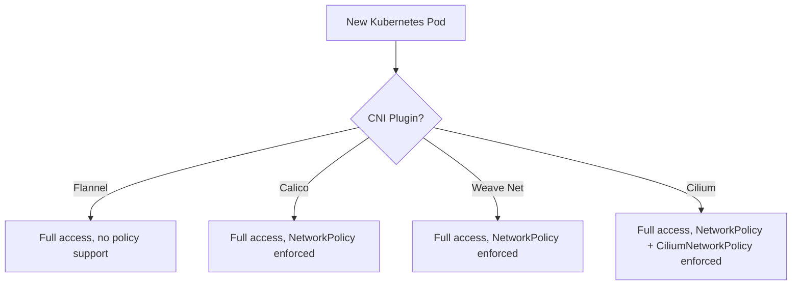

# Comparing Default Access Models Across Kubernetes CNI Plugins

Author: [nawazdhandala](https://github.com/nawazdhandala)

Tags: Cilium, Kubernetes, EBPF, Network Policy, Star Wars Demo

Description: Compare how different Kubernetes CNI plugins handle default access - from fully permissive models to those with built-in default-deny - and why Cilium's approach provides the best balance.

---

## Introduction

The "current access" phase of the Cilium Star Wars demo illustrates a fundamental truth about Kubernetes networking: access is permissive by default. But how permissive, and what tools each CNI provides to observe and control that access, varies significantly across plugins. Comparing the default access models of Flannel, Calico, Weave Net, and Cilium reveals important architectural differences that affect both security posture and operational complexity.

Understanding these differences is critical when evaluating CNI options for a new cluster or when planning a migration from one CNI to another. The default access model shapes what kind of security investment you will need to make on day one versus what is provided out of the box. Cilium's model is distinctive: permissive by default (matching Kubernetes expectations) but with the richest set of policy primitives and observability tools to lock it down.

## Prerequisites

- Understanding of Kubernetes CNI concepts
- Familiarity with the Star Wars demo baseline

## Default Access Model Comparison



## CNI-by-CNI Breakdown

| CNI | Default Access | Policy Support | L7 Support | Observability |
|-----|---------------|----------------|------------|---------------|
| Flannel | Permissive | None | No | Minimal |
| Calico | Permissive | L3/L4 NetworkPolicy + GlobalNetworkPolicy | Via Envoy sidecar | Moderate |
| Weave Net | Permissive | L3/L4 NetworkPolicy | No | Minimal |
| Cilium | Permissive | L3/L4/L7 CiliumNetworkPolicy | Native eBPF | Full (Hubble) |

## Flannel: No Policy at All

Flannel is a network overlay that provides IP routing but ignores `NetworkPolicy` resources entirely. If you apply a policy on a Flannel cluster, it has no effect.

```bash
# On a Flannel cluster, this policy does nothing
kubectl apply -f sw_l3_l4_policy.yaml
# xwing can still reach deathstar - Flannel ignores the policy
```

## Calico: L3/L4 Policy With iptables or eBPF

Calico enforces `NetworkPolicy` using iptables or its own eBPF dataplane. L7 policy requires deploying Envoy as a sidecar or DaemonSet, adding operational overhead.

```bash
# Calico policy equivalent
kubectl apply -f - <<EOF
apiVersion: projectcalico.org/v3
kind: NetworkPolicy
metadata:
  name: deathstar-policy
  namespace: default
spec:
  selector: org == 'empire' && class == 'deathstar'
  ingress:
  - action: Allow
    source:
      selector: org == 'empire'
EOF
```

## Cilium: Native eBPF with Full Observability

Cilium's advantage is native L7 enforcement without sidecars and built-in flow observability via Hubble.

```bash
# Cilium gives you visibility out of the box
cilium hubble enable
hubble observe --follow --namespace default

# Policy covers L3/L4/L7 in a single resource
kubectl apply -f sw_l3_l4_l7_policy.yaml
```

## Why Permissive Defaults Are Universal (and That Is OK)

All CNIs start permissive because Kubernetes was designed for connectivity. The right approach is not to change the default but to layer policy on top. The differentiator between CNIs is how easy and expressive that policy layering is. Cilium wins on both dimensions: its policy model is the most expressive, and its tooling (Hubble) makes the baseline access patterns fully observable.

## Conclusion

Every Kubernetes CNI starts with permissive default access - that is a feature, not a flaw, of the Kubernetes network model. The question is what each CNI provides to move from permissive to controlled. Cilium's combination of native L7 enforcement, identity-based policy, and Hubble observability makes it the most capable platform for implementing network security in Kubernetes. The Star Wars demo's current access phase is the starting line; Cilium provides the tools to finish the race.
