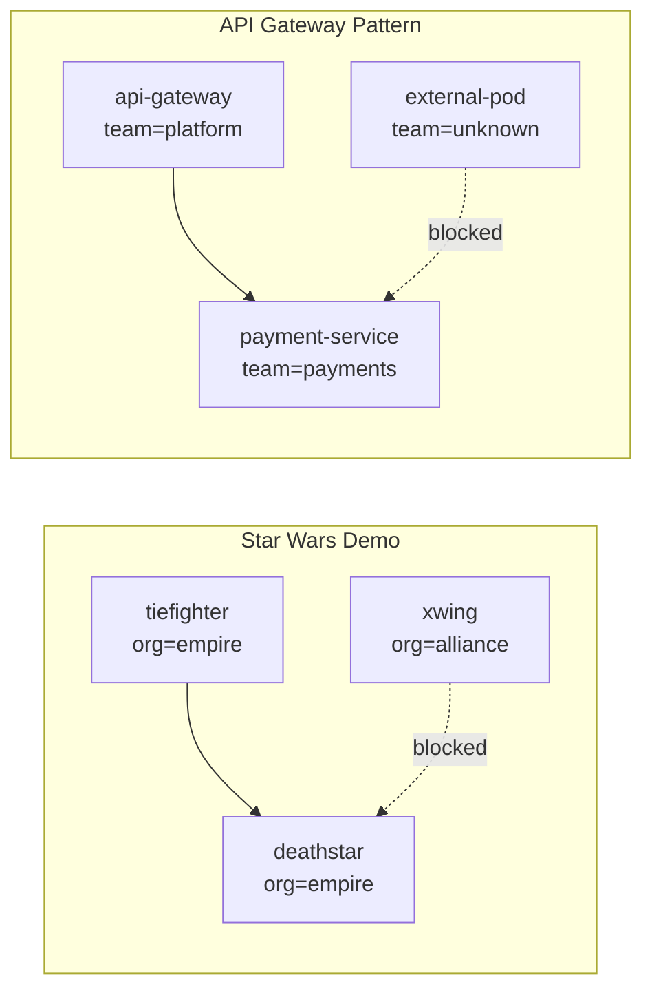

# Comparing the Cilium Star Wars Demo App to Real-World Microservice Architectures

Author: [nawazdhandala](https://github.com/nawazdhandala)

Tags: Cilium, Kubernetes, eBPF, Networking, Microservices, Architecture

Description: Compare the simplified Star Wars demo application structure to real-world microservice architectures and understand how to apply the same Cilium policy patterns at scale.

---

## Introduction

The Cilium Star Wars demo application is a deliberate simplification, but its structure mirrors patterns found in nearly every production microservice environment. By comparing the demo app to real architectures, you can bridge the gap between learning the demo and applying Cilium policies in your own clusters. The mapping is more direct than you might expect.

The core pattern — a sensitive service (`deathstar`) that should only be reached by authorized clients (`tiefighter`) using specific API methods (`POST /v1/request-landing`) — appears constantly in production. It is the pattern for an internal payment service, an authentication API, a database proxy, or a secrets manager. The label-based identity model that Cilium uses in the demo scales naturally to these environments through standard Kubernetes label conventions.

This post compares the demo's simplified architecture against three common real-world patterns: an API gateway architecture, a multi-team monorepo deployment, and a zero-trust mesh. Understanding these comparisons will guide how you design labels and policies for Cilium in production.

## Prerequisites

- Understanding of the Cilium Star Wars demo
- Familiarity with Kubernetes label and selector conventions

## Demo Architecture vs. API Gateway Pattern



The label `org=empire` maps to `team=payments`. The `class=tiefighter` maps to `app=api-gateway`. The pattern is identical; only the names change.

## Equivalent Production Policy

```yaml
# Production equivalent of the Star Wars L7 policy
apiVersion: cilium.io/v2
kind: CiliumNetworkPolicy
metadata:
  name: payment-service-policy
  namespace: payments
spec:
  endpointSelector:
    matchLabels:
      app: payment-service
      team: payments
  ingress:
  - fromEndpoints:
    - matchLabels:
        app: api-gateway
        team: platform
    toPorts:
    - ports:
      - port: "8080"
        protocol: TCP
      rules:
        http:
        - method: "POST"
          path: "/v1/payments"
        - method: "GET"
          path: "/v1/payments/[0-9]*"
```

## Demo vs. Multi-Team Kubernetes Cluster

| Demo Concept | Multi-Team Cluster |
|-------------|-------------------|
| `org=empire` | `team=backend` |
| `org=alliance` | `team=frontend` |
| `class=deathstar` | `app=database-proxy` |
| `class=tiefighter` | `app=backend-api` |
| Landing request | Write API call |
| Exhaust port | Admin/delete endpoint |

## Scaling Labels for Production

```bash
# Production pods should carry structured labels for policy selection
kubectl label pod my-service \
  app=my-service \
  team=platform \
  env=production \
  tier=backend

# Verify labels
kubectl get pods --show-labels -l team=platform
```

## Demo vs. Zero-Trust Architecture

In zero-trust, every service must authenticate every request and no network connection is trusted by default. The Star Wars demo enacts zero-trust at the network layer:

- Default deny (no `xwing` access after policy is applied)
- Explicit allow with least privilege (`POST /v1/request-landing` only)
- Identity-based (label selectors, not IPs)

```yaml
# Zero-trust default deny all ingress except explicit allows
apiVersion: cilium.io/v2
kind: CiliumNetworkPolicy
metadata:
  name: default-deny
spec:
  endpointSelector: {}
  ingress:
  - {}
  egress:
  - {}
```

## Conclusion

The Cilium Star Wars demo application is not just a toy — it is a scaled-down model of real production architectures. By mapping its components to your own services, labels, and API boundaries, you can apply the same policy design principles directly. The demo teaches the pattern; your production labels and services provide the substance.

Description: Explore Cilium's capabilities using the classic Star Wars demo application, which demonstrates identity-based network policies and L7 visibility in a fun, relatable way.

---

## Introduction

The Cilium Star Wars demo is one of the most popular ways to learn how Cilium's identity-based security model works in practice. By modeling the Galactic Empire and Rebel Alliance as Kubernetes services, it vividly illustrates how Cilium enforces network policies at multiple layers.

In this demo, you'll deploy a set of Star Wars-themed microservices — the Death Star, TIE fighters, and X-wing fighters — and then apply Cilium network policies to control which services can communicate with each other. This makes abstract networking concepts tangible and easy to understand.

Whether you're evaluating Cilium for the first time or deepening your understanding of its policy model, this demo provides a hands-on foundation. It covers basic connectivity, identity-based enforcement, and Layer 7 HTTP policy — all in a single scenario.

## Prerequisites

- A running Kubernetes cluster
- Cilium installed and running (`cilium status`)
- `kubectl` configured and pointing to your cluster
- `cilium` CLI installed

## Step 1: Deploy the Star Wars Demo Application

Deploy the Death Star service, TIE fighter, and X-wing pods using the official Cilium demo manifests.

```bash
# Apply the Star Wars demo manifests from the Cilium documentation repository
kubectl create -f https://raw.githubusercontent.com/cilium/cilium/HEAD/examples/minikube/http-sw-app.yaml
```

## Step 2: Verify Connectivity Without Policy

Before applying any network policy, verify that all pods can communicate freely.

```bash
# Check that the X-wing can access the Death Star (this should succeed without policy)
kubectl exec xwing -- curl -s -XPOST deathstar.default.svc.cluster.local/v1/request-landing

# Check that the TIE fighter can also access the Death Star
kubectl exec tiefighter -- curl -s -XPOST deathstar.default.svc.cluster.local/v1/request-landing
```

## Step 3: Apply a Cilium Network Policy

Apply a L3/L4 policy that allows only TIE fighters (Empire ships) to access the Death Star, blocking X-wing (Rebel) access.

```yaml
# cilium-sw-policy.yaml
# This CiliumNetworkPolicy restricts Death Star access to Empire ships only
apiVersion: "cilium.io/v2"
kind: CiliumNetworkPolicy
metadata:
  name: "rule1"
spec:
  description: "L3-L4 policy to restrict deathstar access to empire ships only"
  endpointSelector:
    matchLabels:
      org: empire
      class: deathstar
  ingress:
  - fromEndpoints:
    - matchLabels:
        org: empire
    toPorts:
    - ports:
      - port: "80"
        protocol: TCP
```

```bash
# Apply the network policy to the cluster
kubectl apply -f cilium-sw-policy.yaml
```

## Step 4: Verify Policy Enforcement

After applying the policy, test connectivity to confirm the policy is working correctly.

```bash
# TIE fighter (Empire) should still be allowed
kubectl exec tiefighter -- curl -s -XPOST deathstar.default.svc.cluster.local/v1/request-landing

# X-wing (Rebel) should now be blocked — this request should hang/timeout
kubectl exec xwing -- curl -s -XPOST deathstar.default.svc.cluster.local/v1/request-landing
```

## Step 5: Visualize Policy with Hubble

Use Hubble to observe traffic flows and confirm policy decisions.

```bash
# Enable Hubble observability
cilium hubble enable

# Observe traffic in real time while running the connectivity tests
hubble observe --pod deathstar --follow
```

## Best Practices

- Always verify baseline connectivity before applying policies to understand the default behavior
- Use `hubble observe` to audit policy decisions and debug connectivity issues
- Label your pods consistently — Cilium's identity model relies on labels
- Start with L3/L4 policies before moving to L7 for simpler troubleshooting
- Use `cilium endpoint list` to inspect the security identity assigned to each pod

## Conclusion

The Cilium Star Wars demo provides an accessible and memorable way to understand how identity-based network policies work. By walking through deployment, policy application, and observability with Hubble, you gain practical experience with Cilium's core capabilities — setting a strong foundation for securing real-world Kubernetes workloads.
