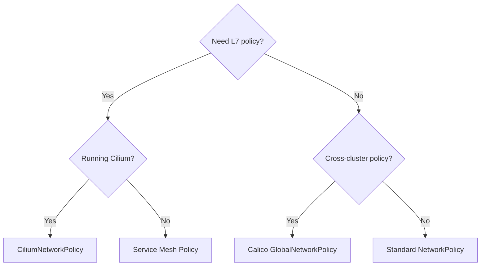

# Comparing CiliumNetworkPolicy to Other Policy Formats

Author: [nawazdhandala](https://github.com/nawazdhandala)

Tags: Cilium, Kubernetes, EBPF, Network Policy, Star Wars Demo

Description: Compare CiliumNetworkPolicy against standard Kubernetes NetworkPolicy, Calico GlobalNetworkPolicy, and service mesh policies to understand when to use each.

---

## Introduction

The policy format used in the Cilium Star Wars demo - `CiliumNetworkPolicy` - is one of several policy APIs available in the Kubernetes ecosystem. Understanding how it compares to the standard `NetworkPolicy`, Calico's `GlobalNetworkPolicy`, and service mesh policy formats helps engineers make informed decisions about which policy mechanism to use in different scenarios.

The comparison reveals that `CiliumNetworkPolicy` occupies a unique position: it is more expressive than standard `NetworkPolicy` (which lacks L7 support), more portable than Calico's API (which is tightly coupled to Calico's label syntax), and more operationally simpler than service mesh policy (which requires sidecar injection). For teams running Cilium, `CiliumNetworkPolicy` should be the default policy mechanism.

## Prerequisites

- Understanding of CiliumNetworkPolicy from the Star Wars demo
- Familiarity with Kubernetes NetworkPolicy basics

## Side-by-Side Comparison

### Standard Kubernetes NetworkPolicy

```yaml
apiVersion: networking.k8s.io/v1
kind: NetworkPolicy
metadata:
  name: deathstar-k8s
  namespace: default
spec:
  podSelector:
    matchLabels:
      org: empire
      class: deathstar
  policyTypes:
  - Ingress
  ingress:
  - from:
    - podSelector:
        matchLabels:
          org: empire
    ports:
    - port: 80
      protocol: TCP
  # No L7 support - cannot restrict HTTP methods/paths
```

### Calico NetworkPolicy

```yaml
apiVersion: projectcalico.org/v3
kind: NetworkPolicy
metadata:
  name: deathstar-calico
  namespace: default
spec:
  selector: org == 'empire' && class == 'deathstar'
  ingress:
  - action: Allow
    source:
      selector: org == 'empire'
    destination:
      ports: [80]
  - action: Deny
  # L7 requires Envoy sidecar configuration
```

### CiliumNetworkPolicy (Star Wars Demo)

```yaml
apiVersion: cilium.io/v2
kind: CiliumNetworkPolicy
metadata:
  name: rule1
spec:
  endpointSelector:
    matchLabels:
      org: empire
      class: deathstar
  ingress:
  - fromEndpoints:
    - matchLabels:
        org: empire
    toPorts:
    - ports:
      - port: "80"
        protocol: TCP
      rules:
        http:
        - method: "POST"
          path: "/v1/request-landing"
  # L7 native - no sidecar needed
```

## Feature Matrix

| Feature | K8s NetworkPolicy | Calico NP | CiliumNetworkPolicy |
|---------|------------------|-----------|---------------------|
| L3/L4 enforcement | Yes (CNI-dependent) | Yes | Yes |
| L7 HTTP | No | Via Envoy sidecar | Native |
| L7 gRPC | No | No | Native |
| L7 Kafka | No | No | Native |
| DNS-based policy | No | No | Yes |
| CIDR-based | Yes | Yes | Yes |
| Default deny | Implicit (select all) | Explicit | Via selector |
| Observability | None | calicoctl | Hubble |

## When to Use Each



## Migrating from Standard NetworkPolicy

```bash
# Standard NetworkPolicy works on Cilium without changes
kubectl apply -f standard-network-policy.yaml

# But to use L7 features, convert to CiliumNetworkPolicy
# Cilium also supports the standard NetworkPolicy API natively
kubectl get networkpolicies
kubectl get ciliumnetworkpolicies
```

## Conclusion

`CiliumNetworkPolicy` is the most capable single-resource policy format in the Kubernetes ecosystem. It subsumes standard `NetworkPolicy` (all K8s NetworkPolicy resources work with Cilium), adds L7 for HTTP/gRPC/Kafka without sidecars, and integrates natively with Hubble for observability. For teams on Cilium, migrating to `CiliumNetworkPolicy` is the right long-term direction, while standard `NetworkPolicy` remains a fully supported fallback for portability requirements.

Description: A side-by-side comparison of the different network policy types available in the Cilium Star Wars demo, from no policy to L3/L4 to L7, with analysis of what each protects against.

---

## Introduction

The Cilium Star Wars demo is structured to progressively demonstrate the different layers of network policy. Starting with no policy, moving through L3/L4 identity-based rules, and culminating in L7 HTTP-aware enforcement, each stage reveals both new capabilities and the gaps that the next layer fills.

Understanding this progression is critical for designing a robust security posture in production. Each policy type has a different scope of protection, different performance characteristics, and different operational requirements. Choosing the right layer - or combining layers - requires knowing exactly what each one does and doesn't protect.

This post provides a structured comparison of the three policy stages in the Star Wars demo, with a matrix of what each protects against and guidance on when to use each type.

## Prerequisites

- Cilium installed and healthy
- Star Wars demo deployed
- Familiarity with basic Cilium and Kubernetes concepts

## Step 1: No Policy - Baseline (Allow All)

Without any policy, all pods can reach all other pods. This is Kubernetes' default behavior.

```bash
# Verify no CiliumNetworkPolicies exist
kubectl get cnp -A
# Expected: No resources found

# Both X-wing and TIE fighter can reach the Death Star
kubectl exec tiefighter -- curl -s -XPOST deathstar.default.svc.cluster.local/v1/request-landing
kubectl exec xwing -- curl -s -XPOST deathstar.default.svc.cluster.local/v1/request-landing
# Both return: Ship landed
```

## Step 2: L3/L4 Policy - Identity and Port Enforcement

L3/L4 policy blocks unauthorized pods at the identity level and restricts to allowed ports.

```yaml
# l3-l4-policy.yaml - blocks X-wing entirely, allows TIE fighter on port 80
apiVersion: "cilium.io/v2"
kind: CiliumNetworkPolicy
metadata:
  name: "rule1"
spec:
  endpointSelector:
    matchLabels:
      org: empire
      class: deathstar
  ingress:
  - fromEndpoints:
    - matchLabels:
        org: empire
    toPorts:
    - ports:
      - port: "80"
        protocol: TCP
```

```bash
# Apply the L3/L4 policy
kubectl apply -f l3-l4-policy.yaml

# X-wing is now blocked (connection dropped)
kubectl exec xwing -- curl --max-time 5 -XPOST deathstar.default.svc.cluster.local/v1/request-landing

# TIE fighter still works - but ALL paths are still accessible
kubectl exec tiefighter -- curl -s -XPUT deathstar.default.svc.cluster.local/v1/exhaust-port
# Returns: Panic: deathstar exploded!
```

## Step 3: L7 Policy - HTTP Method and Path Enforcement

L7 policy adds HTTP-level inspection to restrict the specific operations permitted.

```yaml
# l7-policy.yaml - adds HTTP method and path restrictions
apiVersion: "cilium.io/v2"
kind: CiliumNetworkPolicy
metadata:
  name: "rule1"
spec:
  endpointSelector:
    matchLabels:
      org: empire
      class: deathstar
  ingress:
  - fromEndpoints:
    - matchLabels:
        org: empire
    toPorts:
    - ports:
      - port: "80"
        protocol: TCP
      rules:
        http:
        # Only this specific method and path combination is allowed
        - method: "POST"
          path: "/v1/request-landing"
```

```bash
# Apply the L7 policy
kubectl apply -f l7-policy.yaml

# Exhaust port is now blocked even from TIE fighter
kubectl exec tiefighter -- curl -s -XPUT deathstar.default.svc.cluster.local/v1/exhaust-port
# Returns: 403 Forbidden
```

## Policy Comparison Matrix

| Capability | No Policy | L3/L4 Only | L3/L4 + L7 |
|------------|-----------|------------|------------|
| Block unauthorized pods | No | Yes | Yes |
| Allow only specific ports | No | Yes | Yes |
| Block dangerous API paths | No | No | Yes |
| Block wrong HTTP methods | No | No | Yes |
| Performance overhead | None | Minimal | Low (Envoy proxy) |
| Visibility in Hubble | Basic | L4 verdicts | L7 HTTP details |

## Best Practices

- Never run production workloads without at least L3/L4 policy
- Apply L7 policies to any service with destructive or sensitive operations
- Use Hubble to verify which policy layer is handling a given flow
- Combine `CiliumNetworkPolicy` (namespace-scoped) with `CiliumClusterwideNetworkPolicy` for cluster-wide defaults
- Test policies in a staging environment before applying to production

## Conclusion

The Cilium Star Wars demo's progression from no policy to L3/L4 to L7 mirrors a real security maturity model. Each layer addresses threats that the previous layer cannot. For production deployments, combining L3/L4 identity enforcement with L7 path restrictions on sensitive APIs provides a defense-in-depth posture that is both powerful and operationally manageable.
