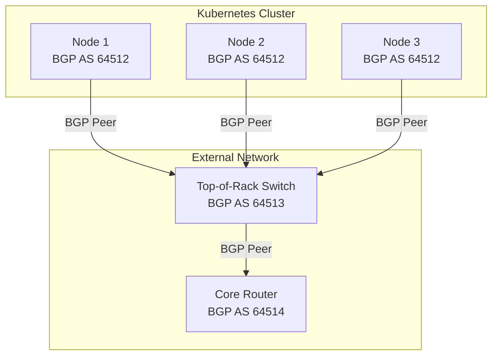

# How to Configure BGP Peering in Calico

Author: [nawazdhandala](https://github.com/nawazdhandala)

Tags: Calico, Kubernetes, BGP, Networking, CNI

Description: A step-by-step guide to configuring BGP peering in Calico to enable dynamic routing between Kubernetes nodes and external network infrastructure.

---

## Introduction

Border Gateway Protocol (BGP) is the routing protocol that powers the internet, and Calico leverages it to distribute pod network routes across your Kubernetes cluster. When Calico runs in BGP mode, every node runs a BGP speaker (via BIRD) that advertises the pod CIDRs it owns. This eliminates the need for encapsulation overhead on networks that support native routing.

Configuring BGP peering allows Calico nodes to exchange routing information with each other and with external routers. In a full-mesh topology, every node peers with every other node. For larger clusters, this becomes impractical, making route reflectors or top-of-rack router peering the preferred approach.

Understanding how to configure BGP peering in Calico is foundational to building a high-performance, scalable Kubernetes networking layer that integrates with your existing data center infrastructure.

## Prerequisites

- A running Kubernetes cluster with Calico installed (v3.26+)
- `calicoctl` installed and configured to communicate with the Kubernetes API datastore
- `kubectl` access with cluster-admin privileges
- BGP-capable routers or switches for external peering (optional)

## Configure Default BGP Settings

Begin by examining the default BGP configuration applied globally to all nodes:

```bash
calicoctl get bgpconfiguration default -o yaml
```

If no default configuration exists, create one:

```yaml
apiVersion: projectcalico.org/v3
kind: BGPConfiguration
metadata:
  name: default
spec:
  logSeverityScreen: Info
  nodeToNodeMeshEnabled: true
  asNumber: 64512
```

Apply it with:

```bash
calicoctl apply -f bgp-default.yaml
```

## Configure Node-to-Node Full Mesh (Small Clusters)

For clusters with fewer than 50 nodes, the default full-mesh BGP topology works well. Verify that all nodes are peering:

```bash
calicoctl node status
```

Expected output shows each node with `Established` state:

```plaintext
Calico process is running.

IPv4 BGP status
+--------------+-------------------+-------+----------+-------------+
| PEER ADDRESS |     PEER TYPE     | STATE |  SINCE   |    INFO     |
+--------------+-------------------+-------+----------+-------------+
| 10.0.0.2     | node-to-node mesh | up    | 14:23:00 | Established |
| 10.0.0.3     | node-to-node mesh | up    | 14:23:01 | Established |
+--------------+-------------------+-------+----------+-------------+
```

## Configure a BGP Peer for External Router

To peer Calico nodes with an external router (such as a top-of-rack switch), create a `BGPPeer` resource:

```yaml
apiVersion: projectcalico.org/v3
kind: BGPPeer
metadata:
  name: external-router
spec:
  peerIP: 192.168.1.1
  asNumber: 64513
```

Apply this peer configuration:

```bash
calicoctl apply -f bgp-peer-external.yaml
```

To scope a peer to a specific node rather than all nodes, add a `node` field:

```yaml
apiVersion: projectcalico.org/v3
kind: BGPPeer
metadata:
  name: node1-external-router
spec:
  node: k8s-node-01
  peerIP: 192.168.1.1
  asNumber: 64513
```

## Verify BGP Peer Status

After applying peer configuration, check that the BGP session has come up:

```bash
calicoctl node status
kubectl get bgppeers -o wide
```

You can also check BGP peer status via the Calico node pod:

```bash
kubectl exec -n calico-system ds/calico-node -- birdcl show protocols
```

## BGP Peering Architecture



## Conclusion

Configuring BGP peering in Calico provides a scalable, high-performance networking foundation for your Kubernetes cluster. By defining `BGPConfiguration` and `BGPPeer` resources, you control how pod routes are distributed across your infrastructure. Start with the default full-mesh for smaller clusters and plan your transition to route reflectors or top-of-rack peering as your cluster grows.
