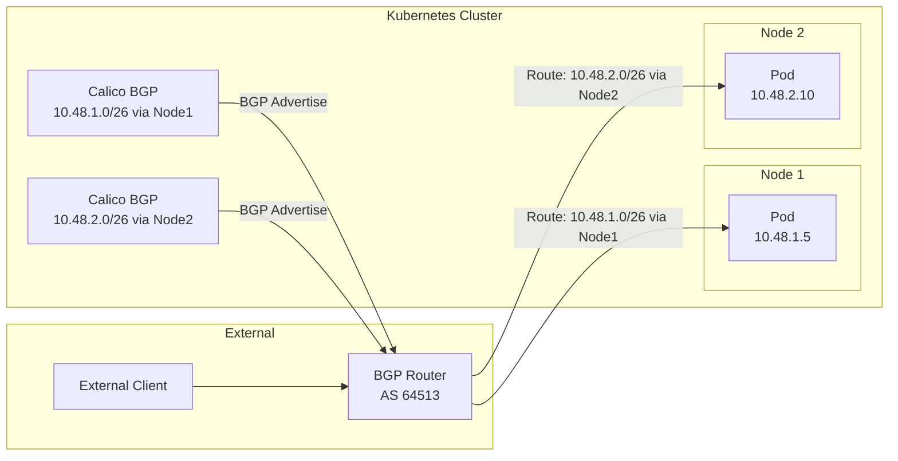

# How to Configure BGP to Workload Connectivity in Calico

Author: [nawazdhandala](https://github.com/nawazdhandala)

Tags: Calico, Kubernetes, BGP, Networking, Workloads

Description: Configure Calico BGP to enable direct external connectivity to Kubernetes workloads without load balancers by advertising pod IPs to upstream routers.

---

## Introduction

One of the most powerful capabilities of Calico's BGP mode is the ability to advertise pod IP addresses directly to your network infrastructure. Instead of relying on NodePort services or cloud load balancers for external access, BGP-enabled networks can route traffic directly to pods using their assigned IP addresses, eliminating extra network hops and NAT translation.

BGP-to-workload connectivity requires your upstream routers to accept and propagate pod CIDR routes received from Calico nodes. When a pod is scheduled on a node, Calico's IPAM assigns it an IP from a block allocated to that node, and BGP advertises that block to upstream routers. This means external clients can connect directly to pod IPs without any NAT.

This guide walks through configuring Calico to advertise pod routes via BGP and verifying that external systems can reach workloads directly.

## Prerequisites

- Calico running in BGP mode with at least one external BGP peer
- BGP peer router configured to accept routes from Calico nodes
- Workloads deployed in the cluster

## Verify IP Pool BGP Advertisement

By default, Calico advertises pod CIDRs from all IP pools. Verify the IP pool configuration:

```bash
calicoctl get ippools -o yaml
```

Ensure `disabled: false` and check that no export filters are blocking advertisement. Create a pool specifically for workload advertisement if needed:

```yaml
apiVersion: projectcalico.org/v3
kind: IPPool
metadata:
  name: workload-pool
spec:
  cidr: 10.48.0.0/16
  ipipMode: Never
  vxlanMode: Never
  natOutgoing: false
  disabled: false
```

Setting `natOutgoing: false` ensures pods retain their original IP for return traffic when accessed externally.

## Configure BGP Peer to Accept Pod Routes

On your upstream router, configure it to accept the pod CIDR prefix from Calico:

```bash
# Example for a Linux router using Bird2
# In bird.conf:
protocol bgp calico_peer {
  local as 64513;
  neighbor 10.0.0.1 as 64512;
  ipv4 {
    import filter {
      if net ~ 10.48.0.0/16+ then accept;
      reject;
    };
    export none;
  };
}
```

## Deploy a Test Workload with Fixed IP

Create a pod and verify it receives an IP from the advertised pool:

```bash
kubectl run bgp-test --image=nginx --port=80
kubectl get pod bgp-test -o wide
# Note the pod IP
```

## Verify Route on External Router

From the external router, verify the pod CIDR route is present:

```bash
# On Linux router with ip command
ip route | grep 10.48

# With bird/birdcl
birdcl show route
```

## Connectivity Architecture



## Test Direct Pod Connectivity

From outside the cluster, test direct connectivity to a pod IP:

```bash
# From external host/router
curl http://10.48.1.5:80
ping -c 3 10.48.1.5
```

## Conclusion

Configuring BGP-to-workload connectivity in Calico enables a clean, low-latency networking model where external traffic reaches pods directly without NAT or load balancer indirection. This requires configuring IP pools with `natOutgoing: false`, establishing BGP sessions with upstream routers, and ensuring those routers accept and propagate pod CIDR routes. The result is a transparent network where pod IPs are first-class citizens on your network.
