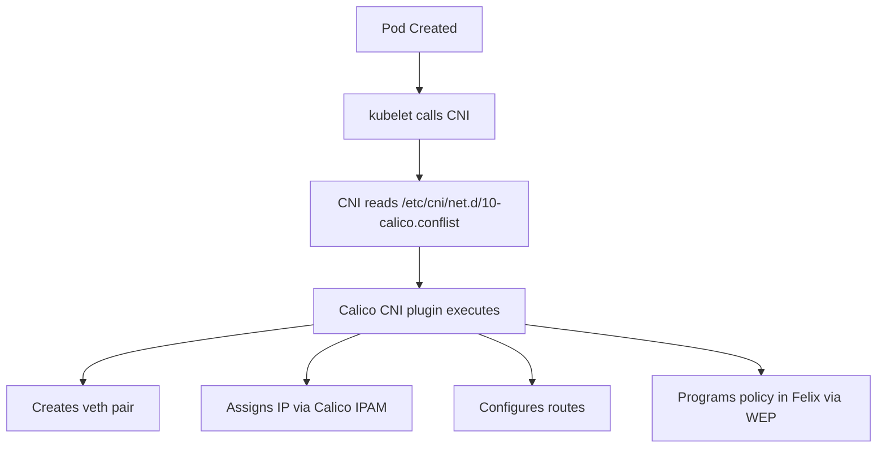

# Configure Calico CNI Plugin

Author: [nawazdhandala](https://github.com/nawazdhandala)

Tags: Calico, Kubernetes, Networking, CNI, Plugins, Configuration

Description: A comprehensive guide to configuring the Calico CNI plugin, covering network configuration files, IPAM settings, policy enforcement modes, and container interface naming.

---

## Introduction

The Calico CNI plugin is the component that runs whenever a pod is created or deleted. It configures the container's network namespace - creating veth pairs, assigning IP addresses from Calico's IPAM system, and setting up routes. The CNI plugin's configuration is stored in `/etc/cni/net.d/10-calico.conflist` and controls how every pod's network interface is initialized.

Getting CNI plugin configuration right is essential for pod networking reliability. Misconfigured CNI plugins cause pods to fail to start, receive wrong IP addresses, or be unable to communicate with the cluster network. This guide covers the key configuration parameters and their implications.

## Prerequisites

- Kubernetes cluster with Calico installed
- Node-level access to inspect `/etc/cni/net.d/`
- `kubectl` with cluster admin access

## CNI Configuration Structure



## Core CNI Configuration File

```json
{
  "name": "k8s-pod-network",
  "cniVersion": "0.3.1",
  "plugins": [
    {
      "type": "calico",
      "log_level": "info",
      "log_file_path": "/var/log/calico/cni/cni.log",
      "datastore_type": "kubernetes",
      "nodename": "__KUBERNETES_NODE_NAME__",
      "mtu": 0,
      "ipam": {
        "type": "calico-ipam"
      },
      "policy": {
        "type": "k8s"
      },
      "kubernetes": {
        "kubeconfig": "__KUBECONFIG_FILEPATH__"
      }
    },
    {
      "type": "portmap",
      "snat": true,
      "capabilities": {"portMappings": true}
    },
    {
      "type": "bandwidth",
      "capabilities": {"bandwidth": true}
    }
  ]
}
```

## Step 1: Configure IPAM Settings

Calico's IPAM plugin supports several modes:

```json
"ipam": {
  "type": "calico-ipam",
  "assign_ipv4": "true",
  "assign_ipv6": "false",
  "ipv4_pools": ["192.168.0.0/16"],
  "ipv6_pools": []
}
```

For cross-subnet-aware assignment (avoids cross-AZ allocation):

```json
"ipam": {
  "type": "calico-ipam",
  "assign_ipv4": "true",
  "assign_ipv6": "false",
  "ipv4_pools": ["prod-pool"],
  "subnet": "usePodCidr"
}
```

## Step 2: Configure MTU

Set MTU in the CNI configuration to match Felix's MTU setting:

```json
"mtu": 1450
```

Or use 0 (auto-detect from Felix configuration):

```json
"mtu": 0
```

## Step 3: Configure Container Interface Name

```json
"container_settings": {
  "allow_ip_forwarding": false
}
```

The container interface name defaults to `eth0`. For multi-interface pods, configure accordingly.

## Step 4: Configure Logging

```json
"log_level": "info",
"log_file_path": "/var/log/calico/cni/cni.log"
```

Available log levels: `error`, `warning`, `info`, `debug`.

## Step 5: Deploy CNI Configuration via DaemonSet

Calico's node DaemonSet writes the CNI configuration:

```bash
# Verify CNI config is deployed
kubectl exec -n calico-system ds/calico-node -- \
  cat /host/etc/cni/net.d/10-calico.conflist

# Check that the config matches your expected settings
```

## Step 6: Verify CNI Installation

```bash
# Check CNI binaries are installed
kubectl exec -n calico-system ds/calico-node -- ls /host/opt/cni/bin/calico*

# Test CNI by creating a pod
kubectl run cni-test --image=busybox -- sleep 60
kubectl get pod cni-test -o wide
# Should have a pod IP from your configured CIDR
kubectl delete pod cni-test
```

## Conclusion

Configuring the Calico CNI plugin involves setting the datastore type, IPAM configuration (IP pool selection, IPv4/IPv6), MTU settings that align with Felix's configuration, and logging levels appropriate for your environment. The CNI configuration file is written to nodes by the calico-node DaemonSet, so most configuration is managed through Calico's operator or ConfigMaps rather than directly editing the file.
