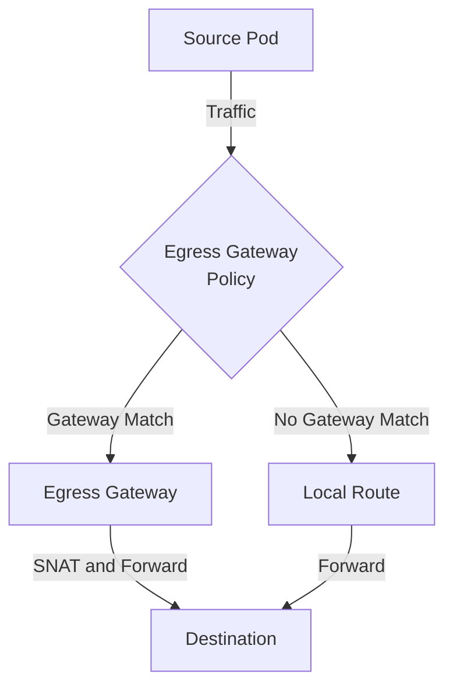

# How to Configure Calico Egress Gateway Policies

Author: [nawazdhandala](https://github.com/nawazdhandala)

Tags: Calico, Kubernetes, Network Policy, Egress Gateway, Security

Description: Configure Calico egress gateway policies to control and secure outbound traffic leaving your Kubernetes cluster.

---

## Introduction

Calico Egress Gateway Policies in Calico Enterprise and Calico Cloud provide destination-based control over which egress gateways outbound traffic uses with the `projectcalico.org/v3` API. This guide covers configuring Egress Gateway policies with production-ready configurations.

## Prerequisites

- Kubernetes cluster with Calico Enterprise or Calico Cloud and egress gateway support enabled
- `calicoctl` and `kubectl` installed

## Core Configuration

```yaml
apiVersion: projectcalico.org/v3
kind: EgressGatewayPolicy
metadata:
  name: configure-egress-gateway
spec:
  rules:
    - destination:
        cidr: 10.0.0.0/8
      description: "Local traffic bypasses the egress gateway"
    - destination:
        cidr: 203.0.113.0/24
      description: "Route partner API traffic through the blue gateways"
      gateway:
        namespaceSelector: "projectcalico.org/name == 'egress-gateways'"
        selector: "egress-code == 'blue'"
        maxNextHops: 2
    - description: "Route remaining internet traffic through the red gateways"
      gateway:
        namespaceSelector: "projectcalico.org/name == 'egress-gateways'"
        selector: "egress-code == 'red'"
      gatewayPreference: PreferNodeLocal
```

## Implementation

```bash
# Apply policy

calicoctl apply -f configure-egress-gateway.yaml

# Verify policy is active
calicoctl get egressgatewaypolicy configure-egress-gateway -o yaml

# Apply the policy to a namespace
kubectl annotate ns test egress.projectcalico.org/egressGatewayPolicy="configure-egress-gateway" --overwrite

# Test connectivity
kubectl exec -n test test-pod -- curl -s --max-time 5 http://target:8080
echo "Result: $?"
```

## Verification

```bash
# Confirm the namespace is using the egress gateway policy
kubectl get ns test -o jsonpath='{.metadata.annotations.egress\.projectcalico\.org/egressGatewayPolicy}'
echo

# From the external destination, confirm traffic uses the egress gateway source IP
sudo tcpdump -n host <egress-gateway-ip>
```

## Architecture



## Conclusion

Configure Egress Gateway in Calico ensures your outbound routing is properly configured, tested, and monitored. Follow the patterns in this guide, validate in staging first, and maintain comprehensive logging for security visibility. Regular policy audits help you keep your cluster's security posture aligned with evolving requirements.
