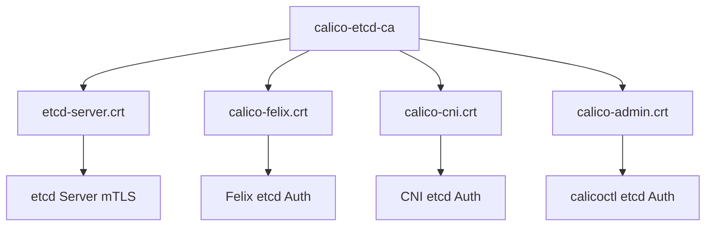

# Configure Calico etcd Certificate Generation

Author: [nawazdhandala](https://github.com/nawazdhandala)

Tags: Calico, Kubernetes, Networking, etcd, TLS, Certificates, PKI, Configuration

Description: A step-by-step guide to generating and configuring TLS certificates for Calico's etcd client connections using OpenSSL and cert-manager.

---

## Introduction

Calico's communication with etcd must be secured using mutual TLS (mTLS) to prevent eavesdropping and ensure that only authorized Calico components can connect to the etcd cluster. This requires a PKI (Public Key Infrastructure) with a Certificate Authority, server certificates for etcd, and client certificates for each Calico component.

Generating these certificates correctly - with the right Subject Alternative Names, key usage extensions, and validity periods - is critical for both security and operational reliability. Misconfigured certificates are a common source of Calico failures, especially after upgrades or when certificates expire unexpectedly.

This guide covers generating etcd certificates for Calico using OpenSSL for manual generation and cert-manager for automated lifecycle management.

## Prerequisites

- etcd cluster or plans to deploy one
- OpenSSL installed on a management workstation
- (Optional) cert-manager installed in Kubernetes
- Calico configured to use etcd datastore

## Step 1: Create a Certificate Authority

```bash
# Generate CA private key
openssl genrsa -out calico-etcd-ca.key 4096

# Generate self-signed CA certificate (10-year validity)
openssl req -x509 -new -nodes \
  -key calico-etcd-ca.key \
  -sha256 -days 3650 \
  -out calico-etcd-ca.crt \
  -subj "/C=US/O=Calico/CN=calico-etcd-ca"
```

## Step 2: Generate etcd Server Certificate

```bash
# etcd server private key
openssl genrsa -out etcd-server.key 2048

# Create certificate signing request
cat > etcd-server-csr.conf <<EOF
[req]
req_extensions = v3_req
distinguished_name = req_distinguished_name
[req_distinguished_name]
[v3_req]
basicConstraints = CA:FALSE
keyUsage = nonRepudiation, digitalSignature, keyEncipherment
subjectAltName = @alt_names
[alt_names]
DNS.1 = etcd
DNS.2 = etcd.kube-system.svc.cluster.local
IP.1 = 127.0.0.1
IP.2 = 10.0.0.10
EOF

openssl req -new -key etcd-server.key \
  -out etcd-server.csr \
  -subj "/CN=etcd-server" \
  -config etcd-server-csr.conf

# Sign the CSR with the CA
openssl x509 -req -in etcd-server.csr \
  -CA calico-etcd-ca.crt -CAkey calico-etcd-ca.key \
  -CAcreateserial -out etcd-server.crt \
  -days 365 -sha256 -extensions v3_req \
  -extfile etcd-server-csr.conf
```

## Step 3: Generate Calico Client Certificates



```bash
for component in calico-felix calico-cni calico-admin; do
  # Generate key
  openssl genrsa -out "${component}.key" 2048

  # Generate CSR
  openssl req -new \
    -key "${component}.key" \
    -out "${component}.csr" \
    -subj "/CN=${component}/O=calico"

  # Sign with CA
  openssl x509 -req -in "${component}.csr" \
    -CA calico-etcd-ca.crt -CAkey calico-etcd-ca.key \
    -CAcreateserial -out "${component}.crt" \
    -days 365 -sha256
done
```

## Step 4: Store Certificates in Kubernetes Secrets

```bash
kubectl create secret generic calico-etcd-certs \
  -n kube-system \
  --from-file=etcd-ca=calico-etcd-ca.crt \
  --from-file=etcd-cert=calico-felix.crt \
  --from-file=etcd-key=calico-felix.key
```

## Step 5: Automate with cert-manager (Recommended)

```yaml
apiVersion: cert-manager.io/v1
kind: Issuer
metadata:
  name: calico-etcd-ca-issuer
  namespace: kube-system
spec:
  ca:
    secretName: calico-etcd-ca-secret
---
apiVersion: cert-manager.io/v1
kind: Certificate
metadata:
  name: calico-felix-etcd-cert
  namespace: kube-system
spec:
  secretName: calico-felix-etcd-certs
  duration: 720h
  renewBefore: 168h
  commonName: calico-felix
  subject:
    organizations: ["calico"]
  usages:
    - client auth
  issuerRef:
    name: calico-etcd-ca-issuer
```

## Conclusion

Generating TLS certificates for Calico's etcd connections requires a well-structured PKI with appropriate extensions and Subject Alternative Names. Using cert-manager for automated certificate lifecycle management prevents expiry-related outages and reduces operational overhead. Store CA certificates, client certificates, and private keys in Kubernetes secrets with appropriate RBAC restrictions.
