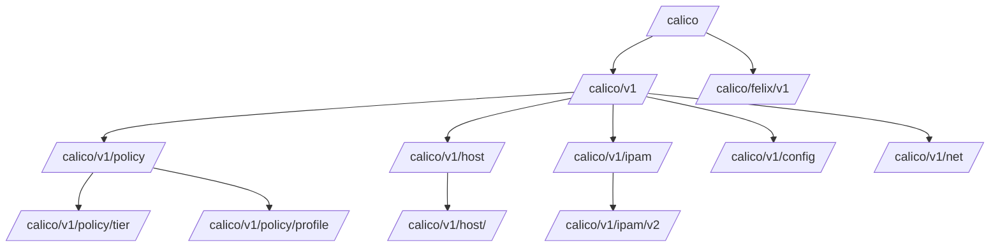

# Configure Calico etcdv3 Paths

Author: [nawazdhandala](https://github.com/nawazdhandala)

Tags: Calico, Kubernetes, Networking, etcd, etcdv3, Configuration, Datastore

Description: Understand and configure the etcdv3 key paths used by Calico to store network policy, IPAM, and host configuration data in your Kubernetes cluster.

---

## Introduction

Calico uses a structured hierarchy of etcdv3 key paths to store all its operational data - from network policies and IP address management (IPAM) records to host configuration and Felix agent state. Understanding this path structure is essential for configuring etcd RBAC correctly, diagnosing datastore issues, and performing maintenance operations such as data migration or backup.

The Calico etcdv3 path hierarchy is organized by data type, with each path prefix corresponding to a specific category of information. Knowing which component reads and writes which paths helps you configure minimal permissions and understand the blast radius of potential datastore failures.

## Prerequisites

- Calico configured with etcd datastore (not Kubernetes API mode)
- etcdctl configured with appropriate credentials
- Understanding of Calico's component architecture

## Calico etcdv3 Path Structure



## Key Path Categories

### Policy Paths

```bash
# List all network policies
etcdctl get /calico/v1/policy/ --prefix --keys-only

# Key paths:
# /calico/v1/policy/tier/<tier-name>/policy/<policy-name>
# /calico/v1/policy/profile/<profile-name>/rules
# /calico/v1/policy/profile/<profile-name>/tags
# /calico/v1/policy/profile/<profile-name>/labels
```

### Host/Endpoint Paths

```bash
# List all host data
etcdctl get /calico/v1/host/ --prefix --keys-only

# Key paths:
# /calico/v1/host/<hostname>/metadata
# /calico/v1/host/<hostname>/bird_ip
# /calico/v1/host/<hostname>/workload/<workload-id>/endpoint/<endpoint-id>
# /calico/v1/host/<hostname>/config/
```

### IPAM Paths

```bash
# View IPAM data
etcdctl get /calico/v1/ipam/ --prefix --keys-only

# Key paths:
# /calico/v1/ipam/v2/host/<hostname>/ipv4/block/<cidr>
# /calico/v1/ipam/v2/assignment/ipv4/block/<cidr>
# /calico/v1/ipam/v2/handle/<handle-id>
```

## Step 1: Configure the etcd Root Path Prefix

Calico supports a configurable prefix for all its etcd paths. Set it via the Felix configuration:

```bash
kubectl patch felixconfiguration default \
  --type=merge \
  --patch='{"spec":{"etcdV3CompactionPeriod":"10m"}}'
```

Or via environment variable in the DaemonSet:

```yaml
env:
  - name: ETCD_ENDPOINTS
    value: "https://etcd:2379"
  - name: CALICO_ETCD_PREFIX
    value: "/calico"
```

## Step 2: Explore Current Data

```bash
# Count total Calico keys in etcd
etcdctl get /calico/ --prefix --keys-only | wc -l

# View a specific policy
etcdctl get /calico/v1/policy/tier/default/policy/allow-web

# View Felix configuration
etcdctl get /calico/v1/config/ --prefix
```

## Step 3: Verify Data Integrity

```bash
# Check that host entries exist for all cluster nodes
for node in $(kubectl get nodes -o name | cut -d/ -f2); do
  count=$(etcdctl get "/calico/v1/host/${node}/" --prefix --keys-only | wc -l)
  echo "Node ${node}: ${count} etcd entries"
done
```

## Conclusion

Understanding Calico's etcdv3 path structure enables precise RBAC configuration, targeted backup/restore operations, and effective troubleshooting. The key prefixes - `/calico/v1/policy/`, `/calico/v1/host/`, `/calico/v1/ipam/`, and `/calico/felix/v1/` - each serve distinct functional areas and can be managed independently. Always interact with these paths using calicoctl in preference to direct etcdctl manipulation to avoid data corruption.
