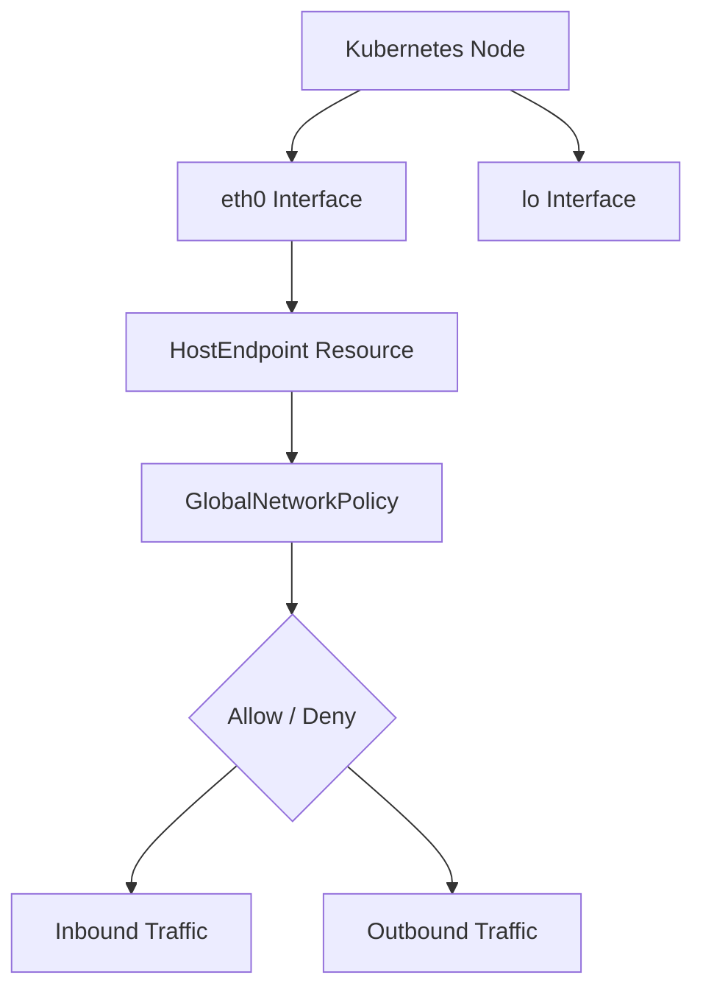

# Configure Calico Host Endpoint Security

Author: [nawazdhandala](https://github.com/nawazdhandala)

Tags: Calico, Kubernetes, Networking, Security, Host Endpoint

Description: A step-by-step guide to configuring Calico host endpoint security policies to protect the underlying node network interfaces in your Kubernetes cluster.

---

## Introduction

Calico host endpoints allow you to apply network policy to the network interfaces of your Kubernetes nodes themselves, not just to pods. This capability extends Calico's fine-grained policy model to the host networking layer, enabling you to control traffic flowing directly to and from node processes — including the kubelet, SSH, and other system services.

By default, Kubernetes nodes have unrestricted network access. Once you enable host endpoint protection, you gain the ability to enforce allow-list or deny-list policies at the OS level. This is a critical security boundary for production clusters where lateral movement or direct node compromise must be mitigated.

This guide walks through creating and applying HostEndpoint resources along with the supporting GlobalNetworkPolicy objects needed to keep your cluster operational while enforcing strict host-level security.

## Prerequisites

- A running Kubernetes cluster with Calico installed (v3.20+)
- `kubectl` and `calicoctl` configured with cluster admin access
- Familiarity with Calico NetworkPolicy concepts
- Calico datastore access (Kubernetes API or etcd)

## Understanding Host Endpoints

A HostEndpoint resource in Calico represents a network interface on a Kubernetes node. When a HostEndpoint is created, Calico begins enforcing policy on that interface. If no policy explicitly allows traffic, it will be denied by default once the failsafe rules are considered.



## Step 1: Enable Automatic Host Endpoint Creation

Calico can automatically create HostEndpoint resources for all node interfaces when using the `all-interfaces` mode. This is the recommended approach for most clusters.

```bash
kubectl patch felixconfiguration default \
  --type=merge \
  --patch='{"spec":{"interfacePrefix":"cali"}}'
```

Enable automatic host endpoint management via the Calico operator or by patching the Installation resource:

```bash
kubectl patch installation default \
  --type=merge \
  -p '{"spec":{"nonPrivilegedNetwork":false}}'
```

## Step 2: Create a HostEndpoint Resource

For manual creation, define a HostEndpoint for a specific node and interface:

```yaml
apiVersion: projectcalico.org/v3
kind: HostEndpoint
metadata:
  name: node1-eth0
  labels:
    node: node1
    role: worker
spec:
  interfaceName: eth0
  node: node1
  expectedIPs:
    - 10.0.1.10
```

Apply with calicoctl:

```bash
calicoctl apply -f hostendpoint.yaml
```

## Step 3: Create Failsafe GlobalNetworkPolicy

Before enforcing restrictions, create a policy that preserves essential cluster traffic:

```yaml
apiVersion: projectcalico.org/v3
kind: GlobalNetworkPolicy
metadata:
  name: allow-cluster-internal
spec:
  selector: "has(node)"
  order: 0
  ingress:
    - action: Allow
      protocol: TCP
      destination:
        ports: [22, 6443, 2379, 2380, 10250, 10255]
    - action: Allow
      protocol: UDP
      destination:
        ports: [53, 4789]
  egress:
    - action: Allow
```

```bash
calicoctl apply -f allow-cluster-internal.yaml
```

## Step 4: Apply a Default Deny Policy

Once failsafe rules are in place, apply a lower-priority deny-all policy:

```yaml
apiVersion: projectcalico.org/v3
kind: GlobalNetworkPolicy
metadata:
  name: deny-all-host
spec:
  selector: "has(node)"
  order: 1000
  ingress:
    - action: Deny
  egress:
    - action: Deny
```

## Conclusion

Configuring Calico host endpoint security transforms your Kubernetes nodes from open network participants into policy-enforced boundaries. With HostEndpoint resources and matching GlobalNetworkPolicy objects, you can restrict exactly which traffic reaches node processes, dramatically reducing your attack surface. Always validate your failsafe policies in a staging environment before applying them to production nodes.
