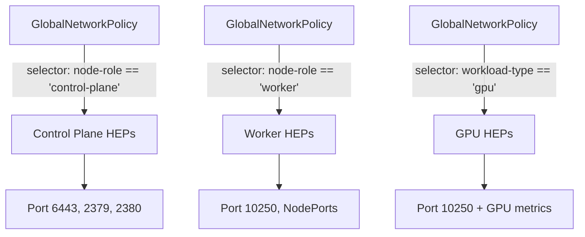

# Configure Calico Host Endpoint Selectors

Author: [nawazdhandala](https://github.com/nawazdhandala)

Tags: Calico, Kubernetes, Networking, Host Endpoint, Selectors, Configuration

Description: Learn how to configure Calico host endpoint selectors to target specific nodes and interfaces with precise network policies using label-based selection.

---

## Introduction

Calico host endpoint selectors are the mechanism by which GlobalNetworkPolicy objects target specific HostEndpoint resources. Rather than applying a policy to all nodes uniformly, selectors allow you to apply differentiated policies based on node labels — enforcing stricter rules on control plane nodes, different port allowances for GPU nodes, or region-specific rules for geographically distributed clusters.

Mastering selectors is fundamental to building a layered host endpoint security model. Calico selectors support equality, set membership, existence checks, and compound boolean expressions, giving you expressive power to match exactly the nodes you intend to affect.

This guide covers the selector syntax, common patterns, and examples for configuring host endpoint selectors in production Kubernetes clusters.

## Prerequisites

- Calico installed with HostEndpoint resources created
- Nodes labeled appropriately for your security zones
- `calicoctl` and `kubectl` with cluster admin access
- Basic familiarity with Calico GlobalNetworkPolicy structure

## Understanding Selector Syntax

Calico uses a CSS-like selector language. The selector in a GlobalNetworkPolicy `spec.selector` field matches labels on HostEndpoint resources.

| Expression | Meaning |
|------------|---------|
| `role == 'worker'` | Label `role` equals `worker` |
| `role != 'control-plane'` | Label `role` not equal to `control-plane'` |
| `has(gpu)` | Label `gpu` exists (any value) |
| `!has(untrusted)` | Label `untrusted` does not exist |
| `env in {'prod', 'staging'}` | Label `env` is one of the listed values |
| `role == 'worker' && has(gpu)` | Both conditions must be true |

## Step 1: Label Your Nodes

Add meaningful labels that reflect security zones:

```bash
kubectl label node control-plane-1 node-role=control-plane security-tier=critical
kubectl label node worker-1 node-role=worker security-tier=standard
kubectl label node worker-gpu-1 node-role=worker workload-type=gpu security-tier=standard
```

## Step 2: Add Labels to HostEndpoints

When creating HostEndpoints manually, mirror the node labels:

```yaml
apiVersion: projectcalico.org/v3
kind: HostEndpoint
metadata:
  name: worker-1-eth0
  labels:
    node-role: worker
    security-tier: standard
    workload-type: compute
spec:
  interfaceName: eth0
  node: worker-1
  expectedIPs:
    - 10.0.1.20
```

## Step 3: Write Selector-Targeted Policies



Control plane policy:

```yaml
apiVersion: projectcalico.org/v3
kind: GlobalNetworkPolicy
metadata:
  name: control-plane-ingress
spec:
  selector: "node-role == 'control-plane'"
  order: 5
  ingress:
    - action: Allow
      protocol: TCP
      destination:
        ports: [6443, 2379, 2380, 10250]
    - action: Deny
  egress:
    - action: Allow
```

Worker node policy:

```yaml
apiVersion: projectcalico.org/v3
kind: GlobalNetworkPolicy
metadata:
  name: worker-ingress
spec:
  selector: "node-role == 'worker'"
  order: 5
  ingress:
    - action: Allow
      protocol: TCP
      destination:
        ports: [10250, 30000, 32767]
    - action: Deny
  egress:
    - action: Allow
```

## Step 4: Use Compound Selectors

Target GPU workers with additional ports for DCGM metrics:

```yaml
apiVersion: projectcalico.org/v3
kind: GlobalNetworkPolicy
metadata:
  name: gpu-worker-extra-ports
spec:
  selector: "node-role == 'worker' && workload-type == 'gpu'"
  order: 4
  ingress:
    - action: Allow
      protocol: TCP
      destination:
        ports: [9400]
```

## Conclusion

Calico host endpoint selectors provide fine-grained control over which policies apply to which nodes. By labeling nodes with meaningful security attributes and writing selector expressions that target those labels precisely, you can maintain differentiated host-level security policies across heterogeneous node pools. Always verify selector matches with `calicoctl get hostendpoints -o wide` before applying policies to production nodes.
