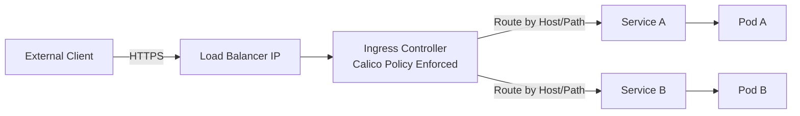

# How to Configure the Calico Ingress Gateway

Author: [nawazdhandala](https://github.com/nawazdhandala)

Tags: Calico, Kubernetes, Ingress, Gateway, Networking

Description: Configure Calico's ingress gateway to enable controlled external access to Kubernetes services with traffic routing and load balancing.

---

## Introduction

Calico's ingress gateway capabilities (available in Calico Enterprise and via integration with standard Kubernetes Ingress controllers) provide a controlled entry point for external traffic into the cluster. The ingress gateway sits at the boundary between external networks and the Kubernetes pod network, performing routing decisions, TLS termination, and traffic policy enforcement.

For open-source Calico, ingress gateway functionality is typically implemented via an Envoy-based ingress controller or NGINX, with Calico providing the underlying network policy enforcement. Calico Enterprise adds additional features including a dedicated gateway implementation with advanced traffic management capabilities.

## Prerequisites

- Calico installed
- An ingress controller (NGINX, Envoy-based, or Calico Enterprise gateway)
- kubectl access
- DNS for external access

## Configure Ingress Resource

```yaml
apiVersion: networking.k8s.io/v1
kind: Ingress
metadata:
  name: app-ingress
  annotations:
    nginx.ingress.kubernetes.io/rewrite-target: /
spec:
  ingressClassName: nginx
  rules:
  - host: app.example.com
    http:
      paths:
      - path: /
        pathType: Prefix
        backend:
          service:
            name: my-app
            port:
              number: 80
```

## Apply Calico Network Policy for Ingress

```yaml
apiVersion: projectcalico.org/v3
kind: NetworkPolicy
metadata:
  name: allow-ingress-to-app
  namespace: production
spec:
  selector: app == 'my-app'
  types:
  - Ingress
  ingress:
  - action: Allow
    source:
      selector: app == 'ingress-nginx'
    destination:
      ports:
      - 8080
```

## Verify Gateway Functionality

```bash
# Check ingress controller pods
kubectl get pods -n ingress-nginx

# Test ingress routing
curl -H "Host: app.example.com" http://$(kubectl get svc -n ingress-nginx ingress-nginx-controller   -o jsonpath='{.status.loadBalancer.ingress[0].ip}')/

# Check ingress status
kubectl describe ingress app-ingress
```

## Ingress Architecture



## Conclusion

The Calico ingress gateway combines Kubernetes ingress routing with Calico's network policy enforcement to provide secure, controlled external access to cluster services. Configure ingress resources for routing rules, create Calico network policies to restrict which pods the ingress controller can reach, and monitor ingress metrics to ensure reliable external access.
