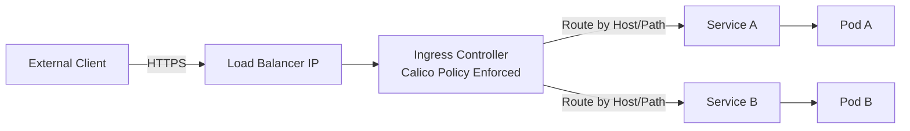

# How to Configure the Calico Ingress Gateway

Author: [nawazdhandala](https://github.com/nawazdhandala)

Tags: Calico, Kubernetes, Ingress, Gateway, Networking

Description: Configure Calico's ingress gateway to enable controlled external access to Kubernetes services with traffic routing and load balancing.

---

## Introduction

Calico can secure ingress traffic by combining Kubernetes ingress routing with Calico network policy enforcement. The ingress controller sits at the boundary between external networks and the Kubernetes pod network, performing routing decisions and, depending on the controller configuration, TLS termination.

For open-source Calico, ingress functionality is typically implemented with a standard Kubernetes ingress controller such as NGINX or an Envoy-based controller, with Calico providing the underlying network policy enforcement. Calico Enterprise and Calico Cloud also provide Calico Ingress Gateway, a hardened Envoy Gateway implementation that uses the Kubernetes Gateway API for advanced traffic management capabilities.

## Prerequisites

- Calico installed
- An ingress controller (NGINX, Envoy-based, or Calico Enterprise gateway)
- kubectl access
- DNS for external access

## Configure Ingress Resource

```yaml
apiVersion: networking.k8s.io/v1
kind: Ingress
metadata:
  name: app-ingress
  namespace: production
  annotations:
    nginx.ingress.kubernetes.io/rewrite-target: /
spec:
  ingressClassName: nginx
  rules:
  - host: app.example.com
    http:
      paths:
      - path: /
        pathType: Prefix
        backend:
          service:
            name: my-app
            port:
              number: 80
```

## Apply Calico Network Policy for Ingress

```yaml
apiVersion: projectcalico.org/v3
kind: NetworkPolicy
metadata:
  name: allow-ingress-to-app
  namespace: production
spec:
  selector: app == 'my-app'
  types:
  - Ingress
  ingress:
  - action: Allow
    source:
      namespaceSelector: projectcalico.org/name == 'ingress-nginx'
      selector: app.kubernetes.io/name == 'ingress-nginx' && app.kubernetes.io/component == 'controller'
    destination:
      ports:
      - 80
```

## Verify Gateway Functionality

```bash
# Check ingress controller pods

kubectl get pods -n ingress-nginx

# Test ingress routing
INGRESS_ADDRESS=$(kubectl get svc -n ingress-nginx ingress-nginx-controller -o jsonpath='{.status.loadBalancer.ingress[0].ip}{.status.loadBalancer.ingress[0].hostname}')
curl -H "Host: app.example.com" http://$INGRESS_ADDRESS/

# Check ingress status
kubectl describe ingress app-ingress -n production
```

## Ingress Architecture


```mermaid
graph LR
    CLIENT[External Client] -->|HTTPS| LB[Load Balancer IP]
    LB --> IGW[Ingress Controller\nCalico Policy Enforced]
    IGW -->|Route by Host/Path| SVC1[Service A]
    IGW -->|Route by Host/Path| SVC2[Service B]
    SVC1 --> POD1[Pod A]
    SVC2 --> POD2[Pod B]
```

## Conclusion

This ingress pattern combines Kubernetes ingress routing with Calico's network policy enforcement to provide secure, controlled external access to cluster services. Configure ingress resources for routing rules, create Calico network policies to restrict which pods the ingress controller can reach, and monitor ingress metrics to ensure reliable external access.
