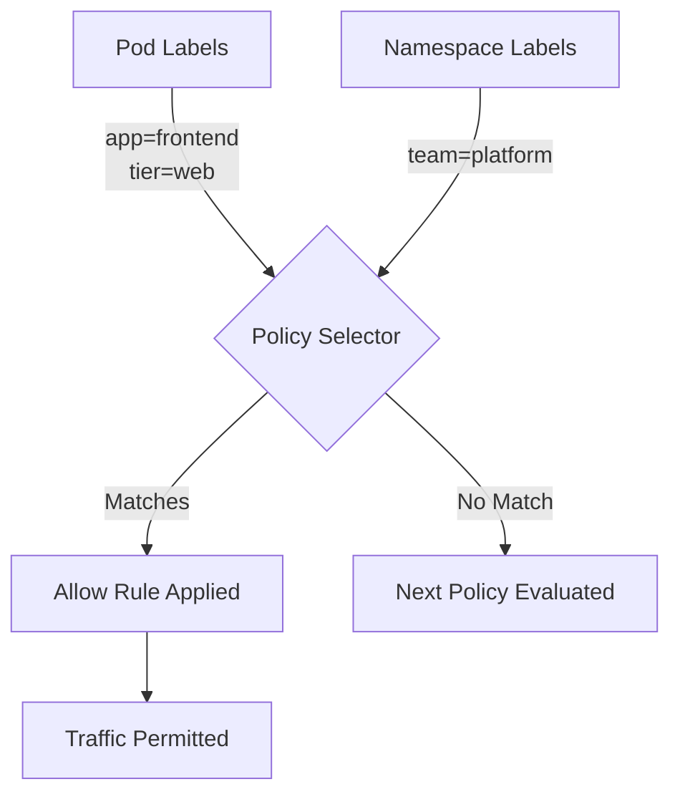

# How to Configure Calico Labels for Network Policy

Author: [nawazdhandala](https://github.com/nawazdhandala)

Tags: Calico, Kubernetes, Network Policy, Labels, Security

Description: A step-by-step guide to using Calico labels effectively to create precise, maintainable network policies that scale with your cluster.

---

## Introduction

Labels are the foundation of every Calico network policy. Without well-designed labels, your policies become brittle, hard to maintain, and prone to misconfiguration. Calico's selector syntax allows you to build rich, expressive rules that target specific workloads based on any combination of labels — but this power is only as good as the label strategy behind it.

Calico extends the standard Kubernetes label system with additional selectors for namespace labels, service account labels, and even custom Calico-specific metadata. The `projectcalico.org/v3` API's selector field supports boolean expressions, making it possible to write rules like "allow traffic from pods that are in the frontend tier AND have the environment=production label."

This guide covers how to design a label taxonomy for network policies, how to apply labels consistently, and how to write Calico policy selectors that are both precise and maintainable.

## Prerequisites

- Kubernetes cluster with Calico v3.26+
- `calicoctl` and `kubectl` installed
- Understanding of Kubernetes label syntax

## Step 1: Design a Label Taxonomy

Before writing any policies, define a consistent labeling strategy:

```yaml
# Recommended label schema for network policy
labels:
  app: frontend          # Application name
  tier: web              # Architecture tier (web, api, data, cache)
  environment: production # Environment (dev, staging, production)
  team: platform         # Owning team
  version: v2            # Application version
```

## Step 2: Apply Labels to Workloads

```yaml
apiVersion: apps/v1
kind: Deployment
metadata:
  name: frontend
  namespace: production
spec:
  template:
    metadata:
      labels:
        app: frontend
        tier: web
        environment: production
        team: platform
```

## Step 3: Write Policy Selectors Using Labels

```yaml
apiVersion: projectcalico.org/v3
kind: NetworkPolicy
metadata:
  name: allow-web-to-api
  namespace: production
spec:
  order: 100
  selector: tier == 'api' && environment == 'production'
  ingress:
    - action: Allow
      source:
        selector: tier == 'web' && environment == 'production'
      destination:
        ports: [8080]
  types:
    - Ingress
```

## Step 4: Use Namespace Labels for Cross-Namespace Policies

```yaml
# Label the namespace
kubectl label namespace production environment=production team=platform

# Use namespace selector in policy
apiVersion: projectcalico.org/v3
kind: NetworkPolicy
metadata:
  name: allow-monitoring
  namespace: production
spec:
  order: 100
  selector: all()
  ingress:
    - action: Allow
      source:
        namespaceSelector: team == 'observability'
      destination:
        ports: [9090, 9091]
  types:
    - Ingress
```

## Step 5: Use Boolean Expressions for Complex Rules

```yaml
# Allow traffic from any web pod that is NOT in the legacy tier
selector: tier == 'web' && tier != 'legacy'

# Allow from frontend OR monitoring
ingress:
  - action: Allow
    source:
      selector: app == 'frontend' || app == 'prometheus'
```

## Label Architecture



## Conclusion

A well-designed label strategy transforms Calico network policies from brittle point-to-point rules into a scalable, self-documenting security framework. Define your label taxonomy before writing policies, apply labels consistently across all workloads, and use Calico's boolean selector syntax to express complex security requirements precisely. Good labels make policies easier to write, easier to audit, and easier to maintain as your cluster grows.
