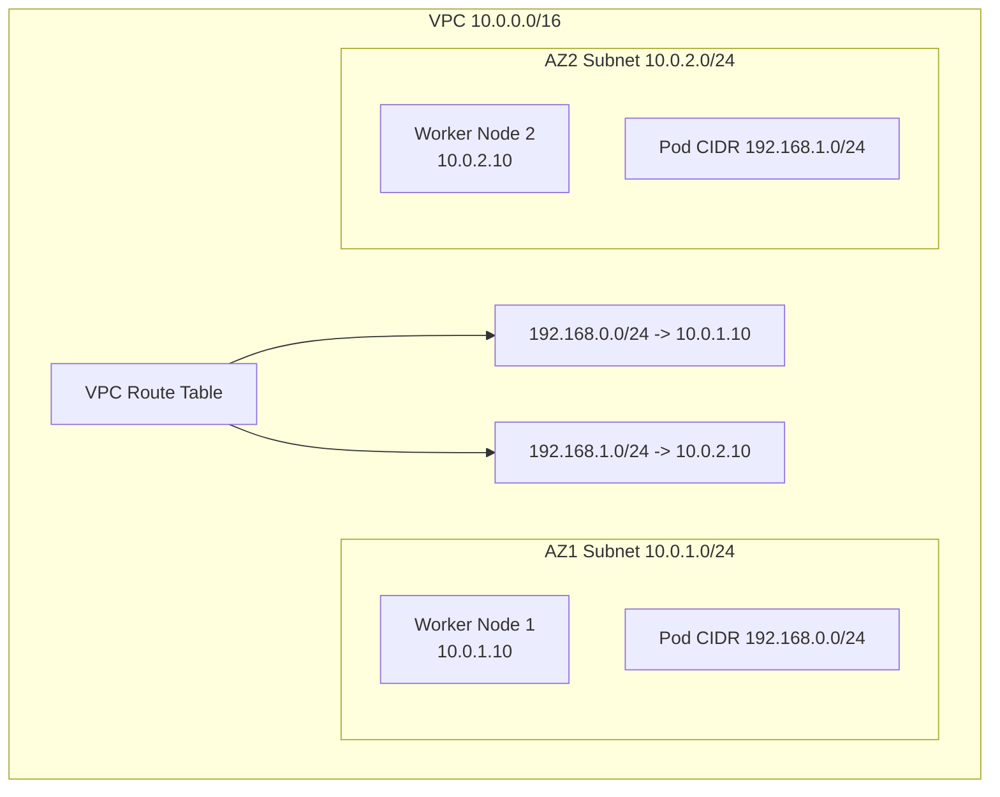

# Configure Calico Networking on AWS

Author: [nawazdhandala](https://github.com/nawazdhandala)

Tags: Calico, Kubernetes, Networking, AWS, Cloud, VPC, Configuration

Description: A complete guide to configuring Calico networking on AWS self-managed Kubernetes clusters, covering VPC routing, IP pool configuration, and BGP setup for optimal cloud integration.

---

## Introduction

Configuring Calico networking on AWS requires careful alignment between Calico's IP address management, pod CIDR ranges, and AWS VPC routing. Unlike managed EKS where CNI configuration is abstracted away, self-managed Kubernetes on AWS gives you full control over how Calico integrates with your VPC network — but also requires you to make explicit choices about routing modes, IP pool sizes, and cross-AZ traffic handling.

AWS offers two primary integration patterns for Calico: overlay networking (VXLAN or IP-in-IP) which works out of the box with AWS security groups, and native routing mode which requires configuring AWS VPC routes for Calico pod CIDRs. Native routing provides better performance by eliminating encapsulation overhead but requires more configuration.

This guide walks through both approaches for deploying Calico networking on AWS self-managed Kubernetes.

## Prerequisites

- Self-managed Kubernetes cluster on AWS EC2 instances
- VPC with subnets for each Availability Zone
- IAM permissions to modify VPC route tables
- `kubectl` and Helm installed

## AWS Architecture Overview



## Step 1: Install Calico with AWS-Appropriate Configuration

```bash
helm repo add projectcalico https://docs.tigera.io/calico/charts
helm install calico projectcalico/tigera-operator \
  --namespace tigera-operator \
  --create-namespace \
  --set installation.calicoNetwork.ipPools[0].cidr=192.168.0.0/16 \
  --set installation.calicoNetwork.ipPools[0].encapsulation=VXLANCrossSubnet
```

## Step 2: Configure IP Pool for AWS

```yaml
apiVersion: projectcalico.org/v3
kind: IPPool
metadata:
  name: aws-pod-pool
spec:
  cidr: 192.168.0.0/16
  blockSize: 24
  ipipMode: CrossSubnet
  vxlanMode: CrossSubnet
  natOutgoing: true
  nodeSelector: all()
```

`CrossSubnet` mode uses encapsulation only for cross-subnet traffic (cross-AZ), and native routing within the same subnet — the ideal tradeoff for AWS.

## Step 3: Configure AWS Security Groups

AWS security groups must allow Calico's encapsulation traffic:

```bash
# Allow VXLAN (UDP 4789) between nodes
aws ec2 authorize-security-group-ingress \
  --group-id sg-0123456789 \
  --protocol udp \
  --port 4789 \
  --source-group sg-0123456789

# Allow IP-in-IP (protocol 4) between nodes
aws ec2 authorize-security-group-ingress \
  --group-id sg-0123456789 \
  --protocol 4 \
  --source-group sg-0123456789
```

## Step 4: Disable Source/Destination Check

AWS instances drop packets with source IPs that don't match their primary IP. Disable this for pod routing:

```bash
# For each worker node instance
aws ec2 modify-instance-attribute \
  --instance-id i-0123456789abcdef0 \
  --no-source-dest-check
```

Or automate via Terraform:

```hcl
resource "aws_instance" "worker" {
  # ...
  source_dest_check = false
}
```

## Step 5: (Optional) Native Routing with VPC Route Tables

For native routing without encapsulation, add routes to the VPC route table:

```bash
# Add a route for each node's pod CIDR
aws ec2 create-route \
  --route-table-id rtb-0123456789 \
  --destination-cidr-block 192.168.0.0/24 \
  --instance-id i-0123456789abcdef0
```

## Conclusion

Configuring Calico on AWS requires choosing between overlay and native routing, correctly sizing IP pools for your node count, and configuring AWS security groups and source/destination check settings. The `CrossSubnet` encapsulation mode provides the best balance of simplicity and performance for multi-AZ AWS deployments, using native routing within an AZ and VXLAN encapsulation across AZ boundaries.
