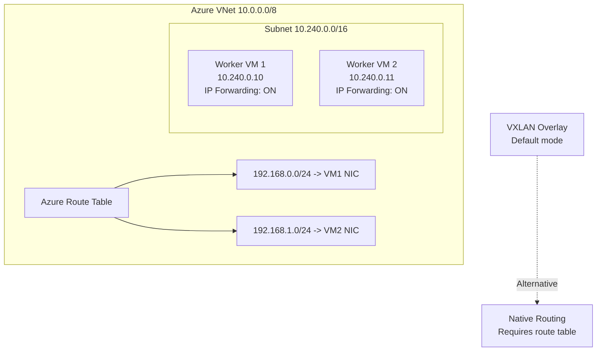

# Configure Calico Networking on Azure

Author: [nawazdhandala](https://github.com/nawazdhandala)

Tags: Calico, Kubernetes, Networking, Azure, Cloud, VNet, Configuration

Description: A complete guide to configuring Calico networking on Azure self-managed Kubernetes clusters, covering VNet integration, IP pool configuration, and Azure-specific routing constraints.

---

## Introduction

Configuring Calico networking on Azure requires understanding Azure's Virtual Network (VNet) constraints and how they interact with Calico's routing model. Azure VMs do not support arbitrary forwarding of packets with source IPs that don't belong to the VM - unlike AWS where you disable source/destination check, Azure enforces this at the platform level. This means Calico must use overlay networking (VXLAN) by default on Azure, unless you configure Azure route tables manually for each node's pod CIDR.

Azure also provides IP Forwarding as a VM NIC setting that must be enabled for Calico's overlay traffic to function correctly on self-managed clusters. This guide covers configuring Calico for both VXLAN overlay mode and native routing mode on Azure.

## Prerequisites

- Azure subscription with VM creation rights
- Self-managed Kubernetes cluster on Azure VMs
- Azure CLI (`az`) installed and authenticated
- `kubectl` and Helm available

## Azure Architecture for Calico



## Step 1: Enable IP Forwarding on Azure VMs

IP Forwarding must be enabled on every VM NIC that will forward pod traffic:

```bash
# Get NIC IDs for worker VMs
for vm in worker-1 worker-2 worker-3; do
  NIC_ID=$(az vm show -g k8s-rg -n $vm \
    --query "networkProfile.networkInterfaces[0].id" -o tsv)

  az network nic update \
    --ids $NIC_ID \
    --ip-forwarding true
done
```

## Step 2: Install Calico with VXLAN for Azure

VXLAN overlay works without Azure route table changes:

```bash
helm repo add projectcalico https://docs.tigera.io/calico/charts
helm install calico projectcalico/tigera-operator \
  --namespace tigera-operator \
  --create-namespace
```

```yaml
apiVersion: projectcalico.org/v3
kind: IPPool
metadata:
  name: azure-pod-pool
spec:
  cidr: 192.168.0.0/16
  ipipMode: Never
  vxlanMode: Always
  natOutgoing: true
  blockSize: 24
```

## Step 3: Configure Azure NSG Rules

Allow VXLAN traffic between nodes in the Network Security Group:

```bash
az network nsg rule create \
  --resource-group k8s-rg \
  --nsg-name k8s-workers-nsg \
  --name AllowVXLAN \
  --priority 200 \
  --direction Inbound \
  --protocol Udp \
  --destination-port-ranges 4789 \
  --source-address-prefixes 10.240.0.0/16 \
  --access Allow
```

## Step 4: (Optional) Native Routing via Azure Route Tables

For native routing without VXLAN, add routes for each node's pod CIDR:

```bash
# Create/update route for each node
az network route-table route create \
  --resource-group k8s-rg \
  --route-table-name k8s-routes \
  --name worker-1-pods \
  --address-prefix 192.168.0.0/24 \
  --next-hop-type VirtualAppliance \
  --next-hop-ip-address 10.240.0.10
```

Set the IP pool to use no encapsulation:

```yaml
spec:
  ipipMode: Never
  vxlanMode: Never
```

## Step 5: Verify Calico Deployment

```bash
kubectl get pods -n calico-system
calicoctl get ippools -o wide
calicoctl ipam show --show-blocks
```

## Conclusion

Configuring Calico on Azure requires enabling IP Forwarding on VM NICs, choosing between VXLAN overlay (simpler, works out of the box with NSG rules for UDP 4789) and native routing (better performance, requires Azure route table entries per node). VXLAN is recommended for most Azure deployments due to its operational simplicity and compatibility with Azure's platform networking constraints.
