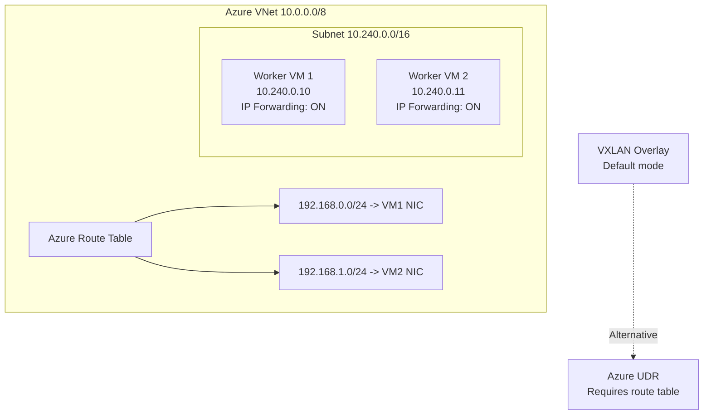

# Configure Calico Networking on Azure

Author: [nawazdhandala](https://github.com/nawazdhandala)

Tags: Calico, Kubernetes, Networking, Azure, Cloud, VNet, Configuration

Description: A complete guide to configuring Calico networking on Azure self-managed Kubernetes clusters, covering VNet integration, IP pool configuration, and Azure-specific routing constraints.

---

## Introduction

Configuring Calico networking on Azure requires understanding Azure's Virtual Network (VNet) constraints and how they interact with Calico's routing model. Azure VM NICs do not forward traffic for IPs that are not assigned to the NIC unless Azure IP Forwarding is enabled, and Azure must also have routes for any non-overlay pod CIDRs. This means Calico should use VXLAN overlay networking on Azure by default, unless you configure Azure route tables for the pod CIDRs.

Azure also provides IP Forwarding as a VM NIC setting that must be enabled when nodes forward pod traffic using Azure user-defined routes. This guide covers configuring Calico for both VXLAN overlay mode and Azure user-defined route mode.

## Prerequisites

- Azure subscription with VM creation rights
- Self-managed Kubernetes cluster on Azure VMs
- Azure CLI (`az`) installed and authenticated
- `kubectl` and Helm available

## Azure Architecture for Calico


```mermaid
graph TD
    subgraph Azure VNet 10.0.0.0/8
        subgraph Subnet 10.240.0.0/16
            A[Worker VM 1<br/>10.240.0.10<br/>IP Forwarding: ON]
            B[Worker VM 2<br/>10.240.0.11<br/>IP Forwarding: ON]
        end
        C[Azure Route Table]
        C --> D[192.168.0.0/24 -> VM1 NIC]
        C --> E[192.168.1.0/24 -> VM2 NIC]
    end
    F[VXLAN Overlay<br/>Default mode] -.->|Alternative| G[Azure UDR<br/>Requires route table]
```

## Step 1: Enable IP Forwarding on Azure VMs

IP Forwarding must be enabled on every VM NIC that will forward pod traffic:

```bash
# Get NIC IDs for worker VMs

for vm in worker-1 worker-2 worker-3; do
  NIC_ID=$(az vm show -g k8s-rg -n $vm \
    --query "networkProfile.networkInterfaces[0].id" -o tsv)

  az network nic update \
    --ids $NIC_ID \
    --ip-forwarding true
done
```

## Step 2: Install Calico with VXLAN for Azure

VXLAN overlay works without Azure route table changes:

```bash
helm repo add projectcalico https://docs.tigera.io/calico/charts
helm template calico-crds projectcalico/crd.projectcalico.org.v1 | kubectl apply --server-side -f -

cat > values.yaml <<EOF
installation:
  calicoNetwork:
    bgp: Disabled
    ipPools:
    - cidr: 192.168.0.0/16
      encapsulation: VXLAN
      natOutgoing: Enabled
      blockSize: 24
EOF

helm install calico projectcalico/tigera-operator \
  -f values.yaml \
  --namespace tigera-operator \
  --create-namespace
```

## Step 3: Configure Azure NSG Rules

Allow VXLAN traffic between nodes in the Network Security Group:

```bash
az network nsg rule create \
  --resource-group k8s-rg \
  --nsg-name k8s-workers-nsg \
  --name AllowVXLAN \
  --priority 200 \
  --direction Inbound \
  --protocol Udp \
  --destination-port-ranges 4789 \
  --source-address-prefixes 10.240.0.0/16 \
  --access Allow
```

## Step 4: (Optional) Azure User-Defined Routes

For networking without VXLAN, use Azure user-defined routes and add routes for each node's pod CIDR. The pod CIDR must be part of your Azure VNet address space:

```bash
# Create/update route for each node
az network route-table route create \
  --resource-group k8s-rg \
  --route-table-name k8s-routes \
  --name worker-1-pods \
  --address-prefix 192.168.0.0/24 \
  --next-hop-type VirtualAppliance \
  --next-hop-ip-address 10.240.0.10
```

In this mode, disable Calico networking and let Azure routing provide the pod network:

```yaml
env:
- name: CALICO_NETWORKING_BACKEND
  value: "none"
```

## Step 5: Verify Calico Deployment

```bash
kubectl get pods -n calico-system
calicoctl get ippools -o wide
calicoctl ipam show --show-blocks
```

## Conclusion

Configuring Calico on Azure requires choosing between VXLAN overlay (simpler, works without pod-CIDR route table entries, with NSG rules for UDP 4789) and Azure user-defined routes (requires IP Forwarding and Azure route table entries per node). VXLAN is recommended for most Azure deployments due to its operational simplicity and compatibility with Azure's platform networking constraints.
