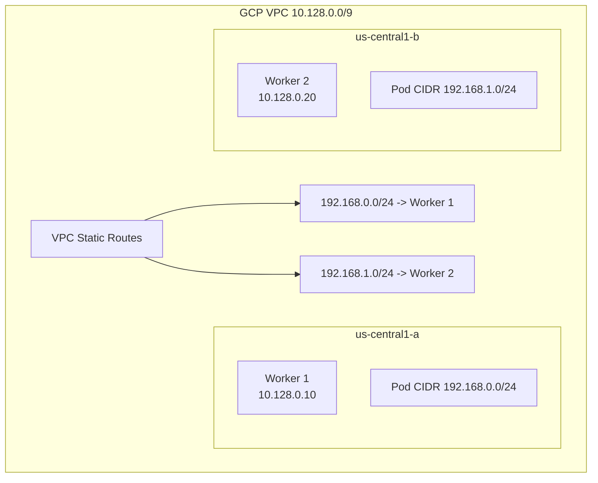

# Configure Calico Networking on Google Compute Engine

Author: [nawazdhandala](https://github.com/nawazdhandala)

Tags: Calico, Kubernetes, Networking, GCE, Google Cloud, VPC, Configuration

Description: A step-by-step guide to configuring Calico networking on Google Compute Engine self-managed Kubernetes clusters, covering GCP VPC routing, firewall rules, and IP pool configuration.

---

## Introduction

Google Compute Engine (GCE) provides a unique networking environment for Calico deployments. GCP's VPC network is globally routed and supports custom static routes, which makes it well-suited for Calico's native routing mode. Unlike AWS, GCP VMs automatically forward packets for any IP address without a source/destination check equivalent. This simplifies Calico deployment on GCE but still requires attention to firewall rules and VPC route configuration.

Calico on GCE can operate in either overlay mode (VXLAN) or native routing mode. For most GCE deployments, native routing via VPC static routes provides better performance and is simpler to manage than overlay networking.

## Prerequisites

- Self-managed Kubernetes on GCE instances
- Google Cloud SDK (`gcloud`) installed and authenticated
- VPC network with GCE instances in the same project
- `kubectl` and Helm available

## GCE Architecture for Calico



## Step 1: Create GCP Firewall Rules

Allow required traffic between Kubernetes nodes:

```bash
# Allow VXLAN (if using overlay mode)
gcloud compute firewall-rules create allow-calico-vxlan \
  --network k8s-network \
  --allow udp:4789 \
  --source-tags kubernetes-node \
  --target-tags kubernetes-node \
  --description "Allow Calico VXLAN between nodes"

# Allow Calico BGP (if using native routing with BGP)
gcloud compute firewall-rules create allow-calico-bgp \
  --network k8s-network \
  --allow tcp:179 \
  --source-tags kubernetes-node \
  --target-tags kubernetes-node \
  --description "Allow Calico BGP peering"

# Allow kubelet
gcloud compute firewall-rules create allow-kubelet \
  --network k8s-network \
  --allow tcp:10250 \
  --source-tags kubernetes-node \
  --target-tags kubernetes-node
```

## Step 2: Install Calico

```bash
helm repo add projectcalico https://docs.tigera.io/calico/charts
helm install calico projectcalico/tigera-operator \
  --namespace tigera-operator \
  --create-namespace
```

## Step 3: Configure IP Pool for GCE Native Routing

```yaml
apiVersion: projectcalico.org/v3
kind: IPPool
metadata:
  name: gce-pod-pool
spec:
  cidr: 192.168.0.0/16
  ipipMode: Never
  vxlanMode: Never
  natOutgoing: true
  blockSize: 24
```

## Step 4: Add VPC Static Routes for Pod CIDRs

For native routing, add a VPC route for each node's pod CIDR:

```bash
# Add route for each worker node
gcloud compute routes create worker-1-pods \
  --network k8s-network \
  --destination-range 192.168.0.0/24 \
  --next-hop-instance worker-1 \
  --next-hop-instance-zone us-central1-a

gcloud compute routes create worker-2-pods \
  --network k8s-network \
  --destination-range 192.168.1.0/24 \
  --next-hop-instance worker-2 \
  --next-hop-instance-zone us-central1-b
```

## Step 5: (Alternative) Enable IP Forwarding on Instances

If using GCE instances without enabling can-ip-forward during creation:

```bash
# Enable IP forwarding (requires instance stop/start on most machine types)
gcloud compute instances describe worker-1 | grep canIpForward
# Should be: canIpForward: true
```

For new instances, always enable:

```bash
gcloud compute instances create worker-new \
  --can-ip-forward \
  --tags kubernetes-node \
  --image-family ubuntu-2204-lts \
  --image-project ubuntu-os-cloud
```

## Conclusion

Configuring Calico on GCE is straightforward when using native routing mode. The key requirements are GCP firewall rules to allow required traffic between nodes, VPC static routes for each node's pod CIDR, and GCE instances created with `--can-ip-forward`. For clusters with frequent node additions, automate the VPC route creation as part of your node provisioning process.
