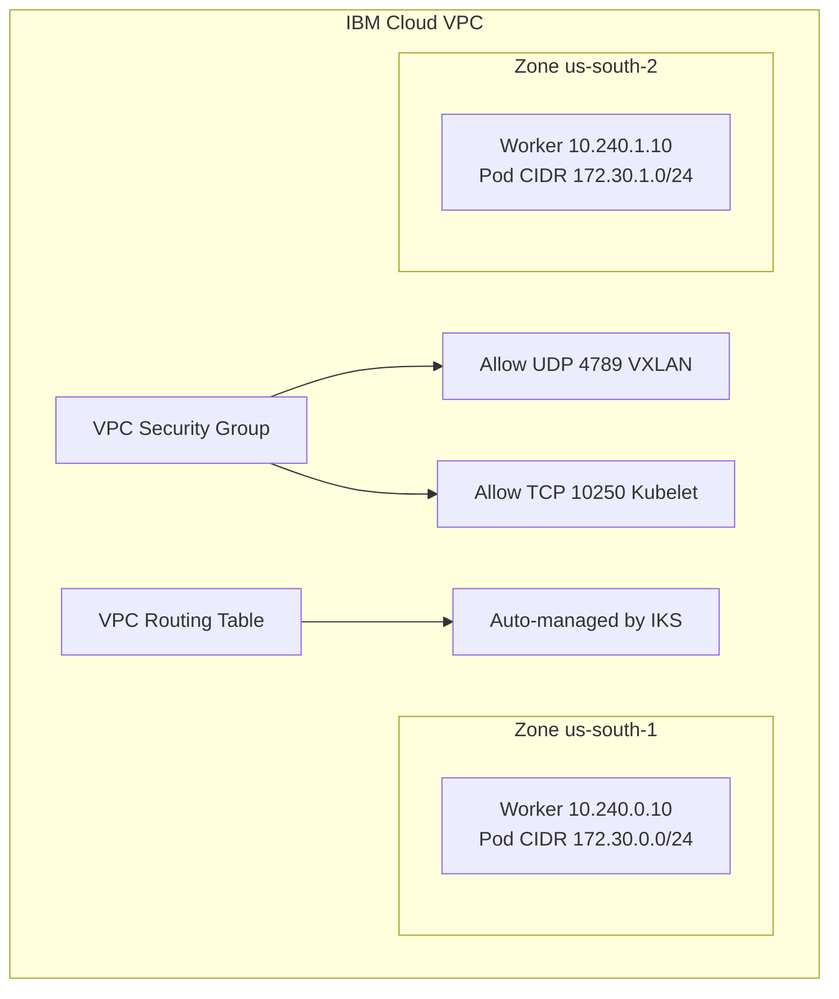

# Configure Calico Networking on IBM Cloud

Author: [nawazdhandala](https://github.com/nawazdhandala)

Tags: Calico, Kubernetes, Networking, IBM Cloud, VPC, Configuration

Description: A guide to configuring Calico networking on IBM Cloud Kubernetes Service and self-managed Kubernetes on IBM Cloud VPC, covering subnet configuration, security groups, and IP pool setup.

---

## Introduction

IBM Cloud Kubernetes Service (IKS) ships with Calico as its default CNI. For standard IKS clusters, Calico is pre-configured, but platform engineers often need to customize network policies, BGP configurations, and IP pool settings to meet enterprise networking requirements. For self-managed Kubernetes on IBM Cloud VPC, Calico requires explicit configuration similar to other cloud providers.

IBM Cloud VPC provides predictable networking with security groups acting similarly to AWS security groups. IBM Cloud's classic infrastructure uses VLAN-based networking that requires different Calico configuration from VPC-based deployments.

## Prerequisites

- IBM Cloud account with Kubernetes or VPC permissions
- IBM Cloud CLI (`ibmcloud`) with the Kubernetes plugin
- `kubectl` and `calicoctl` configured
- Familiarity with IBM Cloud VPC or Classic Infrastructure

## IBM Cloud VPC Architecture for Calico



## Step 1: Access Calico Configuration on IKS

For IBM Cloud Kubernetes Service, use the IBM Cloud CLI to get Calico credentials:

```bash
ibmcloud login --apikey $IBM_API_KEY -r us-south

# Get cluster credentials
ibmcloud ks cluster config --cluster my-cluster

# Download calicoctl config for the cluster
ibmcloud ks cluster config --cluster my-cluster \
  --admin --network
```

## Step 2: Configure IP Pools for IKS

IKS pre-configures Calico IP pools. To customize:

```bash
# View existing pools
calicoctl get ippools -o wide

# Modify the default pool
calicoctl get ippool default-ipv4-ippool -o yaml > pool.yaml
# Edit pool.yaml to adjust cidr, blockSize, etc.
calicoctl apply -f pool.yaml
```

## Step 3: Self-Managed Kubernetes on IBM Cloud VPC

For self-managed clusters on IBM Cloud VPC:

```bash
# Install Calico
helm repo add projectcalico https://docs.tigera.io/calico/charts
helm install calico projectcalico/tigera-operator \
  --namespace tigera-operator --create-namespace
```

Configure the IP pool:

```yaml
apiVersion: projectcalico.org/v3
kind: IPPool
metadata:
  name: ibm-vpc-pod-pool
spec:
  cidr: 172.30.0.0/16
  ipipMode: Never
  vxlanMode: Always
  natOutgoing: true
  blockSize: 24
```

## Step 4: Configure IBM Cloud VPC Security Groups

```bash
# Allow VXLAN between worker nodes
ibmcloud is security-group-rule-add <sg-id> \
  inbound udp \
  --remote <sg-id> \
  --port-min 4789 --port-max 4789

# Allow kubelet
ibmcloud is security-group-rule-add <sg-id> \
  inbound tcp \
  --remote <sg-id> \
  --port-min 10250 --port-max 10250
```

## Step 5: Configure Calico for IBM Classic Infrastructure

For clusters on IBM Classic Infrastructure (VLAN-based):

```yaml
apiVersion: projectcalico.org/v3
kind: IPPool
metadata:
  name: classic-pod-pool
spec:
  cidr: 172.30.0.0/16
  ipipMode: Always
  vxlanMode: Never
  natOutgoing: true
```

Classic Infrastructure requires IP-in-IP encapsulation as VLANs don't support arbitrary pod CIDR routing.

## Step 6: Verify Configuration

```bash
calicoctl get nodes -o wide
calicoctl get ippools -o wide
calicoctl ipam show --show-blocks

# Test pod-to-pod connectivity
kubectl run test --image=busybox --rm -it -- ping 172.30.1.5
```

## Conclusion

Configuring Calico on IBM Cloud differs between IKS (where Calico is pre-installed and managed) and self-managed clusters. For IKS, the focus is on customizing the pre-existing configuration; for self-managed clusters on IBM Cloud VPC, configuration mirrors other cloud providers with VXLAN overlay and VPC security group rules. IBM Classic Infrastructure requires IP-in-IP encapsulation rather than VXLAN due to VLAN-based networking constraints.
