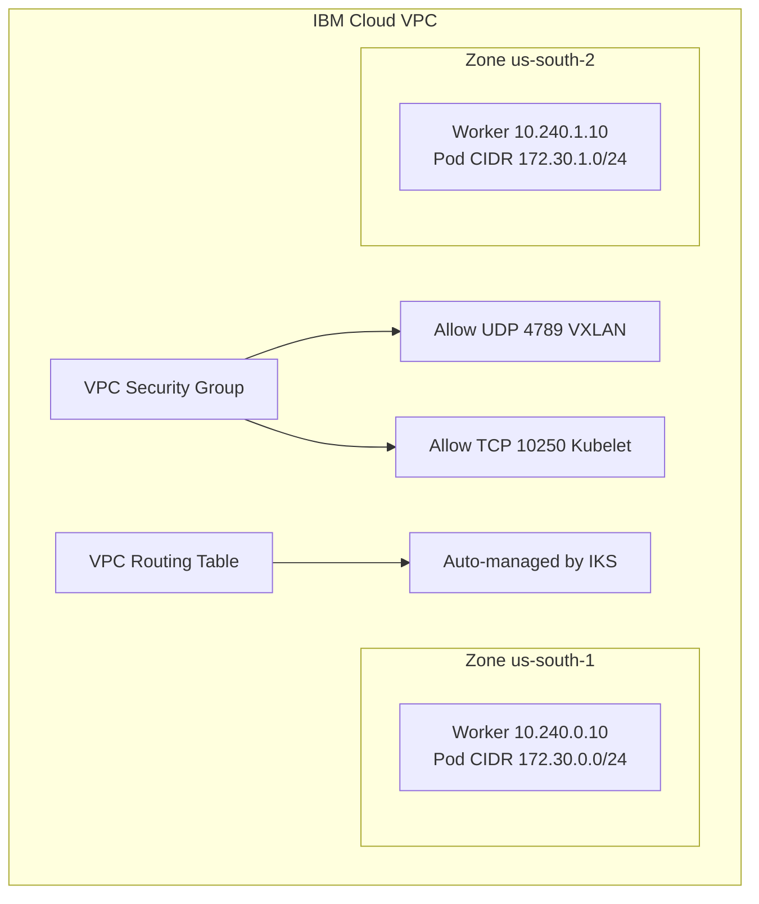

# Configure Calico Networking on IBM Cloud

Author: [nawazdhandala](https://github.com/nawazdhandala)

Tags: Calico, Kubernetes, Networking, IBM Cloud, VPC, Configuration

Description: A guide to configuring Calico networking on IBM Cloud Kubernetes Service and self-managed Kubernetes on IBM Cloud VPC, covering subnet configuration, security groups, and IP pool setup.

---

## Introduction

IBM Cloud Kubernetes Service (IKS) ships with Calico for cluster networking and network policy. For standard IKS clusters, Calico is pre-configured, but platform engineers often need to customize network policies to meet enterprise networking requirements. For self-managed Kubernetes on IBM Cloud VPC, Calico requires explicit configuration similar to other cloud providers.

IBM Cloud VPC provides predictable networking with security groups acting similarly to AWS security groups. IBM Cloud's classic infrastructure uses VLAN-based networking that requires different Calico configuration from VPC-based deployments.

## Prerequisites

- IBM Cloud account with Kubernetes or VPC permissions
- IBM Cloud CLI (`ibmcloud`) with the Kubernetes plugin
- `kubectl` and `calicoctl` configured
- Familiarity with IBM Cloud VPC or Classic Infrastructure

## IBM Cloud VPC Architecture for Calico


```mermaid
graph TD
    subgraph IBM Cloud VPC
        subgraph Zone us-south-1
            A[Worker 10.240.0.10<br/>Pod CIDR 172.30.0.0/24]
        end
        subgraph Zone us-south-2
            B[Worker 10.240.1.10<br/>Pod CIDR 172.30.1.0/24]
        end
        C[VPC Security Group] --> D[Allow UDP 4789 VXLAN]
        C --> E[Allow TCP 10250 Kubelet]
        F[VPC Routing Table] --> G[Auto-managed by IKS]
    end
```

## Step 1: Access Calico Configuration on IKS

For IBM Cloud Kubernetes Service, use the IBM Cloud CLI to get Calico credentials:

```bash
ibmcloud login --apikey $IBM_API_KEY -r us-south

# Get cluster credentials

ibmcloud ks cluster config --cluster my-cluster

# Download calicoctl config for the cluster
ibmcloud ks cluster config --cluster my-cluster \
  --admin --network
```

## Step 2: Review Calico Configuration on IKS

IKS pre-configures and manages Calico components, including the default `IPPool` resources. IBM does not support modifying the default Calico `IPPool`, Calico components, or Calico node daemon sets in IKS clusters. Instead, use `calicoctl` to view the managed configuration and apply supported Calico network policies:

```bash
# View Calico nodes and policies
calicoctl get nodes
calicoctl get NetworkPolicy --all-namespaces -o wide
calicoctl get GlobalNetworkPolicies -o wide

# Apply a supported Calico network policy
calicoctl apply -f policy.yaml
```

## Step 3: Self-Managed Kubernetes on IBM Cloud VPC

For self-managed clusters on IBM Cloud VPC:

```bash
# Install Calico
helm repo add projectcalico https://docs.tigera.io/calico/charts
kubectl create namespace tigera-operator
helm template calico-crds projectcalico/crd.projectcalico.org.v1 \
  --version v3.32.0 | kubectl apply --server-side -f -
helm install calico projectcalico/tigera-operator \
  --version v3.32.0 \
  --namespace tigera-operator
```

Configure the default IP pool during installation by using an operator `Installation` resource:

```yaml
apiVersion: operator.tigera.io/v1
kind: Installation
metadata:
  name: default
spec:
  calicoNetwork:
    bgp: Disabled
    ipPools:
      - cidr: 172.30.0.0/16
        encapsulation: VXLAN
        natOutgoing: Enabled
        blockSize: 24
```

## Step 4: Configure IBM Cloud VPC Security Groups

```bash
# Allow VXLAN between worker nodes
ibmcloud is security-group-rule-add <sg-id> \
  inbound udp \
  --remote <sg-id> \
  --port-min 4789 --port-max 4789

# Allow kubelet
ibmcloud is security-group-rule-add <sg-id> \
  inbound tcp \
  --remote <sg-id> \
  --port-min 10250 --port-max 10250
```

## Step 5: Configure Calico for IBM Classic Infrastructure

For self-managed clusters on IBM Classic Infrastructure (VLAN-based), use IP-in-IP only when the underlay network does not route pod CIDRs directly:

```yaml
apiVersion: projectcalico.org/v3
kind: IPPool
metadata:
  name: classic-pod-pool
spec:
  cidr: 172.30.0.0/16
  ipipMode: Always
  vxlanMode: Never
  natOutgoing: true
```

IBM Cloud manages Calico networking for IKS classic clusters. For self-managed classic deployments, IP-in-IP encapsulation is a common option when VLAN routing does not carry pod CIDRs directly.

## Step 6: Verify Configuration

```bash
calicoctl get nodes -o wide
calicoctl get ippools -o wide
calicoctl ipam show --show-blocks

# Test pod-to-pod connectivity
kubectl run test --image=busybox --rm -it -- ping 172.30.1.5
```

## Conclusion

Configuring Calico on IBM Cloud differs between IKS (where Calico is pre-installed and managed) and self-managed clusters. For IKS, the focus is on reviewing the managed configuration and applying supported network policies; for self-managed clusters on IBM Cloud VPC, configuration mirrors other cloud providers with VXLAN overlay and VPC security group rules. For self-managed IBM Classic Infrastructure deployments, IP-in-IP encapsulation is an option when the VLAN-based underlay does not route pod CIDRs directly.
