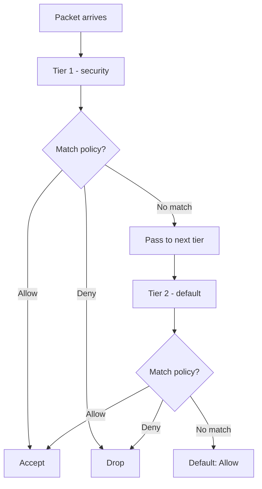

# Configure Calico NetworkPolicy Resource

Author: [nawazdhandala](https://github.com/nawazdhandala)

Tags: Calico, Kubernetes, Networking, NetworkPolicy, Security, Configuration

Description: A guide to creating and configuring Calico NetworkPolicy resources, covering namespace-scoped policies, rule structure, selectors, and action types for pod-level network security.

---

## Introduction

The Calico NetworkPolicy resource is a namespace-scoped policy that extends the standard Kubernetes NetworkPolicy with additional capabilities including egress policies, action logging, and named ports. Calico NetworkPolicy resources are applied to pods within a specific namespace based on selector expressions, making them the primary tool for implementing pod-level microsegmentation.

Understanding the NetworkPolicy resource structure - tiers, order, selectors, and rule actions - is foundational to building effective security policies in Calico.

## Prerequisites

- Calico installed with network policy enforcement enabled
- `calicoctl` and `kubectl` with cluster admin access
- Understanding of Calico's tier system

## NetworkPolicy Resource Structure

```yaml
apiVersion: projectcalico.org/v3
kind: NetworkPolicy
metadata:
  name: allow-frontend-to-backend
  namespace: production
spec:
  tier: default          # Policy tier (default or custom)
  order: 100             # Evaluation order within tier
  selector: "app == 'backend'"  # Targets pods with this label

  ingress:
    - action: Allow
      protocol: TCP
      source:
        selector: "app == 'frontend'"
      destination:
        ports: [8080]
    - action: Deny         # Default deny at end of rule list
      source: {}

  egress:
    - action: Allow
      destination:
        selector: "app == 'database'"
        ports: [5432]
    - action: Allow
      destination:
        namespaceSelector: "kubernetes.io/metadata.name == 'kube-system'"
      protocol: UDP
      destination:
        ports: [53]         # Allow DNS
    - action: Deny
```

## Step 1: Create a Basic Allow Policy

```yaml
apiVersion: projectcalico.org/v3
kind: NetworkPolicy
metadata:
  name: allow-http-ingress
  namespace: web
spec:
  selector: "app == 'webserver'"
  order: 200
  ingress:
    - action: Allow
      protocol: TCP
      destination:
        ports: [80, 443]
  egress:
    - action: Allow
```

```bash
calicoctl apply -f allow-http-ingress.yaml
```

## Step 2: Create a Default Deny Policy

```yaml
apiVersion: projectcalico.org/v3
kind: NetworkPolicy
metadata:
  name: default-deny
  namespace: production
spec:
  selector: "all()"
  order: 1000
  ingress:
    - action: Deny
  egress:
    - action: Deny
```

## Policy Evaluation Flow



## Step 3: Use Named Ports

```yaml
ingress:
  - action: Allow
    destination:
      ports:
        - http        # Named port - resolves from pod spec
        - 8080        # Numeric port
```

Configure named ports on pods:

```yaml
# Pod spec
containers:
  - name: app
    ports:
      - name: http
        containerPort: 8080
```

## Step 4: Combine Selectors

```yaml
ingress:
  - action: Allow
    source:
      selector: "app == 'frontend'"
      namespaceSelector: "environment == 'production'"
    # Both selectors must match
```

## Conclusion

Calico NetworkPolicy resources provide fine-grained namespace-scoped pod security with capabilities beyond the standard Kubernetes NetworkPolicy. Effective policies use a default-deny base with explicit allow rules, are ordered within tiers for predictable evaluation, and use label selectors that are easy to reason about. Always test new policies in a lower environment before applying to production namespaces.
