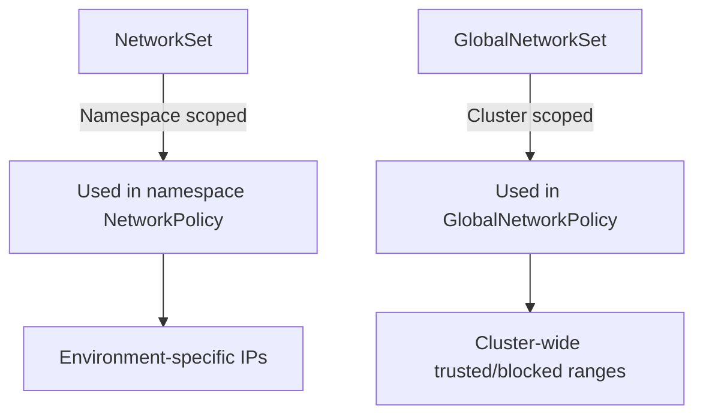

# Configure Calico NetworkSet Resource

Author: [nawazdhandala](https://github.com/nawazdhandala)

Tags: Calico, Kubernetes, Networking, NetworkSet, Security, Configuration

Description: A guide to configuring Calico NetworkSet resources to group external IP addresses and CIDRs for use in network policies as reusable allow/deny lists.

---

## Introduction

Calico NetworkSet resources provide a way to name and group IP addresses, CIDRs, and DNS names that appear in network policies. Instead of embedding raw IP ranges directly in policy rules — which makes policies harder to read and maintain — you define named sets and reference them by selector in your policies.

NetworkSet resources exist in both namespace-scoped (NetworkSet) and cluster-scoped (GlobalNetworkSet) forms. Use namespace-scoped sets for environment-specific IP groups and global sets for cluster-wide trusted or blocked ranges.

## Prerequisites

- Calico installed with network policy enforcement
- `calicoctl` and `kubectl` with cluster admin access

## NetworkSet Resource Types



## Step 1: Create a Namespace-Scoped NetworkSet

```yaml
apiVersion: projectcalico.org/v3
kind: NetworkSet
metadata:
  name: trusted-payment-processors
  namespace: payments
  labels:
    role: trusted-external
    type: payment-processor
spec:
  nets:
    - 52.44.0.0/16      # Stripe IPs
    - 54.241.0.0/16     # PayPal IPs
    - 185.28.196.0/22   # Adyen IPs
```

## Step 2: Create a GlobalNetworkSet

```yaml
apiVersion: projectcalico.org/v3
kind: GlobalNetworkSet
metadata:
  name: management-hosts
  labels:
    role: management
    access-level: admin
spec:
  nets:
    - 10.0.0.0/24       # Internal management CIDR
    - 203.0.113.100/32  # VPN gateway IP
    - 198.51.100.0/29   # Office public IPs
```

## Step 3: Reference NetworkSet in a Policy

```yaml
# Allow egress to trusted payment processors
apiVersion: projectcalico.org/v3
kind: NetworkPolicy
metadata:
  name: allow-payment-egress
  namespace: payments
spec:
  selector: "app == 'checkout'"
  order: 100
  egress:
    - action: Allow
      destination:
        selector: "role == 'trusted-external' && type == 'payment-processor'"
        ports: [443]
      protocol: TCP
```

```yaml
# Allow SSH ingress from management hosts (GlobalNetworkPolicy)
apiVersion: projectcalico.org/v3
kind: GlobalNetworkPolicy
metadata:
  name: allow-management-ssh
spec:
  selector: "has(node)"
  order: 10
  ingress:
    - action: Allow
      protocol: TCP
      source:
        selector: "role == 'management' && access-level == 'admin'"
      destination:
        ports: [22]
```

## Step 4: Create a Blocklist NetworkSet

```yaml
apiVersion: projectcalico.org/v3
kind: GlobalNetworkSet
metadata:
  name: blocked-ips
  labels:
    threat: blocked
spec:
  nets:
    - 198.199.0.0/16    # Blocked CIDR
    - 10.99.0.0/24      # Compromised internal range

---
apiVersion: projectcalico.org/v3
kind: GlobalNetworkPolicy
metadata:
  name: block-threat-ips
spec:
  selector: "all()"
  order: 1
  ingress:
    - action: Deny
      source:
        selector: "threat == 'blocked'"
  egress:
    - action: Deny
      destination:
        selector: "threat == 'blocked'"
```

## Step 5: Update a NetworkSet

```bash
# Add new IPs to existing NetworkSet
calicoctl get networkset trusted-payment-processors -n payments -o yaml > nset.yaml
# Edit nset.yaml to add new nets
calicoctl apply -f nset.yaml

# Policies automatically pick up the updated IP list
```

## Conclusion

Calico NetworkSet resources transform raw IP lists into named, labeled groups that policies can reference by selector. This indirection makes policies more readable and allows IP lists to be updated without touching policy definitions. Use GlobalNetworkSets for cluster-wide groups (blocklists, management IPs) and namespace-scoped NetworkSets for environment-specific groups (trusted external APIs, partner IP ranges).
