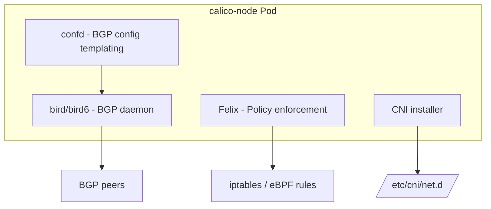

# Configure Calico Node Configuration

Author: [nawazdhandala](https://github.com/nawazdhandala)

Tags: Calico, Kubernetes, Networking, Node, Felix, Configuration

Description: A comprehensive guide to configuring Calico node settings, covering Felix configuration, BGP settings, interface detection, and dataplane mode selection for Kubernetes cluster nodes.

---

## Introduction

The Calico node configuration encompasses all the settings that control how each cluster node participates in the Calico data plane: which network interfaces to use, how to detect the node's own IP address, which dataplane (iptables, eBPF, VPP) to use, BGP peering configuration, and Felix's policy enforcement parameters.

Getting node configuration right is essential for cluster networking reliability. Incorrect IP auto-detection causes Felix to report the wrong node IP, breaking pod routing. Wrong dataplane mode selection can prevent Calico from functioning on specific kernel versions. This guide covers the key node configuration parameters and how to set them correctly.

## Prerequisites

- Calico installed on Kubernetes
- `kubectl` and `calicoctl` with cluster admin access
- Understanding of your cluster's network interface layout

## Calico Node Architecture



## Step 1: Configure Felix Global Settings

Felix configuration is managed via the FelixConfiguration custom resource:

```bash
# View current Felix configuration
kubectl get felixconfiguration default -o yaml
```

Key settings to configure:

```yaml
apiVersion: projectcalico.org/v3
kind: FelixConfiguration
metadata:
  name: default
spec:
  # Dataplane settings
  bpfEnabled: false                 # Set to true for eBPF
  iptablesBackend: "NFT"            # NFT (nftables) or Legacy

  # Interface settings
  interfacePrefix: "cali"           # Prefix for Calico-created interfaces
  deviceRouteSourceAddress: ""      # Source IP for routes (usually auto)

  # Performance settings
  iptablesRefreshInterval: "90s"    # How often to refresh iptables rules
  routeRefreshInterval: "90s"

  # Logging
  logSeverityScreen: "Info"
  logFilePath: "/var/log/calico/felix.log"

  # Metrics
  prometheusMetricsEnabled: true
  prometheusMetricsPort: 9091

  # Failsafe ports
  failsafeInboundHostPorts:
    - protocol: TCP
      port: 22
    - protocol: TCP
      port: 6443
```

## Step 2: Configure Node IP Detection

Felix must correctly detect the node's IP address:

```bash
# View current node IPs registered in Calico
calicoctl get nodes -o wide
```

Configure auto-detection method via DaemonSet environment variable:

```yaml
# In calico-node DaemonSet
env:
  - name: IP_AUTODETECTION_METHOD
    value: "interface=eth0"         # Use specific interface
    # Or:
    # value: "first-found"          # Use first non-loopback interface
    # value: "can-reach=8.8.8.8"   # Use interface that can reach target
    # value: "cidr=10.0.0.0/8"     # Use interface in this CIDR
```

## Step 3: Configure Dataplane Mode

```bash
# Check current dataplane
kubectl get felixconfiguration default -o jsonpath='{.spec.bpfEnabled}'

# Enable eBPF (requires kernel 5.3+)
kubectl patch installation default \
  --type=merge \
  -p '{"spec":{"calicoNetwork":{"linuxDataplane":"BPF"}}}'

# Verify eBPF is enabled
kubectl get felixconfiguration default -o yaml | grep bpfEnabled
```

## Step 4: Configure BGP Settings

For clusters using BGP routing:

```yaml
apiVersion: projectcalico.org/v3
kind: BGPConfiguration
metadata:
  name: default
spec:
  logSeverityScreen: Info
  nodeToNodeMeshEnabled: true       # Full mesh BGP (small clusters)
  asNumber: 64512                   # Your AS number
```

## Step 5: Per-Node Override Configuration

Override settings for specific nodes:

```yaml
apiVersion: projectcalico.org/v3
kind: FelixConfiguration
metadata:
  name: node.worker-gpu-1           # node.<node-name> for per-node override
spec:
  bpfEnabled: false                 # Disable eBPF on this specific node
  logSeverityScreen: "Debug"        # Enable debug logging on this node only
```

## Conclusion

Configuring Calico node settings involves choosing the right IP autodetection method for your network layout, selecting the appropriate dataplane mode for your kernel version and workload, tuning Felix performance parameters, and configuring BGP when needed. Per-node FelixConfiguration overrides allow fine-grained control for heterogeneous clusters with different hardware or kernel versions.
