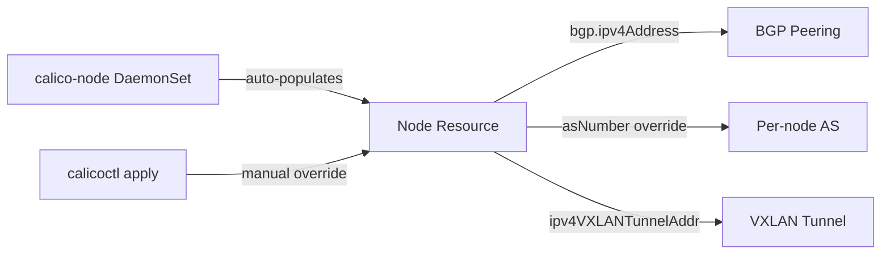

# Configure Calico Node Resource

Author: [nawazdhandala](https://github.com/nawazdhandala)

Tags: Calico, Kubernetes, Networking, Node, Configuration

Description: How to configure the Calico Node resource to manage per-node BGP settings, IP address assignments, and routing behavior in a Calico-managed cluster.

---

## Introduction

The Calico Node resource represents a node in the Calico data model and stores per-node configuration including BGP router ID, AS number overrides, and IP addresses used for peering. While most node settings are auto-populated by the `calico-node` DaemonSet during startup, explicit Node resource configuration is required when overriding defaults - such as assigning a specific BGP AS number to a node, configuring additional IP addresses, or setting the IPv4 address used for tunnel endpoints.

Understanding the Node resource is essential for advanced BGP configurations, multi-homed nodes, and environments where auto-detection produces incorrect results.

## Prerequisites

- Calico installed and calico-node DaemonSet running
- `calicoctl` with cluster admin access
- BGP enabled (not in policy-only mode)

## Step 1: View Existing Node Resources

```bash
# List all Calico Node resources
calicoctl get nodes

# Inspect a specific node
calicoctl get node node1 -o yaml
```

The output shows BGP configuration including the IPv4 address used for peering and the AS number.

## Step 2: Override BGP AS Number for a Node

By default, all nodes use the global AS number from BGPConfiguration. To assign a different AS number to a specific node:

```yaml
apiVersion: projectcalico.org/v3
kind: Node
metadata:
  name: node1
spec:
  bgp:
    ipv4Address: 192.168.1.10/24
    asNumber: 65002  # Override global AS number for this node
```

```bash
calicoctl apply -f node1-override.yaml
```

## Step 3: Set Tunnel IP Address

When using VXLAN or IP-in-IP, Calico uses `ipv4VXLANTunnelAddr` for tunnel endpoints. This is normally auto-assigned but can be set manually:

```yaml
apiVersion: projectcalico.org/v3
kind: Node
metadata:
  name: node1
spec:
  bgp:
    ipv4Address: 192.168.1.10/24
  ipv4VXLANTunnelAddr: 10.0.1.5
```

## Step 4: Configure IPv6 BGP

For dual-stack clusters, configure both IPv4 and IPv6 BGP addresses:

```yaml
apiVersion: projectcalico.org/v3
kind: Node
metadata:
  name: node1
spec:
  bgp:
    ipv4Address: 192.168.1.10/24
    ipv6Address: "2001:db8::1/64"
```



## Step 5: Verify Node Resource After Changes

```bash
# Verify the node resource has the correct values
calicoctl get node node1 -o yaml

# Check Felix has picked up the change
kubectl logs -n calico-system ds/calico-node --tail=20 | grep "node1\|BGP\|AS"

# Verify BGP sessions are established
calicoctl node status
```

## Conclusion

The Calico Node resource provides per-node BGP and tunnel configuration that overrides global defaults. Most fields are auto-populated by calico-node, but explicit configuration is needed for AS number overrides, multi-homed nodes with specific peering addresses, or when auto-detection picks the wrong interface. Changes to Node resources take effect within seconds as Felix and BIRD pick up the updated configuration.
