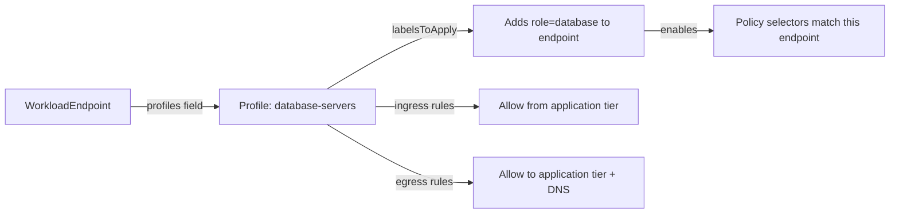

# Configure Calico Profile Resource

Author: [nawazdhandala](https://github.com/nawazdhandala)

Tags: Calico, Kubernetes, Networking, Profile, Configuration, Security

Description: How to configure Calico Profile resources to define reusable policy rule sets and labels applied to workload endpoints, enabling policy inheritance patterns for consistent security postures across workloads.

---

## Introduction

Calico Profile resources attach policy rules and labels directly to workload endpoints, providing a mechanism for inherited policy that applies regardless of NetworkPolicy selectors. Profiles are automatically created for Kubernetes namespaces and are used to propagate namespace-level labels to all endpoints within that namespace. Understanding Profile configuration is important when working with non-Kubernetes workloads, legacy deployments, or when troubleshooting how label inheritance affects policy evaluation.

In Kubernetes deployments, Profiles are primarily managed automatically — but understanding their structure helps with advanced troubleshooting and non-Kubernetes Calico deployments.

## Prerequisites

- Calico installed
- `calicoctl` with cluster admin access
- Understanding of Calico policy evaluation order (profiles are evaluated after NetworkPolicies)

## Step 1: View Existing Profiles

```bash
# List all profiles
calicoctl get profiles

# In Kubernetes, profiles correspond to namespaces
calicoctl get profile kns.production -o yaml
```

Profile names for Kubernetes namespaces follow the pattern `kns.<namespace-name>`.

## Step 2: Understand Profile Structure

```yaml
apiVersion: projectcalico.org/v3
kind: Profile
metadata:
  name: kns.production
spec:
  # Labels applied to all endpoints in this profile
  labelsToApply:
    pcns.projectcalico.org/name: production
    pcns.projectcalico.org/kubernetes-namespace: production
  # Ingress/egress rules (evaluated after NetworkPolicies)
  ingress:
    - action: Allow
      source:
        selector: pcns.projectcalico.org/name == 'production'
  egress:
    - action: Allow
```

## Step 3: Create a Custom Profile for Non-Kubernetes Workloads

For bare-metal or VM workloads managed directly by Calico (not Kubernetes):

```yaml
apiVersion: projectcalico.org/v3
kind: Profile
metadata:
  name: database-servers
spec:
  labelsToApply:
    role: database
    tier: data
  ingress:
    - action: Allow
      source:
        selector: "role == 'application'"
      destination:
        ports: [5432]
    - action: Deny
  egress:
    - action: Allow
      destination:
        selector: "role == 'application'"
    - action: Allow
      destination:
        nets: [10.0.0.1/32]  # Internal DNS
        ports: [53]
    - action: Deny
```

## Step 4: Apply Profile to a WorkloadEndpoint

```bash
# Apply the profile to a specific workload endpoint
calicoctl get workloadendpoint --all-namespaces -o yaml | grep -A5 "db-server"

# Patch the workload endpoint to use the profile
calicoctl patch workloadendpoint db-server-eth0 \
  --patch='{"spec":{"profiles":["database-servers"]}}'
```



## Step 5: Verify Profile Application

```bash
# Verify profile exists and has correct spec
calicoctl get profile database-servers -o yaml

# Verify workload endpoint is using the profile
calicoctl get workloadendpoint -A -o yaml | grep -B5 "database-servers"
```

## Conclusion

Calico Profile resources provide label inheritance and default policy rules for workload endpoints. In Kubernetes deployments, profiles are auto-managed for namespaces and rarely need manual configuration. For non-Kubernetes workloads or advanced policy designs, profiles enable reusable policy sets that can be assigned to multiple workload endpoints. The key operational detail is that Profile rules are evaluated after NetworkPolicies, making them suitable for default allow/deny fallbacks rather than primary security controls.
